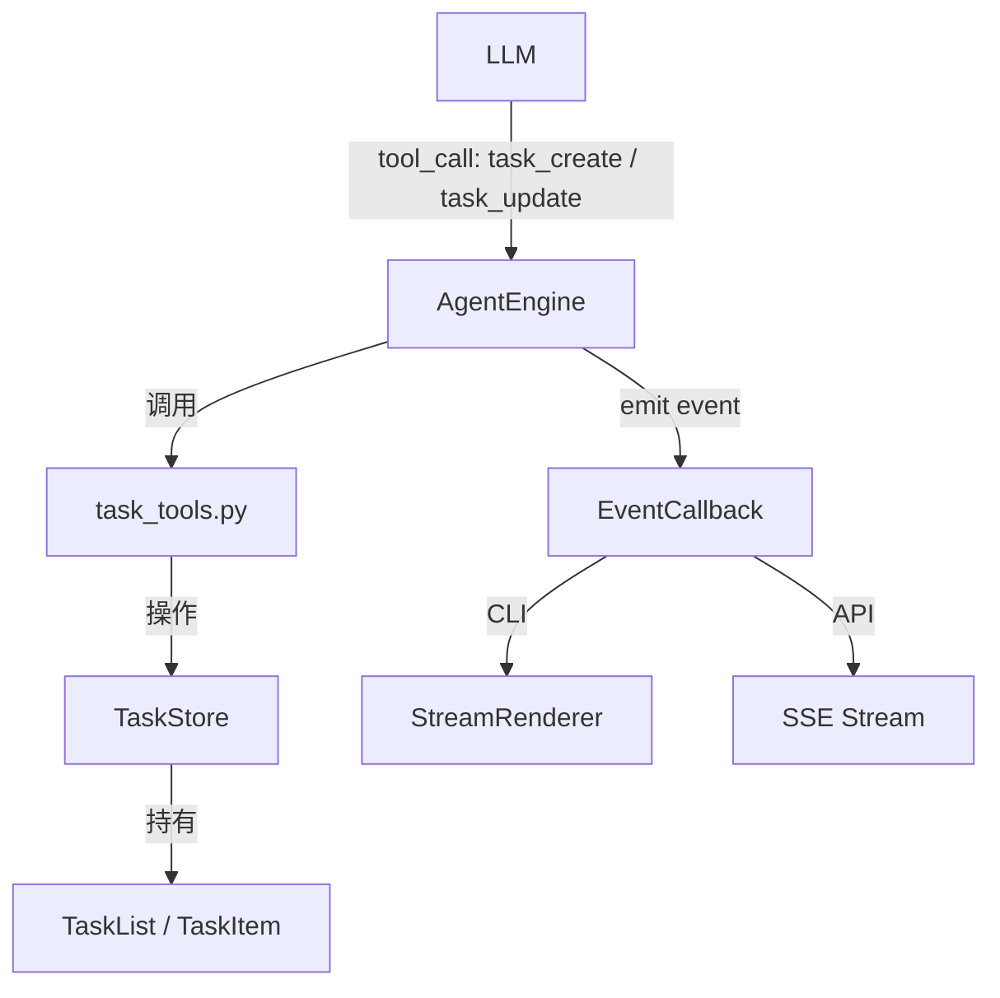
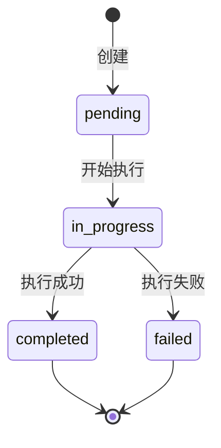

# 设计文档：Agent Task List

## 概述

为 ExcelManus Agent 添加内存级任务清单功能，使 LLM 在处理复杂 Excel 任务时能通过 Tool Calling 自主创建子任务清单并实时更新状态。该功能完全融入现有架构：数据模型作为独立模块、工具通过 ToolRegistry 注册、事件通过 EventType/ToolCallEvent 传播、CLI 通过 StreamRenderer 渲染、API 通过 SSE 推送。

设计遵循 KISS/YAGNI 原则：单会话内存级存储（不持久化到文件系统），不引入依赖图或跨会话共享等复杂机制。

## 架构

### 整体集成方式



### 关键设计决策

1. **内存级存储**：TaskStore 挂载在 AgentEngine 实例上，随会话生命周期存在，不持久化。理由：当前需求仅需单会话内追踪，YAGNI。
2. **每会话单 TaskList**：一个会话同时只有一个活跃 TaskList。新建 TaskList 会替换旧的。理由：Agent 一次处理一个用户请求，不需要多任务清单并行。
3. **工具层实现**：task_create 和 task_update 作为标准 ToolDef 注册到 ToolRegistry，与现有 file_tools、data_tools 模式一致。
4. **事件驱动渲染**：通过扩展 EventType 枚举和 ToolCallEvent 字段传递任务状态变更，StreamRenderer 和 SSE 各自消费渲染。

## 组件与接口

### 1. 数据模型 — `excelmanus/task_list.py`

```python
from enum import Enum
from dataclasses import dataclass, field
from datetime import datetime


class TaskStatus(Enum):
    """任务状态枚举。"""
    PENDING = "pending"
    IN_PROGRESS = "in_progress"
    COMPLETED = "completed"
    FAILED = "failed"


# 合法的状态转换映射
VALID_TRANSITIONS: dict[TaskStatus, set[TaskStatus]] = {
    TaskStatus.PENDING: {TaskStatus.IN_PROGRESS},
    TaskStatus.IN_PROGRESS: {TaskStatus.COMPLETED, TaskStatus.FAILED},
    TaskStatus.COMPLETED: set(),
    TaskStatus.FAILED: set(),
}


@dataclass
class TaskItem:
    """单个任务项。"""
    title: str
    status: TaskStatus = TaskStatus.PENDING
    result: str | None = None

    def transition(self, new_status: TaskStatus) -> None:
        """执行状态转换，非法转换抛出 ValueError。"""
        if new_status not in VALID_TRANSITIONS[self.status]:
            raise ValueError(
                f"非法状态转换: {self.status.value} → {new_status.value}"
            )
        self.status = new_status

    def to_dict(self) -> dict:
        """序列化为字典。"""
        d = {"title": self.title, "status": self.status.value}
        if self.result is not None:
            d["result"] = self.result
        return d

    @classmethod
    def from_dict(cls, data: dict) -> "TaskItem":
        """从字典反序列化。"""
        return cls(
            title=data["title"],
            status=TaskStatus(data["status"]),
            result=data.get("result"),
        )


@dataclass
class TaskList:
    """任务清单。"""
    title: str
    items: list[TaskItem] = field(default_factory=list)
    created_at: datetime = field(default_factory=datetime.now)

    def progress_summary(self) -> dict[str, int]:
        """返回各状态的计数。"""
        summary = {s.value: 0 for s in TaskStatus}
        for item in self.items:
            summary[item.status.value] += 1
        return summary

    def to_dict(self) -> dict:
        """序列化为字典。"""
        return {
            "title": self.title,
            "items": [item.to_dict() for item in self.items],
            "created_at": self.created_at.isoformat(),
            "progress": self.progress_summary(),
        }

    @classmethod
    def from_dict(cls, data: dict) -> "TaskList":
        """从字典反序列化。"""
        return cls(
            title=data["title"],
            items=[TaskItem.from_dict(item) for item in data["items"]],
            created_at=datetime.fromisoformat(data["created_at"]),
        )
```

### 2. 任务存储 — `TaskStore`（内嵌于 task_list.py）

```python
class TaskStore:
    """单会话任务清单存储。"""

    def __init__(self) -> None:
        self._task_list: TaskList | None = None

    @property
    def current(self) -> TaskList | None:
        return self._task_list

    def create(self, title: str, subtask_titles: list[str]) -> TaskList:
        """创建新任务清单，替换已有的。"""
        items = [TaskItem(title=t) for t in subtask_titles]
        self._task_list = TaskList(title=title, items=items)
        return self._task_list

    def update_item(
        self, index: int, new_status: TaskStatus, result: str | None = None
    ) -> TaskItem:
        """更新指定任务项的状态。"""
        if self._task_list is None:
            raise ValueError("当前没有活跃的任务清单")
        if index < 0 or index >= len(self._task_list.items):
            raise IndexError(
                f"任务索引 {index} 超出范围 [0, {len(self._task_list.items) - 1}]"
            )
        item = self._task_list.items[index]
        item.transition(new_status)
        if result is not None:
            item.result = result
        return item

    def clear(self) -> None:
        """清除当前任务清单。"""
        self._task_list = None
```

### 3. 任务工具 — `excelmanus/tools/task_tools.py`

```python
"""任务清单工具：通过 Tool Calling 让 Agent 管理子任务。"""

from excelmanus.task_list import TaskList, TaskStatus, TaskStore
from excelmanus.tools.registry import ToolDef

# 模块级 TaskStore 引用，由 init_store() 注入
_store: TaskStore | None = None


def init_store(store: TaskStore) -> None:
    """注入 TaskStore 实例。"""
    global _store
    _store = store


def _get_store() -> TaskStore:
    if _store is None:
        raise RuntimeError("TaskStore 未初始化")
    return _store


def task_create(title: str, subtasks: list[str]) -> str:
    """创建任务清单。"""
    store = _get_store()
    task_list = store.create(title, subtasks)
    return f"已创建任务清单「{task_list.title}」，共 {len(task_list.items)} 个子任务。"


def task_update(task_index: int, status: str, result: str | None = None) -> str:
    """更新任务项状态。"""
    store = _get_store()
    try:
        new_status = TaskStatus(status)
    except ValueError:
        valid = ", ".join(s.value for s in TaskStatus)
        return f"无效状态 '{status}'，合法值: {valid}"
    try:
        item = store.update_item(task_index, new_status, result)
        return f"任务 #{task_index}「{item.title}」已更新为 {item.status.value}。"
    except (ValueError, IndexError) as exc:
        return str(exc)


def get_tools() -> list[ToolDef]:
    """返回任务清单工具定义。"""
    return [
        ToolDef(
            name="task_create",
            description="创建任务清单，将复杂任务拆解为有序子任务列表",
            input_schema={
                "type": "object",
                "properties": {
                    "title": {
                        "type": "string",
                        "description": "任务清单标题",
                    },
                    "subtasks": {
                        "type": "array",
                        "items": {"type": "string"},
                        "description": "子任务标题列表",
                    },
                },
                "required": ["title", "subtasks"],
                "additionalProperties": False,
            },
            func=task_create,
        ),
        ToolDef(
            name="task_update",
            description="更新任务项状态（pending → in_progress → completed/failed）",
            input_schema={
                "type": "object",
                "properties": {
                    "task_index": {
                        "type": "integer",
                        "description": "任务项索引（从 0 开始）",
                    },
                    "status": {
                        "type": "string",
                        "enum": ["pending", "in_progress", "completed", "failed"],
                        "description": "新状态",
                    },
                    "result": {
                        "type": "string",
                        "description": "可选的结果描述",
                    },
                },
                "required": ["task_index", "status"],
                "additionalProperties": False,
            },
            func=task_update,
        ),
    ]
```

### 4. 事件扩展 — `excelmanus/events.py` 修改

在 EventType 枚举中新增：

```python
class EventType(Enum):
    # ... 现有类型 ...
    TASK_LIST_CREATED = "task_list_created"
    TASK_ITEM_UPDATED = "task_item_updated"
```

在 ToolCallEvent 中新增可选字段：

```python
@dataclass
class ToolCallEvent:
    # ... 现有字段 ...
    # 任务清单事件字段
    task_list_data: dict | None = None  # TaskList.to_dict() 的结果
    task_index: int | None = None       # 更新的任务项索引
    task_status: str = ""               # 更新后的状态
    task_result: str | None = None      # 任务项结果
```

### 5. 引擎集成 — `excelmanus/engine.py` 修改

AgentEngine 需要：
- 持有一个 TaskStore 实例
- 在 `_execute_tool_call` 中，当工具为 task_create 或 task_update 时，额外发射对应的任务事件

```python
class AgentEngine:
    def __init__(self, ...):
        # ... 现有初始化 ...
        self._task_store = TaskStore()
        # 将 store 注入 task_tools
```

在 `_execute_tool_call` 成功执行后，检查工具名并发射事件：

```python
if success and tool_name == "task_create":
    self._emit(on_event, ToolCallEvent(
        event_type=EventType.TASK_LIST_CREATED,
        task_list_data=self._task_store.current.to_dict(),
    ))
elif success and tool_name == "task_update":
    self._emit(on_event, ToolCallEvent(
        event_type=EventType.TASK_ITEM_UPDATED,
        task_index=arguments.get("task_index"),
        task_status=arguments.get("status", ""),
        task_result=arguments.get("result"),
        task_list_data=self._task_store.current.to_dict(),
    ))
```

### 6. CLI 渲染 — `excelmanus/renderer.py` 修改

在 StreamRenderer 的 handlers 映射中新增：

```python
EventType.TASK_LIST_CREATED: self._render_task_list_created,
EventType.TASK_ITEM_UPDATED: self._render_task_item_updated,
```

渲染逻辑：

```python
_STATUS_ICONS = {
    "pending": "⬜",
    "in_progress": "🔄",
    "completed": "✅",
    "failed": "❌",
}

def _render_task_list_created(self, event: ToolCallEvent) -> None:
    """渲染新建任务清单。"""
    data = event.task_list_data
    if not data:
        return
    title = data.get("title", "")
    items = data.get("items", [])
    lines = [f"  📋 [bold]{title}[/bold]"]
    for i, item in enumerate(items):
        icon = _STATUS_ICONS.get(item["status"], "⬜")
        lines.append(f"     {icon} {i}. {item['title']}")
    self._console.print("\n".join(lines))

def _render_task_item_updated(self, event: ToolCallEvent) -> None:
    """渲染任务项状态更新。"""
    idx = event.task_index
    status = event.task_status
    icon = _STATUS_ICONS.get(status, "❓")
    data = event.task_list_data or {}
    items = data.get("items", [])
    title = items[idx]["title"] if 0 <= idx < len(items) else f"#{idx}"
    self._console.print(f"     {icon} {idx}. {title}")

    # 检查是否全部完成
    progress = data.get("progress", {})
    total = sum(progress.values())
    done = progress.get("completed", 0) + progress.get("failed", 0)
    if total > 0 and done == total:
        self._console.print(
            f"  📋 全部完成: ✅{progress.get('completed', 0)} ❌{progress.get('failed', 0)}"
        )
```

### 7. API SSE 集成 — `excelmanus/api.py` 修改

在 `_sse_event_to_sse` 函数中新增对任务事件的处理：

```python
elif event.event_type in {EventType.TASK_LIST_CREATED, EventType.TASK_ITEM_UPDATED}:
    data = {
        "task_list": event.task_list_data,
        "task_index": event.task_index,
        "task_status": event.task_status,
    }
    sse_type = "task_update"
```

## 数据模型

### TaskStatus 状态机



### TaskItem 字段

| 字段 | 类型 | 说明 |
|------|------|------|
| title | str | 子任务标题 |
| status | TaskStatus | 当前状态 |
| result | str \| None | 可选的结果描述 |

### TaskList 字段

| 字段 | 类型 | 说明 |
|------|------|------|
| title | str | 任务清单标题 |
| items | list[TaskItem] | 有序子任务列表 |
| created_at | datetime | 创建时间戳 |

### 序列化格式

```json
{
  "title": "分析销售数据",
  "items": [
    {"title": "读取 Excel 文件", "status": "completed"},
    {"title": "数据清洗", "status": "in_progress"},
    {"title": "生成图表", "status": "pending"}
  ],
  "created_at": "2025-01-15T10:30:00",
  "progress": {"pending": 1, "in_progress": 1, "completed": 1, "failed": 0}
}
```


## 正确性属性（Correctness Properties）

*属性（Property）是一种在系统所有合法执行路径上都应成立的特征或行为——本质上是对系统应做什么的形式化陈述。属性是人类可读规格说明与机器可验证正确性保证之间的桥梁。*

以下属性基于需求文档中的验收标准推导而来，每个属性都包含显式的全称量化（"对于任意"），适合用属性测试（Property-Based Testing）验证。

### Property 1: TaskList 序列化往返一致性

*对于任意* 合法的 TaskList 实例（包含任意数量的 TaskItem，各 TaskItem 处于任意合法状态，result 可为 None 或非空字符串），执行 `TaskList.from_dict(task_list.to_dict())` 应产生一个等价的 TaskList：title 相同、items 数量相同、每个 TaskItem 的 title/status/result 均相同、created_at 时间戳相同。

**Validates: Requirements 6.3, 6.1, 6.2, 6.4, 1.1, 1.2**

### Property 2: 新建 TaskList 所有项初始为 pending

*对于任意* 非空的子任务标题列表，通过 `TaskStore.create()` 创建的 TaskList 中，所有 TaskItem 的 status 均为 `TaskStatus.PENDING`。

**Validates: Requirements 1.4**

### Property 3: 状态转换合法性

*对于任意* TaskItem 和任意目标状态，当且仅当 `(当前状态, 目标状态)` 属于合法转换集合 `{(pending, in_progress), (in_progress, completed), (in_progress, failed)}` 时，`transition()` 调用成功；否则抛出 `ValueError`。

**Validates: Requirements 1.5**

### Property 4: 进度摘要不变量

*对于任意* TaskList，`progress_summary()` 返回的各状态计数之和等于 `len(items)`，且每个状态的计数等于 items 中处于该状态的实际数量。

**Validates: Requirements 1.6**

### Property 5: task_create 工具产生有效 TaskList

*对于任意* 标题字符串和非空子任务标题列表，调用 `task_create()` 后，`TaskStore.current` 不为 None，且其 title 与传入标题一致，items 数量与子任务列表长度一致。

**Validates: Requirements 2.3**

### Property 6: 越界索引返回错误

*对于任意* 包含 N 个子任务的 TaskList（N ≥ 1），调用 `task_update()` 时传入 index < 0 或 index ≥ N，返回值应包含错误描述字符串（不抛出异常）。

**Validates: Requirements 2.4**

### Property 7: 渲染输出包含正确状态图标

*对于任意* TaskList 数据（items 处于各种状态组合），StreamRenderer 渲染 TASK_LIST_CREATED 事件时，输出中每个 TaskItem 对应的行应包含与其状态匹配的图标（pending→⬜, in_progress→🔄, completed→✅, failed→❌）。

**Validates: Requirements 4.1, 4.2, 4.3**

### Property 8: ToolCallEvent 任务字段序列化完整性

*对于任意* 设置了 task_list_data 的 ToolCallEvent 实例，`to_dict()` 的返回字典应包含 `task_list_data`、`task_index`、`task_status`、`task_result` 字段。

**Validates: Requirements 5.3, 3.4**

## 错误处理

| 场景 | 处理方式 |
|------|----------|
| task_update 在无活跃 TaskList 时调用 | 返回错误字符串 "当前没有活跃的任务清单" |
| task_update 索引越界 | 返回错误字符串，包含合法索引范围 |
| task_update 非法状态转换 | 返回错误字符串，说明当前状态和目标状态 |
| task_update 无效状态值 | 返回错误字符串，列出合法状态值 |
| task_create 空子任务列表 | 正常创建空 TaskList（不报错，由 LLM 自行判断是否合理） |
| 渲染异常 | StreamRenderer 已有降级机制（`_fallback_render`），任务事件复用该机制 |
| SSE 序列化异常 | 复用现有 SSE 异常处理逻辑，记录日志并跳过该事件 |

所有工具层错误通过返回描述性字符串传递给 LLM，而非抛出异常。这与现有工具的错误处理模式一致（LLM 可根据错误信息自行调整策略）。

## 测试策略

### 属性测试（Property-Based Testing）

使用 `hypothesis` 库，每个属性测试至少运行 100 次迭代。

| 属性 | 测试文件 | 说明 |
|------|----------|------|
| Property 1 | `tests/test_pbt_task_list.py` | TaskList 序列化往返 |
| Property 2 | `tests/test_pbt_task_list.py` | 新建 TaskList 初始状态 |
| Property 3 | `tests/test_pbt_task_list.py` | 状态转换合法性 |
| Property 4 | `tests/test_pbt_task_list.py` | 进度摘要不变量 |
| Property 5 | `tests/test_pbt_task_list.py` | task_create 有效性 |
| Property 6 | `tests/test_pbt_task_list.py` | 越界索引错误 |
| Property 7 | `tests/test_pbt_task_list.py` | 渲染状态图标 |
| Property 8 | `tests/test_pbt_task_list.py` | 事件序列化完整性 |

每个测试用注释标注对应属性：
```python
# Feature: agent-task-list, Property 1: TaskList 序列化往返一致性
```

### 单元测试

| 测试范围 | 测试文件 | 说明 |
|----------|----------|------|
| TaskStatus 枚举 | `tests/test_task_list.py` | 验证四种状态值 |
| ToolDef schema 合规 | `tests/test_task_list.py` | 验证工具 schema 格式 |
| 事件类型存在性 | `tests/test_task_list.py` | 验证 EventType 新增值 |
| CLI 渲染完成摘要 | `tests/test_task_list.py` | 全部完成时显示摘要行 |
| 窄终端渲染 | `tests/test_task_list.py` | 终端宽度 < 60 时的紧凑格式 |
| API SSE 事件格式 | `tests/test_task_list.py` | task_update SSE 事件包含正确字段 |

### 测试配置

- 属性测试库：`hypothesis`（已在 pyproject.toml 的 dev 依赖中）
- 属性测试迭代次数：`@settings(max_examples=100)`
- 测试命名约定：`test_pbt_*.py` 为属性测试，`test_*.py` 为单元测试
- 运行命令：`pytest tests/test_pbt_task_list.py tests/test_task_list.py`
