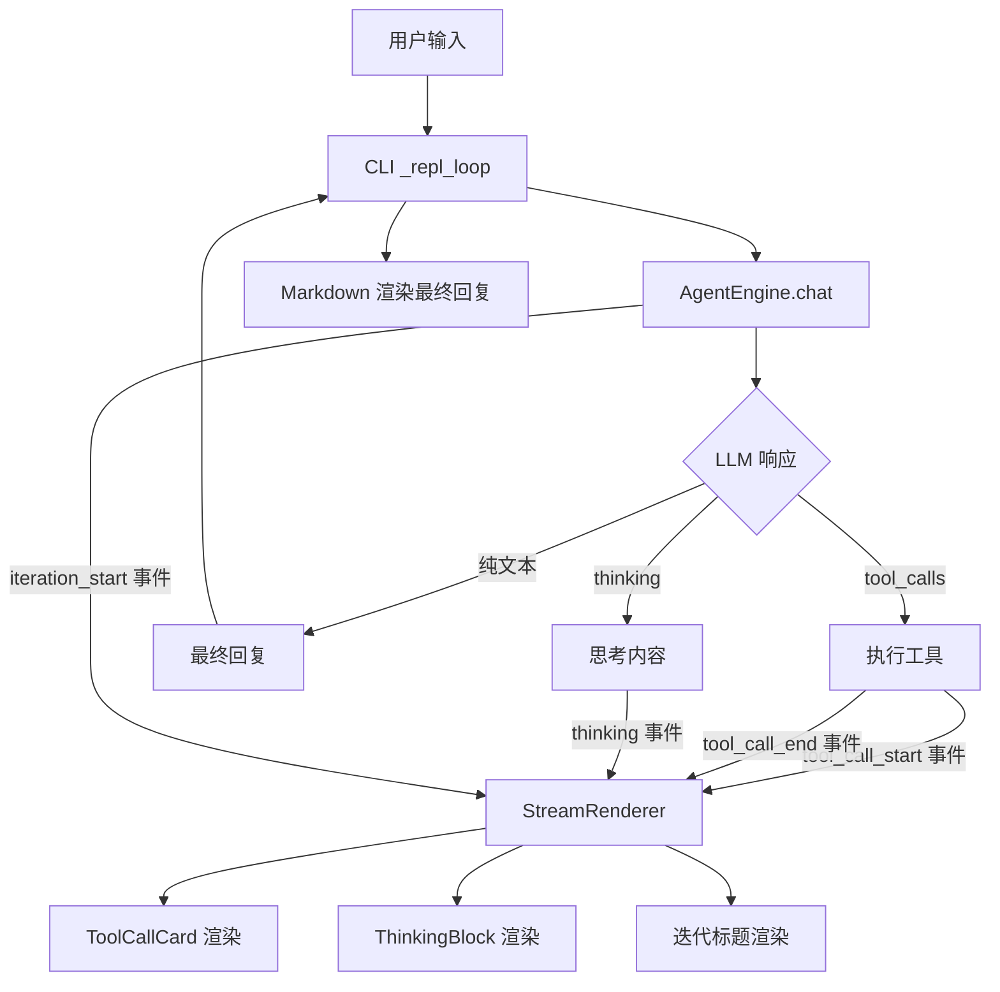
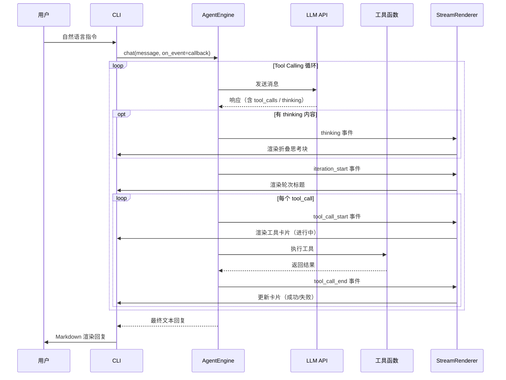

# 设计文档：CLI 美化

## 概述

本设计将 ExcelManus 的 CLI 从"黑盒 spinner"模式升级为"实时事件流渲染"模式。核心思路是在 AgentEngine 的 Tool Calling 循环中引入回调机制，将工具调用和 LLM 思考过程作为结构化事件发出，由新增的 StreamRenderer 组件实时渲染为可视化卡片和折叠块。

设计遵循最小侵入原则：AgentEngine 仅新增可选的回调参数，不改变现有返回值和调用方式；CLI 层通过注册回调函数接收事件并驱动渲染。

## 架构

### 整体架构



### 事件流时序



## 组件与接口

### 1. 事件数据模型（`excelmanus/events.py`）

新建模块，定义所有事件类型的数据结构。

```python
from __future__ import annotations
from dataclasses import dataclass, field, asdict
from datetime import datetime
from enum import Enum
from typing import Any, Callable, Optional


class EventType(Enum):
    """事件类型枚举。"""
    TOOL_CALL_START = "tool_call_start"
    TOOL_CALL_END = "tool_call_end"
    THINKING = "thinking"
    ITERATION_START = "iteration_start"


@dataclass
class ToolCallEvent:
    """工具调用事件数据。"""
    event_type: EventType
    tool_name: str = ""
    arguments: dict[str, Any] = field(default_factory=dict)
    result: str = ""
    success: bool = True
    error: str | None = None
    thinking: str = ""
    iteration: int = 0
    timestamp: datetime = field(default_factory=datetime.now)

    def to_dict(self) -> dict[str, Any]:
        """序列化为字典。"""
        d = asdict(self)
        d["event_type"] = self.event_type.value
        d["timestamp"] = self.timestamp.isoformat()
        return d

    @classmethod
    def from_dict(cls, data: dict[str, Any]) -> ToolCallEvent:
        """从字典反序列化。"""
        data = dict(data)
        data["event_type"] = EventType(data["event_type"])
        data["timestamp"] = datetime.fromisoformat(data["timestamp"])
        return cls(**data)


# 回调函数类型别名
EventCallback = Callable[[ToolCallEvent], None]
```

### 2. AgentEngine 回调扩展（`excelmanus/engine.py`）

修改 `chat()` 方法签名，新增可选的 `on_event` 回调参数。在工具调用循环的关键节点发出事件。

```python
# engine.py 中 chat 方法签名变更
async def chat(
    self,
    user_message: str,
    on_event: EventCallback | None = None,
) -> str:
    ...
```

事件发出点：
- 每轮迭代开始时：发出 `ITERATION_START` 事件
- LLM 响应包含 thinking/reasoning 字段时：发出 `THINKING` 事件
- 每个 tool_call 执行前：发出 `TOOL_CALL_START` 事件
- 每个 tool_call 执行后：发出 `TOOL_CALL_END` 事件

回调调用使用 `_emit` 辅助方法，内部捕获回调异常避免影响主流程：

```python
def _emit(self, on_event: EventCallback | None, event: ToolCallEvent) -> None:
    """安全地发出事件，捕获回调异常。"""
    if on_event is None:
        return
    try:
        on_event(event)
    except Exception as exc:
        logger.warning("事件回调异常: %s", exc)
```

### 3. StreamRenderer（`excelmanus/renderer.py`）

新建模块，负责将事件渲染为 Rich 组件输出到终端。

```python
class StreamRenderer:
    """流式事件渲染器。"""

    def __init__(self, console: Console) -> None:
        self._console = console

    def handle_event(self, event: ToolCallEvent) -> None:
        """事件分发入口。"""
        handlers = {
            EventType.TOOL_CALL_START: self._render_tool_start,
            EventType.TOOL_CALL_END: self._render_tool_end,
            EventType.THINKING: self._render_thinking,
            EventType.ITERATION_START: self._render_iteration,
        }
        handler = handlers.get(event.event_type)
        if handler:
            handler(event)

    def _render_tool_start(self, event: ToolCallEvent) -> None:
        """渲染工具调用开始卡片。"""
        ...

    def _render_tool_end(self, event: ToolCallEvent) -> None:
        """渲染工具调用结束卡片（成功/失败）。"""
        ...

    def _render_thinking(self, event: ToolCallEvent) -> None:
        """渲染 LLM 思考过程折叠块。"""
        ...

    def _render_iteration(self, event: ToolCallEvent) -> None:
        """渲染迭代轮次标题。"""
        ...
```

### 4. CLI 集成（`excelmanus/cli.py`）

修改 `_repl_loop` 中的自然语言处理分支，用 StreamRenderer 替换 spinner：

```python
# 替换前
with console.status("思考中...", spinner="dots"):
    reply = await engine.chat(user_input)

# 替换后
renderer = StreamRenderer(console)
reply = await engine.chat(user_input, on_event=renderer.handle_event)
```

## 数据模型

### ToolCallEvent 字段定义

| 字段 | 类型 | 说明 |
|------|------|------|
| `event_type` | `EventType` | 事件类型枚举值 |
| `tool_name` | `str` | 工具名称（TOOL_CALL_START/END 时使用） |
| `arguments` | `dict[str, Any]` | 工具参数字典 |
| `result` | `str` | 工具执行结果文本 |
| `success` | `bool` | 工具执行是否成功 |
| `error` | `str \| None` | 错误信息（失败时） |
| `thinking` | `str` | LLM 思考内容（THINKING 事件时使用） |
| `iteration` | `int` | 当前迭代轮次编号 |
| `timestamp` | `datetime` | 事件产生时间戳 |

### EventType 枚举

| 值 | 说明 |
|------|------|
| `TOOL_CALL_START` | 工具调用开始 |
| `TOOL_CALL_END` | 工具调用结束 |
| `THINKING` | LLM 思考过程 |
| `ITERATION_START` | 新一轮迭代开始 |

### 渲染样式规范

工具调用卡片使用 Rich Panel 组件：

```
┌─ 🔧 read_excel ──────────────────────────┐
│ 参数: file_path="销售数据.xlsx", sheet=0  │
│ 状态: ✅ 成功                              │
│ 结果: 读取了 150 行 × 8 列数据            │
└───────────────────────────────────────────┘
```

失败卡片：

```
┌─ 🔧 write_excel ─────────────────────────┐
│ 参数: file_path="output.xlsx"             │
│ 状态: ❌ 失败                              │
│ 错误: 文件被其他程序占用                    │
└───────────────────────────────────────────┘
```

思考过程折叠块：

```
💭 思考: 用户需要读取销售数据并生成图表，我先读取文件...
```

超长思考内容折叠显示：

```
💭 思考: 用户需要对销售数据进行多维度分析，首先我需要读取原始数据，然后按照地区和产品类...
```


## 正确性属性

*属性（Property）是系统在所有合法执行路径上都应保持为真的特征或行为——本质上是对系统行为的形式化陈述。属性是连接人类可读规格说明与机器可验证正确性保证之间的桥梁。*

### Property 1: ToolCallEvent round-trip 序列化

*对于任意* 合法的 ToolCallEvent 实例，将其序列化为字典（`to_dict()`）再反序列化（`from_dict()`）应产生与原始对象等价的实例。

**Validates: Requirements 5.3**

### Property 2: 工具调用开始事件包含正确数据

*对于任意* 工具名称和参数字典，当 AgentEngine 发出 tool_call_start 事件时，事件的 `tool_name` 应等于实际工具名称，`arguments` 应等于实际参数字典，`event_type` 应为 `TOOL_CALL_START`。

**Validates: Requirements 1.1**

### Property 3: 工具调用结束事件包含正确状态

*对于任意* 工具调用结果（成功或失败），当 AgentEngine 发出 tool_call_end 事件时，事件的 `success` 字段应与实际执行结果一致，且失败时 `error` 字段非空。

**Validates: Requirements 1.2**

### Property 4: 迭代事件轮次编号递增

*对于任意* 多轮 Tool Calling 循环，AgentEngine 发出的 iteration_start 事件序列中，轮次编号应从 1 开始严格递增。

**Validates: Requirements 1.5**

### Property 5: 工具卡片包含名称和参数

*对于任意* 工具名称和参数字典，StreamRenderer 渲染 tool_call_start 事件后的输出文本应包含工具名称，且参数字典中的每个键都应出现在输出中。

**Validates: Requirements 2.1**

### Property 6: 工具调用结束卡片渲染正确状态

*对于任意* tool_call_end 事件，当 `success=True` 时渲染输出应包含成功标记（✅）和结果文本；当 `success=False` 时渲染输出应包含失败标记（❌）和错误信息。

**Validates: Requirements 2.3, 2.4**

### Property 7: 长结果文本截断

*对于任意* 长度超过 200 个字符的工具结果文本，StreamRenderer 渲染后的结果摘要长度应不超过 203 个字符（200 + 省略标记），且应以省略标记结尾。

**Validates: Requirements 2.5**

### Property 8: 多工具调用按序渲染

*对于任意* 包含 N 个工具调用的事件序列（N ≥ 2），StreamRenderer 的渲染调用顺序应与事件序列顺序一致。

**Validates: Requirements 2.6**

### Property 9: 思考块渲染与截断

*对于任意* 非空思考文本，StreamRenderer 应渲染思考块且输出包含思考内容的摘要。当思考文本超过 500 个字符时，摘要部分应不超过 80 个字符加省略标记。

**Validates: Requirements 3.1, 3.3**

### Property 10: 窄终端自适应

*对于任意* 终端宽度（20 到 200 列之间）和任意工具调用事件，StreamRenderer 渲染的卡片宽度应不超过终端宽度。

**Validates: Requirements 4.5**

## 错误处理

### 回调异常隔离

AgentEngine 的 `_emit` 方法在调用回调函数时捕获所有异常，记录警告日志但不中断主流程。这确保渲染层的 bug 不会影响核心工具调用循环。

```python
def _emit(self, on_event, event):
    if on_event is None:
        return
    try:
        on_event(event)
    except Exception as exc:
        logger.warning("事件回调异常: %s", exc)
```

### 渲染异常处理

StreamRenderer 的每个渲染方法内部捕获 Rich 渲染异常，降级为纯文本输出：

```python
def _render_tool_start(self, event):
    try:
        # Rich Panel 渲染
        ...
    except Exception:
        # 降级为纯文本
        self._console.print(f"🔧 {event.tool_name} ...")
```

### 工具调用异常

工具调用过程中的异常由 AgentEngine 现有逻辑处理（记录 ToolCallResult），同时通过 tool_call_end 事件将错误信息传递给渲染层。CLI 层在 `engine.chat()` 外层捕获未预期异常，显示错误信息并保持 REPL 循环。

## 测试策略

### 测试框架

- 单元测试：`pytest` + `pytest-asyncio`
- 属性测试：`hypothesis`（项目已有依赖）
- Mock：`unittest.mock`（标准库）

### 属性测试（Property-Based Testing）

每个正确性属性对应一个独立的 hypothesis 测试函数，最少运行 100 次迭代。

测试标注格式：**Feature: cli-beautify, Property {N}: {属性标题}**

关键属性测试：

1. **ToolCallEvent round-trip**：使用 hypothesis 生成随机 ToolCallEvent 实例，验证 `from_dict(to_dict(event))` 等价于原始事件。需要自定义 hypothesis strategy 生成合法的 EventType、datetime、dict 等字段。

2. **工具卡片渲染内容**：生成随机工具名称和参数，调用 `_render_tool_start`，捕获 Console 输出验证包含预期内容。

3. **文本截断属性**：生成随机长度字符串，验证截断逻辑的长度约束。

4. **思考块渲染与截断**：生成随机长度思考文本，验证摘要长度约束。

### 单元测试

单元测试覆盖具体示例和边界条件：

- ToolCallEvent 字段完整性验证（需求 5.1）
- 空思考内容跳过渲染（需求 3.2）
- 回调为 None 时无副作用（需求 1.4）
- CLI 命令向后兼容（需求 4.4）
- 异常后 REPL 继续运行（需求 4.3）
- 最终回复在卡片之后渲染（需求 4.2）

### 测试文件组织

```
tests/
├── test_events.py          # ToolCallEvent 数据模型测试（含属性测试）
├── test_renderer.py        # StreamRenderer 渲染测试（含属性测试）
├── test_engine.py          # AgentEngine 回调机制测试（扩展现有文件）
├── test_cli.py             # CLI 集成测试（扩展现有文件）
```
