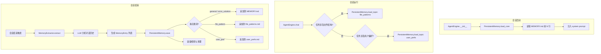

# 设计文档：跨会话持久记忆

## 概述

本设计为 ExcelManus 添加跨会话持久记忆系统。核心思路是：在 `~/.excelmanus/memory/` 目录下维护 Markdown 格式的记忆文件，会话启动时自动加载核心记忆到 system prompt，会话结束时通过 LLM 自动提取有价值信息并持久化。

系统由三个核心组件构成：
1. **PersistentMemory** — 记忆文件的读写与容量管理
2. **MemoryExtractor** — 基于 LLM 的记忆提取
3. **AgentEngine 集成** — 记忆的自动加载与提取触发

## 架构



## 组件与接口

### 1. PersistentMemory（`excelmanus/persistent_memory.py`）

记忆文件的读写管理器，负责文件 I/O、格式解析和容量控制。

```python
class PersistentMemory:
    """持久记忆管理器。"""

    def __init__(self, memory_dir: str, auto_load_lines: int = 200) -> None:
        """初始化，确保目录存在。"""
        ...

    def load_core(self) -> str:
        """读取 MEMORY.md 前 auto_load_lines 行，返回文本内容。
        文件不存在或为空时返回空字符串。"""
        ...

    def load_topic(self, topic_name: str) -> str:
        """按需读取指定主题文件的全部内容。
        文件不存在时返回空字符串。"""
        ...

    def save_entries(self, entries: list[MemoryEntry]) -> None:
        """将记忆条目按类别分发写入对应文件。
        写入后检查容量并在必要时触发清理。"""
        ...

    def parse_entries(self, content: str) -> list[MemoryEntry]:
        """将 Markdown 文本解析为 MemoryEntry 列表。"""
        ...

    def format_entries(self, entries: list[MemoryEntry]) -> str:
        """将 MemoryEntry 列表序列化为 Markdown 文本。"""
        ...

    def _enforce_capacity(self, filepath: Path) -> None:
        """容量管理：当文件超过 500 行时，保留最近条目使其降至 400 行以内。"""
        ...
```

### 2. MemoryExtractor（`excelmanus/memory_extractor.py`）

基于 LLM 的记忆提取器，从对话历史中提取值得记住的信息。

```python
class MemoryExtractor:
    """记忆提取器：调用 LLM 从对话历史中提取有价值的信息。"""

    def __init__(self, client: openai.AsyncOpenAI, model: str) -> None:
        ...

    async def extract(self, messages: list[dict]) -> list[MemoryEntry]:
        """分析对话历史，返回值得记住的 MemoryEntry 列表。
        对话为空或仅含系统消息时返回空列表。
        LLM 调用失败时记录日志并返回空列表。"""
        ...
```

### 3. AgentEngine 集成

在现有 `AgentEngine` 中添加记忆加载和提取逻辑：

```python
# engine.py 中的变更

class AgentEngine:
    def __init__(self, ..., persistent_memory: PersistentMemory | None = None,
                 memory_extractor: MemoryExtractor | None = None) -> None:
        self._persistent_memory = persistent_memory
        self._memory_extractor = memory_extractor
        # 会话启动时加载核心记忆
        if persistent_memory is not None:
            core_memory = persistent_memory.load_core()
            if core_memory:
                # 将核心记忆追加到 system prompt
                original = self._memory.system_prompt
                self._memory.system_prompt = f"{original}\n\n## 持久记忆\n{core_memory}"

    async def extract_and_save_memory(self) -> None:
        """会话结束时调用：提取记忆并持久化。"""
        if self._memory_extractor is None or self._persistent_memory is None:
            return
        messages = self._memory.get_messages()
        entries = await self._memory_extractor.extract(messages)
        if entries:
            self._persistent_memory.save_entries(entries)
```

### 4. ExcelManusConfig 扩展

```python
# config.py 中新增字段
@dataclass(frozen=True)
class ExcelManusConfig:
    ...
    memory_enabled: bool = True
    memory_dir: str = "~/.excelmanus/memory"
    memory_auto_load_lines: int = 200
```

### 5. 主题文件按需加载工具

注册一个新工具 `memory_read_topic`，让 LLM 在需要时主动读取主题文件：

```python
# excelmanus/tools/memory_tools.py

def memory_read_topic(topic: str) -> str:
    """读取指定主题的记忆文件内容。
    topic: file_patterns | user_prefs"""
    ...
```

## 数据模型

### MemoryEntry

```python
from dataclasses import dataclass
from datetime import datetime
from enum import Enum

class MemoryCategory(str, Enum):
    """记忆类别。"""
    FILE_PATTERN = "file_pattern"
    USER_PREF = "user_pref"
    ERROR_SOLUTION = "error_solution"
    GENERAL = "general"

# 类别到主题文件的映射
CATEGORY_TOPIC_MAP: dict[MemoryCategory, str] = {
    MemoryCategory.FILE_PATTERN: "file_patterns.md",
    MemoryCategory.USER_PREF: "user_prefs.md",
    # ERROR_SOLUTION 和 GENERAL 写入 MEMORY.md
}

@dataclass
class MemoryEntry:
    """单条记忆条目。"""
    content: str          # 记忆正文
    category: MemoryCategory  # 所属类别
    timestamp: datetime   # 创建时间
    source: str = ""      # 来源描述（可选）
```

### Markdown 序列化格式

每条 MemoryEntry 在文件中的格式：

```markdown
### [2025-01-15 14:30] file_pattern

用户常用的销售数据文件结构：列名为 日期、产品、数量、单价、金额，数据类型分别为 date、str、int、float、float，通常约 5000 行。

---
```

解析规则：
- 以 `### [时间戳] 类别` 开头的行标记一条新条目
- 条目正文为该标记行之后、下一个 `---` 分隔线之前的所有非空行
- 时间戳格式：`YYYY-MM-DD HH:MM`
- 类别为 `MemoryCategory` 枚举值之一


## 正确性属性

*属性是系统在所有有效执行中都应保持为真的特征或行为——本质上是关于系统应该做什么的形式化陈述。属性是人类可读规格说明与机器可验证正确性保证之间的桥梁。*

### Property 1：核心记忆加载行数限制

*For any* MEMORY.md 文件（包含任意行数 N），`load_core()` 返回的内容行数应等于 `min(N, auto_load_lines)`，且内容应与文件的前 `min(N, auto_load_lines)` 行完全一致。

**Validates: Requirements 2.1, 2.5**

### Property 2：MemoryEntry 序列化往返一致性

*For any* 有效的 MemoryEntry 列表，调用 `format_entries()` 序列化为 Markdown 文本后，再调用 `parse_entries()` 解析回 MemoryEntry 列表，应产生与原始列表等价的结果（content、category、timestamp 字段均相等）。

**Validates: Requirements 6.2, 6.3, 6.4, 5.4, 3.4**

### Property 3：记忆条目按类别分发到正确文件

*For any* 非空的 MemoryEntry 列表，调用 `save_entries()` 后，每条 category 为 `file_pattern` 的条目应出现在 `file_patterns.md` 中，每条 category 为 `user_pref` 的条目应出现在 `user_prefs.md` 中，其余类别的条目应出现在 `MEMORY.md` 中。

**Validates: Requirements 3.3, 4.2**

### Property 4：容量管理保持行数上限

*For any* 超过 500 行的 MEMORY.md 文件，执行 `_enforce_capacity()` 后，文件行数应不超过 400 行，且保留的内容应为原文件中最近（最末尾）的条目。

**Validates: Requirements 7.1, 7.2**

### Property 5：目录自动创建

*For any* 不存在的目录路径，以该路径初始化 `PersistentMemory` 后，该目录应存在。

**Validates: Requirements 1.2**

## 错误处理

| 场景 | 处理策略 |
|------|----------|
| MEMORY.md 文件不存在 | `load_core()` 返回空字符串，不抛异常 |
| TopicFile 不存在 | `load_topic()` 返回空字符串，不抛异常 |
| MemoryDir 无写入权限 | `save_entries()` 捕获 `OSError`，记录 WARNING 日志，不中断会话 |
| LLM 提取调用失败 | `MemoryExtractor.extract()` 捕获异常，记录 ERROR 日志，返回空列表 |
| 对话历史为空 | `MemoryExtractor.extract()` 直接返回空列表，不调用 LLM |
| Markdown 解析遇到格式异常 | 跳过格式不合规的条目，记录 WARNING 日志，继续解析后续内容 |
| 文件写入过程中断 | 使用临时文件 + 原子重命名（`write → rename`）确保文件完整性 |
| `memory_enabled` 为 false | AgentEngine 跳过所有记忆相关操作，零开销 |

## 测试策略

### 属性测试（Property-Based Testing）

使用 **hypothesis** 库进行属性测试，每个属性至少运行 100 次迭代。

| 属性 | 测试文件 | 说明 |
|------|----------|------|
| Property 1 | `tests/test_pbt_persistent_memory.py` | 生成随机行数的文件内容，验证加载行数限制 |
| Property 2 | `tests/test_pbt_persistent_memory.py` | 生成随机 MemoryEntry 列表，验证序列化往返一致性 |
| Property 3 | `tests/test_pbt_persistent_memory.py` | 生成随机类别的 MemoryEntry，验证分发到正确文件 |
| Property 4 | `tests/test_pbt_persistent_memory.py` | 生成超过 500 行的文件，验证容量管理 |
| Property 5 | `tests/test_pbt_persistent_memory.py` | 生成随机临时目录路径，验证自动创建 |

属性测试标签格式：`Feature: cross-session-memory, Property N: {property_text}`

### 单元测试

| 测试文件 | 覆盖范围 |
|----------|----------|
| `tests/test_persistent_memory.py` | PersistentMemory 的基本读写、边界条件（空文件、不存在的文件） |
| `tests/test_memory_extractor.py` | MemoryExtractor 的 LLM 调用 mock、错误处理、空对话跳过 |
| `tests/test_config_memory.py` | ExcelManusConfig 新增字段的默认值和环境变量覆盖 |
| `tests/test_engine_memory.py` | AgentEngine 集成测试：记忆加载注入、memory_enabled 开关 |

### 测试框架

- **pytest** + **pytest-asyncio**：单元测试和异步测试
- **hypothesis**：属性测试，最低 100 次迭代
- 所有属性测试文件以 `test_pbt_` 前缀命名，与项目现有约定一致
