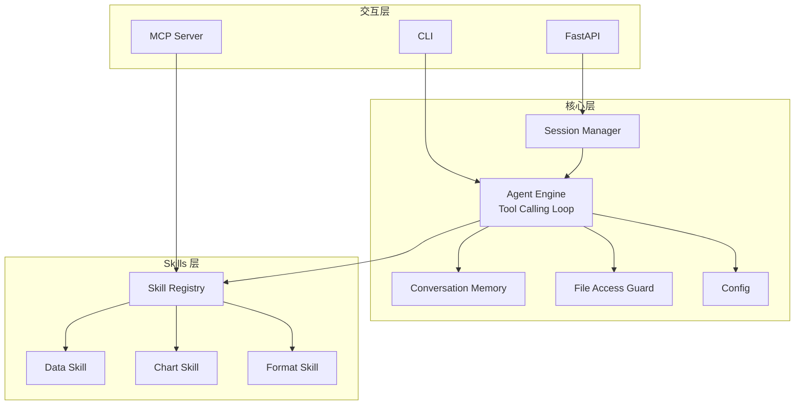

# 设计文档：ExcelManus v2

## 概述

ExcelManus v2 是一个基于原生 OpenAI Responses API + tool calling 的 Excel 智能代理框架。系统采用单 Agent + Skills 动态加载架构，支持独立 Agent 模式和 MCP Server 双模式运行，提供 CLI 和 REST API 双入口。

核心设计决策：
- 使用 OpenAI SDK 原生 Responses API + tool calling，避免重框架耦合
- Skills 按职责分组，采用包命名空间自动发现
- Agent 核心逻辑与 CLI/API/MCP 交互层解耦
- API 模式必须异步不阻塞（`AsyncOpenAI` + `asyncio.to_thread`）
- 所有文件访问必须经过 `FileAccessGuard`（最小权限）

## 架构



## 关键设计

1. MCP 模式不经过 Agent Engine。MCP 只做工具暴露与执行映射。
2. API 模式通过 SessionManager 管理会话上下文，支持 TTL 清理和容量上限。
3. Config 仅启动时加载一次，运行期不可变。
4. ToolDef 使用完整 JSON Schema（`input_schema`），支持嵌套对象参数。
5. 所有工具读写文件前必须完成路径规范化与越界校验。

## 组件与接口

### 1. Config Manager（`excelmanus/config.py`）

```python
from dataclasses import dataclass

@dataclass(frozen=True)
class ExcelManusConfig:
    api_key: str
    base_url: str = "https://dashscope.aliyuncs.com/compatible-mode/v1"
    model: str = "qwen-max-latest"
    max_iterations: int = 20
    max_consecutive_failures: int = 3
    session_ttl_seconds: int = 1800
    max_sessions: int = 1000
    workspace_root: str = "."
    log_level: str = "INFO"


def load_config() -> ExcelManusConfig:
    """加载顺序：环境变量 > .env > 默认值。API Key 缺失时抛出 ConfigError。"""
    ...
```

### 2. Skill 系统（`excelmanus/skills/`）

Skill 模块约定：
- 导出 `SKILL_NAME`、`SKILL_DESCRIPTION`、`get_tools()`
- `get_tools()` 返回 `list[ToolDef]`

```python
from dataclasses import dataclass, field
from typing import Any, Callable

@dataclass
class ToolDef:
    name: str
    description: str
    input_schema: dict[str, Any]
    func: Callable[..., Any]
    sensitive_fields: set[str] = field(default_factory=set)

    def to_openai_schema(self) -> dict: ...
    def to_mcp_tool(self) -> dict: ...


class SkillRegistry:
    def register(self, skill_name: str, description: str, tools: list[ToolDef]) -> None: ...
    def auto_discover(self, package_name: str = "excelmanus.skills") -> None: ...
    def get_all_tools(self) -> list[ToolDef]: ...
    def get_openai_schemas(self) -> list[dict]: ...
    def call_tool(self, tool_name: str, arguments: dict) -> Any: ...
```

### 3. Agent Engine（`excelmanus/engine.py`）

```python
class AgentEngine:
    def __init__(self, config: ExcelManusConfig, registry: SkillRegistry):
        self._client: openai.AsyncOpenAI
        self._config = config
        self._registry = registry
        self._memory = ConversationMemory(config)
        self._file_guard = FileAccessGuard(config.workspace_root)

    async def chat(self, user_message: str) -> str:
        """
        Tool Calling 循环：
        1) 追加 user message
        2) 调用 Responses API（附 tools schema）
        3) 若有 tool_calls：参数校验 + 路径校验 + 异步执行工具 + 结果回填
        4) 若无 tool_calls：返回最终文本
        5) 达到 max_iterations：截断返回
        6) 连续失败超过 max_consecutive_failures：熔断返回
        """
        ...

    def clear_memory(self) -> None: ...
```

### 4. Conversation Memory（`excelmanus/memory.py`）

```python
class ConversationMemory:
    def __init__(self, config: ExcelManusConfig):
        self._messages: list[dict] = []
        self._system_prompt: str = "..."
        self._max_context_tokens: int = 128000
        self._token_counter: TokenCounter = TokenCounter()

    def add_user_message(self, content: str) -> None: ...
    def add_assistant_message(self, content: str) -> None: ...
    def add_tool_call(self, tool_call_id: str, name: str, arguments: str) -> None: ...
    def add_tool_result(self, tool_call_id: str, content: str) -> None: ...
    def get_messages(self) -> list[dict]: ...
    def clear(self) -> None: ...
```

### 5. MCP Server（`excelmanus/mcp_server.py`）

```python
def create_mcp_server(registry: SkillRegistry) -> Server:
    """将 registry 中工具转换为 MCP 工具并注册 call_tool handler。"""
    ...


def run_stdio_server() -> None:
    """以 stdio 传输方式启动 MCP Server。"""
    ...
```

### 6. API Server（`excelmanus/api.py`）

```python
class SessionManager:
    """并发安全的会话容器，支持 TTL 与上限控制。"""

    def __init__(self, max_sessions: int, ttl_seconds: int): ...
    async def get_or_create(self, session_id: str | None) -> tuple[str, AgentEngine]: ...
    async def delete(self, session_id: str) -> bool: ...
    async def cleanup_expired(self, now: float | None = None) -> int: ...


@app.post("/api/v1/chat")
async def chat(request: ChatRequest) -> ChatResponse: ...

@app.delete("/api/v1/sessions/{session_id}")
async def delete_session(session_id: str) -> dict: ...

@app.get("/api/v1/health")
async def health() -> dict: ...
```

### 7. 文件访问守卫（`excelmanus/security.py`）

```python
class SecurityViolationError(Exception):
    pass


class FileAccessGuard:
    def __init__(self, workspace_root: str): ...

    def resolve_and_validate(self, user_path: str) -> Path:
        """
        - 规范化路径
        - 拒绝路径穿越与符号链接越界
        - 仅允许 WORKSPACE_ROOT 内路径
        """
        ...
```

## 数据模型

```python
@dataclass
class Message:
    role: Literal["system", "user", "assistant", "tool"]
    content: str | None = None
    tool_calls: list[dict] | None = None
    tool_call_id: str | None = None
    name: str | None = None


@dataclass
class ToolCallResult:
    tool_name: str
    arguments: dict
    result: str
    success: bool
    error: str | None = None


@dataclass
class ChatResult:
    reply: str
    tool_calls: list[ToolCallResult] = field(default_factory=list)
    iterations: int = 0
    truncated: bool = False
```

## 正确性属性

### Property 1：消息构建完整性
对于任意历史与新输入，构建出的消息序列必须保持 system 在首位、历史有序、新用户消息在末位，并附全量 tools schema。  
**Validates: Requirements 1.1, 1.7**

### Property 2：Tool Call 解析与调用
对于任意包含 `tool_calls` 的响应，Engine 必须正确解析并逐个调用工具，且 tool_call_id 对应一致。  
**Validates: Requirements 1.2**

### Property 3：纯文本终止循环
对于任意不含 `tool_calls` 的响应，Engine 必须立即终止循环并返回文本。  
**Validates: Requirements 1.3**

### Property 4：迭代上限保护
当连续 N 轮均需要工具调用时，Engine 在第 N 轮后必须终止，并标记 `truncated=True`。  
**Validates: Requirements 1.4**

### Property 5：工具异常反馈
任意工具异常必须被捕获并作为 tool message 反馈给 LLM，不直接向调用方抛出。  
**Validates: Requirements 1.5**

### Property 6：连续失败熔断
连续 M 次工具失败后，Engine 必须终止并返回错误摘要。  
**Validates: Requirements 1.6**

### Property 7：对话截断
当 token 超限时，Memory 必须截断最早消息并保留 system 与最近消息。  
**Validates: Requirements 1.8**

### Property 8：Skill 注册与 Schema 生成
重复 Skill 名称注册必须报错；schema 数量必须等于工具总数；schema 必须含 `name/description/input_schema`。  
**Validates: Requirements 2.1, 2.2, 2.5**

### Property 9：MCP 工具映射数量一致
MCP 暴露工具数量必须等于 Registry 工具数量，且名称一致。  
**Validates: Requirements 3.1**

### Property 10：MCP 调用往返正确性
MCP 调用参数必须无损传递到工具函数，返回值必须正确封装为 MCP 响应。  
**Validates: Requirements 3.2, 3.3**

### Property 11：MCP 错误响应
工具异常必须转换为 MCP 标准错误响应。  
**Validates: Requirements 3.4**

### Property 12：API Chat 响应格式
任意合法 chat 请求应返回 200，且响应包含非空 `session_id/reply`。  
**Validates: Requirements 5.2**

### Property 13：API 会话复用
同一 `session_id` 的连续请求应复用同一上下文。  
**Validates: Requirements 5.3**

### Property 14：API 会话删除
删除会话后，同 ID 后续请求必须创建新会话。  
**Validates: Requirements 5.4**

### Property 15：API 异常不泄露
500 响应必须包含 `error_id` 且不得泄露 traceback 或内部路径。  
**Validates: Requirements 5.6**

### Property 16：环境变量加载
通过环境变量设置的值必须在 `load_config()` 输出中精确反映。  
**Validates: Requirements 6.1**

### Property 17：Base URL 验证
仅接受合法 HTTP/HTTPS URL。  
**Validates: Requirements 6.5**

### Property 18：会话 TTL 清理
超过 `session_ttl_seconds` 的空闲会话必须被清理。  
**Validates: Requirements 5.8, 5.10, 6.7**

### Property 19：文件访问边界
路径越界或路径穿越必须被拒绝，并抛出 `SecurityViolationError`。  
**Validates: Requirements 8.1, 8.2, 6.8**

### Property 20：异步不阻塞
并发请求场景下，阻塞工具执行不得阻塞主事件循环。  
**Validates: Requirements 1.10, 5.7**

## 错误处理

| 错误类型 | 策略 |
|---|---|
| ConfigError | 启动失败并提示缺失配置 |
| SkillRegistryError | 注册失败并记录日志 |
| ToolNotFoundError | 作为 tool message 反馈给 LLM |
| ToolExecutionError | 作为 tool message 反馈给 LLM |
| IterationLimitError | 返回当前结果并提示达到上限 |
| ConsecutiveFailureError | 返回失败摘要并熔断 |
| SessionNotFoundError | API 返回 404 |
| SessionLimitExceededError | API 返回 429 |
| SecurityViolationError | 拒绝执行并返回安全错误 |
| MCPError | 返回 MCP 标准错误 |

错误处理原则：
1. 不泄露内部实现细节（API/MCP 响应不含堆栈）。
2. 优先让 LLM 自愈（工具错误先回馈给模型）。
3. 连续失败熔断，避免无限循环。
4. 日志分级 + 日志脱敏并存。

## 测试策略

测试栈：`pytest + pytest-asyncio + hypothesis + httpx + unittest.mock`。

测试重点：
- 属性测试覆盖 Property 1-20（每项至少 100 次迭代）
- 单元测试覆盖边界条件与错误分支
- API/MCP 进行端到端调用验证

属性与测试文件映射：
- Property 1-7：`tests/test_engine.py`、`tests/test_memory.py`
- Property 8：`tests/test_skill_registry.py`
- Property 9-11：`tests/test_mcp_server.py`
- Property 12-15、18、20：`tests/test_api.py`
- Property 16-17：`tests/test_config.py`
- Property 19：`tests/test_skills/test_data_skill.py`
