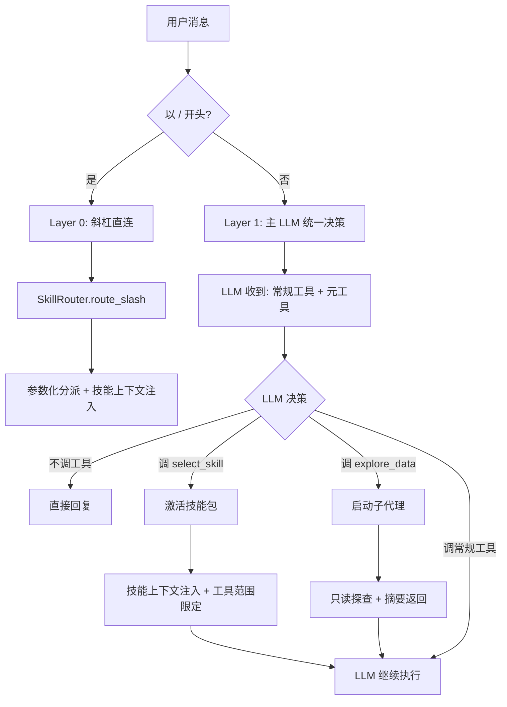
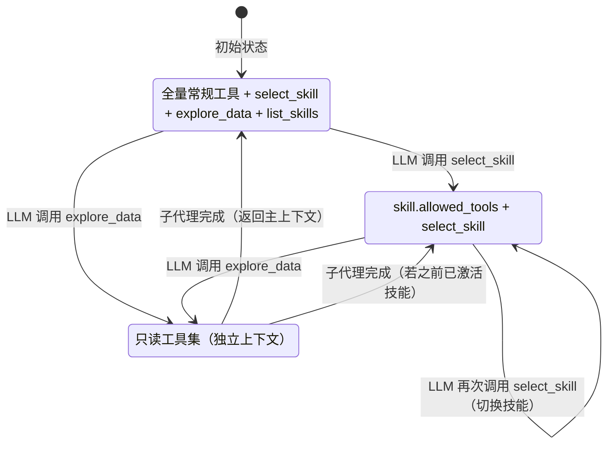

# 设计文档：LLM-Native 路由与子代理架构重构

## 概述

本设计将 ExcelManus 的路由架构从"算法打分路由"重构为"LLM-Native 路由"。核心思路是将路由决策权从算法交还给 LLM，通过 `select_skill` 和 `explore_data` 两个元工具让 LLM 自主选择技能包和启动子代理。

重构后的决策流：
```
用户消息 → Layer 0: 斜杠直连（/skill_name） → 直接分派
         → Layer 1: 主 LLM 统一决策 → LLM 自主选择 select_skill / explore_data / 直接回复
```

## 架构

### 整体架构图



### 工具范围状态机



### 关键设计决策

| 决策 | 选择 | 理由 |
|------|------|------|
| 路由决策者 | LLM（通过元工具） | 对齐行业方案（Claude Code、Cursor、Google ADK），LLM 天然具备意图理解能力 |
| 技能上下文注入方式 | tool result 注入 | 比 Claude Code 的两消息注入更简洁，天然支持 OpenAI API 的 tool_call 消息流 |
| 子代理触发方式 | LLM 工具调用 | 替代规则自动触发，LLM 拥有完全决策权 |
| Skill_Catalog 位置 | 嵌入 select_skill 描述 | ~500 tokens，远小于当前 skills_context_char_budget=12000 |
| 技能切换 | 允许重复调用 select_skill | 灵活性高，LLM 可根据对话进展切换技能 |

## 组件与接口

### 1. SkillRouter（简化后）

**职责**：仅负责斜杠直连路由和技能目录生成。

```python
class SkillRouter:
    """简化后的技能路由器。"""

    def __init__(self, config: ExcelManusConfig, loader: SkillpackLoader) -> None: ...

    async def route(
        self,
        user_message: str,
        *,
        slash_command: str | None = None,
        raw_args: str | None = None,
        file_paths: list[str] | None = None,
        blocked_skillpacks: set[str] | None = None,
    ) -> SkillMatchResult:
        """执行路由：仅处理斜杠直连，非斜杠返回 fallback。"""
        ...

    def build_skill_catalog(
        self,
        blocked_skillpacks: set[str] | None = None,
    ) -> tuple[str, list[str]]:
        """生成技能目录摘要和技能名称列表。
        
        返回:
            (catalog_text, skill_names) 元组
        """
        ...
```

**删除的方法**：
- `_prefilter_candidates`、`_score_triggers`、`_score_description`、`_tokenize`、`_score_file_patterns`
- `_build_fork_plan`、`_decorate_result`
- `_llm_select`、`_filter_auto_routable_skillpacks`
- `confirm_with_llm` 参数

**保留的方法**：
- `_find_skill_by_name`、`_build_parameterized_result`、`_apply_selection_limit`
- `_collect_candidate_file_paths`、`_extract_excel_paths`
- `_detect_large_excel_files`、`_resolve_path_in_workspace`、`_format_size`
- `_build_skill_catalog`（从 staticmethod 提升为实例方法）
- `_fallback_skillpack`

### 2. AgentEngine（新增元工具处理）

**新增方法**：

```python
class AgentEngine:
    # 新增属性
    _active_skill: Skillpack | None  # 当前激活的技能包
    _tool_scope_state: Literal["inactive", "skill_active", "subagent"]  # 工具范围状态

    def _build_meta_tools(self) -> list[dict[str, Any]]:
        """生成 select_skill + explore_data 的 OpenAI 工具定义。"""
        ...

    async def _handle_select_skill(self, skill_name: str, reason: str = "") -> str:
        """处理 select_skill 工具调用：加载技能上下文，限定工具范围。"""
        ...

    async def _handle_explore_data(self, task: str, file_paths: list[str] | None = None) -> str:
        """处理 explore_data 工具调用：启动只读子代理。"""
        ...

    def _build_explorer_system_prompt(self, task: str, file_paths: list[str]) -> str:
        """构建探查子代理的系统提示。"""
        ...

    def _get_current_tool_scope(self) -> list[str]:
        """根据当前状态返回工具范围。"""
        ...

    async def _execute_subagent_loop(
        self,
        *,
        system_prompt: str,
        tool_scope: list[str],
        max_iterations: int,
    ) -> str:
        """子代理执行循环（从 _execute_fork_plan_loop 重构）。"""
        ...
```

**删除的方法**：
- `_run_fork_subagent_if_needed`
- `_execute_fork_plan_loop`（重构为 `_execute_subagent_loop`）
- `_build_fork_system_prompt`
- `_attach_fork_summary`
- `_confirm_with_llm`

### 3. 元工具调用处理流程

在 `_tool_calling_loop` 中，当检测到 `select_skill` 或 `explore_data` 工具调用时，AgentEngine 需要特殊处理：

```python
async def _execute_tool_call(self, tc, tool_scope, on_event, iteration):
    tool_name = tc.function.name
    
    if tool_name == "select_skill":
        # 元工具：不走 ToolRegistry，直接处理
        result = await self._handle_select_skill(
            skill_name=args["skill_name"],
            reason=args.get("reason", ""),
        )
        # 更新工具范围状态
        return ToolCallResult(...)
    
    if tool_name == "explore_data":
        # 元工具：启动子代理
        result = await self._handle_explore_data(
            task=args["task"],
            file_paths=args.get("file_paths"),
        )
        return ToolCallResult(...)
    
    # 常规工具：走 ToolRegistry
    ...
```

### 4. 工具范围管理逻辑

```python
def _get_current_tool_scope(self) -> list[str]:
    """根据当前状态返回工具范围。"""
    if self._active_skill is not None:
        # 已激活技能：技能工具 + select_skill
        scope = list(self._active_skill.allowed_tools)
        if "select_skill" not in scope:
            scope.append("select_skill")
        return scope
    
    # 未激活：全量常规工具 + 元工具
    all_tools = self._all_tool_names()
    meta_tools = ["select_skill", "explore_data", "list_skills"]
    for mt in meta_tools:
        if mt not in all_tools:
            all_tools.append(mt)
    return all_tools
```

## 数据模型

### 修改：SkillMatchResult

```python
@dataclass(frozen=True)
class SkillMatchResult:
    """Skill 路由结果。"""
    skills_used: list[str]
    tool_scope: list[str]
    route_mode: str
    system_contexts: list[str] = field(default_factory=list)
    parameterized: bool = False
    # 删除: fork_plan: ForkPlan | None = None
```

### 删除：ForkPlan

整个 `ForkPlan` 数据类将被删除，因为子代理不再由路由阶段构建执行计划，而是由 LLM 在执行阶段通过 `explore_data` 工具调用触发。

### 新增：工具范围状态

AgentEngine 新增以下实例属性：

```python
# 当前激活的技能包（None 表示未激活）
self._active_skill: Skillpack | None = None

# 元工具名称常量
_META_TOOL_NAMES = ("select_skill", "explore_data", "list_skills")

# 只读工具集（子代理使用）
_READ_ONLY_TOOLS = (
    "read_excel", "analyze_data", "filter_data", "list_sheets",
    "get_file_info", "search_files", "list_directory",
    "read_text_file", "read_cell_styles",
)
```

### select_skill 工具定义结构

```python
{
    "type": "function",
    "function": {
        "name": "select_skill",
        "description": "激活一个技能包来处理当前任务。...\n可用技能：\n{skill_catalog}",
        "parameters": {
            "type": "object",
            "properties": {
                "skill_name": {
                    "type": "string",
                    "description": "要激活的技能名称",
                    "enum": ["data_basic", "chart_basic", ...]
                },
                "reason": {
                    "type": "string",
                    "description": "选择该技能的原因（一句话）"
                }
            },
            "required": ["skill_name"]
        }
    }
}
```

### explore_data 工具定义结构

```python
{
    "type": "function",
    "function": {
        "name": "explore_data",
        "description": "启动只读数据探索子代理...",
        "parameters": {
            "type": "object",
            "properties": {
                "task": {
                    "type": "string",
                    "description": "探查任务描述"
                },
                "file_paths": {
                    "type": "array",
                    "items": {"type": "string"},
                    "description": "要探查的文件路径列表"
                }
            },
            "required": ["task"]
        }
    }
}
```


## 正确性属性

*正确性属性是一种在系统所有有效执行中都应成立的特征或行为——本质上是关于系统应该做什么的形式化陈述。属性是人类可读规范与机器可验证正确性保证之间的桥梁。*

基于需求文档中的验收标准，经过 prework 分析和冗余消除，提炼出以下可测试属性：

### Property 1：斜杠直连路由正确性

*对于任意*已注册的技能名称和任意用户输入，当用户输入以 `/{skill_name}` 开头时，SkillRouter 应返回 `slash_direct` 路由模式且 skills_used 包含该技能；当技能名称不存在时，应返回 `slash_not_found` 路由模式。

**Validates: Requirements 1.1, 1.2**

### Property 2：斜杠命令名称归一化

*对于任意*技能名称，将其转换为带有随机大小写、连字符或下划线变体的形式后，通过斜杠命令路由应仍能正确匹配到原始技能。

**Validates: Requirements 1.3**

### Property 3：Skill_Catalog 完整性

*对于任意*一组已加载的技能包，`_build_meta_tools` 生成的 `select_skill` 工具定义中，描述文本应包含每个技能的 name 和 description，且 `skill_name` 参数的 enum 值应等于所有技能名称的集合。

**Validates: Requirements 2.2, 6.2, 8.2**

### Property 4：select_skill 有效调用返回技能上下文

*对于任意*已注册的技能名称，调用 `_handle_select_skill(skill_name)` 应返回包含该技能 `render_context()` 输出内容的字符串结果。

**Validates: Requirements 2.3**

### Property 5：select_skill 无效调用返回错误

*对于任意*不在已注册技能列表中的字符串，调用 `_handle_select_skill(skill_name)` 应返回包含"未找到技能"的错误提示。

**Validates: Requirements 2.4**

### Property 6：工具范围状态转换正确性

*对于任意*技能包 A 和 B：
- 初始状态下，`_get_current_tool_scope()` 应返回全量常规工具加上元工具（select_skill、explore_data、list_skills）
- 激活技能 A 后，工具范围应等于 A.allowed_tools + ["select_skill"]
- 再激活技能 B 后，工具范围应变为 B.allowed_tools + ["select_skill"]

**Validates: Requirements 2.5, 4.1, 4.2, 4.4, 6.5**

### Property 7：select_skill 记录到已加载集合

*对于任意*有效技能名称，调用 `_handle_select_skill` 后，该名称应出现在 `_loaded_skill_names` 集合中。

**Validates: Requirements 2.7**

### Property 8：子代理只读工具集约束

*对于任意* `explore_data` 调用，传递给子代理执行循环的工具范围应是 `_READ_ONLY_TOOLS` 的子集，不包含任何写入类工具。

**Validates: Requirements 3.2, 4.3**

## 错误处理

### 元工具调用错误

| 场景 | 处理方式 |
|------|---------|
| `select_skill` 传入无效技能名 | 返回错误提示"未找到技能: {name}"，不改变工具范围状态 |
| `select_skill` 参数解析失败 | 返回 JSON 解析错误，由现有 `_execute_tool_call` 错误处理覆盖 |
| `explore_data` 参数缺失 | 返回参数错误提示，不启动子代理 |

### 子代理错误

| 场景 | 处理方式 |
|------|---------|
| 子代理连续工具调用失败达到熔断阈值 | 提前终止，返回错误摘要给主 LLM |
| 子代理达到最大迭代次数 | 终止并返回有限摘要 |
| 子代理 LLM API 调用失败 | 异常向上传播，由主循环的异常处理捕获 |

### 路由错误

| 场景 | 处理方式 |
|------|---------|
| 斜杠命令未匹配技能 | 返回 slash_not_found 路由模式 |
| SkillpackLoader 加载失败 | 保留现有的软校验告警机制，不影响其他技能 |

## 测试策略

### 属性测试（Property-Based Testing）

使用 `hypothesis` 库，每个属性测试至少运行 100 次迭代。

| 属性 | 测试文件 | 说明 |
|------|---------|------|
| Property 1 | `tests/test_pbt_llm_routing.py` | 生成随机技能名和用户输入，验证斜杠路由正确性 |
| Property 2 | `tests/test_pbt_llm_routing.py` | 生成名称变体（大小写、连字符、下划线），验证归一化 |
| Property 3 | `tests/test_pbt_llm_routing.py` | 生成随机技能包集合，验证 Catalog 完整性 |
| Property 4 | `tests/test_pbt_llm_routing.py` | 从已注册技能中随机选择，验证上下文返回 |
| Property 5 | `tests/test_pbt_llm_routing.py` | 生成随机无效名称，验证错误提示 |
| Property 6 | `tests/test_pbt_llm_routing.py` | 生成随机技能对，验证状态转换 |
| Property 7 | `tests/test_pbt_llm_routing.py` | 随机选择技能调用，验证记录行为 |
| Property 8 | `tests/test_pbt_llm_routing.py` | 验证子代理工具集约束 |

每个属性测试标注格式：`Feature: llm-native-routing, Property N: {property_text}`

### 单元测试

| 测试场景 | 说明 |
|---------|------|
| 元工具定义结构 | 验证 select_skill 和 explore_data 的 JSON schema 结构正确 |
| 子代理熔断 | 模拟连续失败，验证熔断行为 |
| 子代理迭代上限 | 设置低迭代上限，验证终止行为 |
| 事件发射 | 验证 SUBAGENT_START/SUMMARY/END 事件正确发射 |
| 控制命令 | 验证 /fullAccess、/subagent 命令行为不变 |
| 向后兼容 | 验证斜杠命令、SKILL.md 加载等现有功能不受影响 |

### 测试配置

- 属性测试库：`hypothesis`
- 最小迭代次数：100（`@settings(max_examples=100)`）
- 测试文件命名：`tests/test_pbt_llm_routing.py`（属性测试）、`tests/test_llm_routing.py`（单元测试）
- 运行命令：`pytest tests/test_pbt_llm_routing.py tests/test_llm_routing.py`
