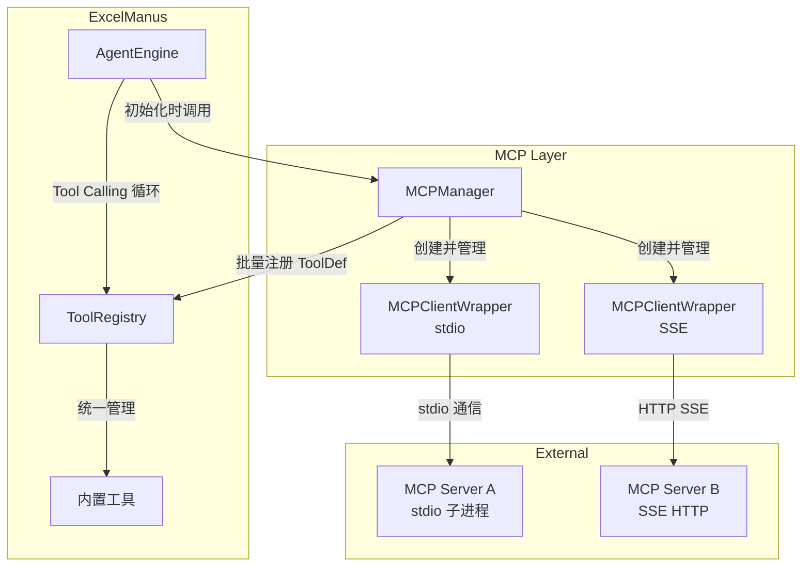

# 设计文档：MCP Client 集成

## 概述

本设计为 ExcelManus Agent 框架添加 MCP（Model Context Protocol）Client 能力。核心思路是：在 AgentEngine 初始化阶段，根据配置文件连接外部 MCP Server，发现远程工具，将其包装为 `ToolDef` 注册到现有 `ToolRegistry`，使 LLM 在 Tool Calling 循环中无缝调用远程工具。

设计遵循以下原则：
- **最小侵入**：新增独立模块 `excelmanus/mcp/`，不修改现有 `ToolDef` 和 `ToolRegistry` 的接口
- **故障隔离**：MCP 连接失败不影响 Agent 正常启动和内置工具使用
- **统一抽象**：远程工具通过 `ToolDef.func` 闭包封装，对 ToolRegistry 和 AgentEngine 完全透明

## 架构



**数据流**：
1. `AgentEngine.__init__()` 调用 `MCPManager.initialize()`
2. `MCPManager` 读取配置文件，为每个 MCP Server 创建 `MCPClientWrapper`
3. 每个 `MCPClientWrapper` 连接 Server 并调用 `tools/list` 获取工具列表
4. `MCPManager` 将远程工具转换为 `ToolDef`（func 为异步调用闭包），批量注册到 `ToolRegistry`
5. LLM 调用远程工具时，`ToolRegistry.call_tool()` 执行闭包，闭包内部通过 MCP 协议转发请求

## 组件与接口

### 1. MCPServerConfig（数据模型）

MCP Server 的配置定义，从 JSON 配置文件解析。

```python
@dataclass
class MCPServerConfig:
    """单个 MCP Server 的连接配置。"""
    name: str                          # 服务器名称，用于工具前缀
    transport: Literal["stdio", "sse"] # 传输方式
    command: str | None = None         # stdio: 启动命令
    args: list[str] | None = None      # stdio: 命令参数
    env: dict[str, str] | None = None  # stdio: 环境变量
    url: str | None = None             # sse: 端点 URL
    timeout: int = 30                  # 工具调用超时（秒）
```

### 2. MCPConfigLoader（配置加载）

负责查找和解析 MCP 配置文件。

```python
class MCPConfigLoader:
    """MCP 配置文件加载器。"""

    @staticmethod
    def load(config_path: str | None = None,
             workspace_root: str = ".") -> list[MCPServerConfig]:
        """加载 MCP Server 配置列表。

        搜索顺序：
        1. EXCELMANUS_MCP_CONFIG 环境变量指定的路径
        2. config_path 参数
        3. {workspace_root}/mcp.json
        4. ~/.excelmanus/mcp.json

        返回空列表表示无配置或配置文件不存在。
        """

    @staticmethod
    def _parse_config(data: dict) -> list[MCPServerConfig]:
        """解析 JSON 配置为 MCPServerConfig 列表。
        格式不合法的条目记录警告并跳过。
        """

    @staticmethod
    def _validate_server_config(entry: dict) -> MCPServerConfig | None:
        """校验单个 Server 配置，返回 None 表示无效。"""
```

**配置文件格式**（`mcp.json`）：

```json
{
  "mcpServers": {
    "filesystem": {
      "transport": "stdio",
      "command": "npx",
      "args": ["-y", "@modelcontextprotocol/server-filesystem", "/tmp"],
      "env": {}
    },
    "web-search": {
      "transport": "sse",
      "url": "http://localhost:8080/sse",
      "timeout": 60
    }
  }
}
```

### 3. MCPClientWrapper（单连接封装）

封装与单个 MCP Server 的连接、工具发现和工具调用。

```python
class MCPClientWrapper:
    """单个 MCP Server 的客户端封装。"""

    def __init__(self, config: MCPServerConfig) -> None:
        self._config = config
        self._session: ClientSession | None = None
        self._tools: list[dict] = []  # 原始工具列表缓存

    async def connect(self) -> None:
        """建立与 MCP Server 的连接。
        stdio: 启动子进程，通过 stdin/stdout 通信。
        sse: 连接到 HTTP SSE 端点。
        """

    async def discover_tools(self) -> list[dict]:
        """调用 tools/list 获取远程工具定义。
        返回 MCP 协议格式的工具列表。
        """

    async def call_tool(self, tool_name: str, arguments: dict) -> str:
        """调用远程工具并返回结果字符串。
        tool_name 为原始名称（不含前缀）。
        超时由 config.timeout 控制。
        """

    async def close(self) -> None:
        """关闭连接，释放资源。"""

    @property
    def is_connected(self) -> bool:
        """连接是否处于活跃状态。"""
```

### 4. MCPManager（管理器）

统一管理所有 MCP Server 连接和工具注册。

```python
class MCPManager:
    """MCP Client 管理器，协调多个 MCP Server 的连接和工具注册。"""

    def __init__(self, workspace_root: str = ".") -> None:
        self._workspace_root = workspace_root
        self._clients: dict[str, MCPClientWrapper] = {}

    async def initialize(self, registry: ToolRegistry) -> None:
        """加载配置 → 连接所有 Server → 注册远程工具到 ToolRegistry。
        任何单个 Server 的失败不影响其余 Server。
        """

    async def shutdown(self) -> None:
        """关闭所有 MCP Server 连接。"""

    def _make_tool_def(self,
                       server_name: str,
                       client: MCPClientWrapper,
                       tool: dict) -> ToolDef | None:
        """将 MCP 工具定义转换为 ToolDef。
        工具名格式：mcp_{server_name}_{original_name}
        func 为同步包装的异步调用闭包。
        """

    @property
    def connected_servers(self) -> list[str]:
        """返回已连接的 Server 名称列表。"""
```

### 5. AgentEngine 集成点

在 `AgentEngine.__init__()` 中增加 MCP 初始化：

```python
# engine.py 中新增（伪代码）
class AgentEngine:
    def __init__(self, config, registry, ...):
        # ... 现有初始化 ...
        self._mcp_manager = MCPManager(config.workspace_root)

    async def initialize_mcp(self) -> None:
        """异步初始化 MCP 连接（需在 event loop 中调用）。"""
        await self._mcp_manager.initialize(self._registry)

    async def shutdown_mcp(self) -> None:
        """关闭 MCP 连接。"""
        await self._mcp_manager.shutdown()
```

由于 `AgentEngine.__init__()` 是同步方法，MCP 的异步初始化需要在首次 `chat()` 调用前或由调用方（CLI/API）显式调用 `initialize_mcp()`。

### 6. 异步到同步桥接

`ToolDef.func` 是同步调用签名，但 MCP 工具调用是异步的。需要桥接：

```python
def _make_tool_func(client: MCPClientWrapper,
                    original_name: str,
                    timeout: int) -> Callable[..., str]:
    """创建同步包装函数，内部通过 event loop 执行异步调用。"""
    def tool_func(**kwargs: Any) -> str:
        loop = asyncio.get_event_loop()
        if loop.is_running():
            # 在已有 event loop 中，使用 asyncio.ensure_future + 同步等待
            import concurrent.futures
            with concurrent.futures.ThreadPoolExecutor() as pool:
                future = pool.submit(
                    asyncio.run,
                    asyncio.wait_for(
                        client.call_tool(original_name, kwargs),
                        timeout=timeout,
                    )
                )
                return future.result()
        else:
            return asyncio.run(
                asyncio.wait_for(
                    client.call_tool(original_name, kwargs),
                    timeout=timeout,
                )
            )
    return tool_func
```

## 数据模型

### MCP 配置文件 Schema

```json
{
  "$schema": "http://json-schema.org/draft-07/schema#",
  "type": "object",
  "properties": {
    "mcpServers": {
      "type": "object",
      "additionalProperties": {
        "type": "object",
        "properties": {
          "transport": {
            "type": "string",
            "enum": ["stdio", "sse"]
          },
          "command": { "type": "string" },
          "args": {
            "type": "array",
            "items": { "type": "string" }
          },
          "env": {
            "type": "object",
            "additionalProperties": { "type": "string" }
          },
          "url": { "type": "string" },
          "timeout": { "type": "integer", "minimum": 1 }
        },
        "required": ["transport"]
      }
    }
  },
  "required": ["mcpServers"]
}
```

### 工具名映射

| MCP Server 名称 | 原始工具名 | 注册到 ToolRegistry 的名称 |
|---|---|---|
| `filesystem` | `read_file` | `mcp_filesystem_read_file` |
| `web-search` | `search` | `mcp_web_search_search` |

名称转换规则：
- Server 名称中的 `-` 替换为 `_`（保持 Python 标识符兼容）
- 格式：`mcp_{normalized_server_name}_{original_tool_name}`

### ToolDef 字段映射

| MCP 工具字段 | ToolDef 字段 | 转换规则 |
|---|---|---|
| `name` | `name` | 添加 `mcp_{server}_` 前缀 |
| `description` | `description` | 直接映射，前缀 `[MCP:{server}]` |
| `inputSchema` | `input_schema` | 直接映射（已是 JSON Schema） |
| — | `func` | 异步调用闭包 |
| — | `max_result_chars` | 默认 5000（远程工具结果可能较长） |


## 正确性属性

*属性是系统在所有合法执行中应保持为真的特征或行为——本质上是对系统应做什么的形式化陈述。属性是人类可读规格与机器可验证正确性保证之间的桥梁。*

### Property 1: 配置解析 round-trip

*对于任何*合法的 MCP 配置字典（包含 stdio 和 sse 类型的 Server 定义），解析为 `MCPServerConfig` 列表后，每个配置项的 name、transport、command、args、env、url、timeout 字段应与原始 JSON 中的对应值一致。

**Validates: Requirements 1.1, 1.3, 1.4, 1.5**

### Property 2: 非法配置过滤

*对于任何*包含合法和非法条目的混合 MCP 配置列表，解析结果应只包含合法条目，且合法条目的数量等于输入中合法条目的数量。非法条目（缺少必填字段、transport 值非法、stdio 缺少 command、sse 缺少 url）应被跳过。

**Validates: Requirements 1.6, 3.4**

### Property 3: 工具定义转换正确性

*对于任何*合法的 MCP 工具定义（包含 name、description、inputSchema）和任何合法的 server_name，转换后的 `ToolDef` 应满足：name 等于 `mcp_{normalized_server_name}_{original_name}`，description 包含原始描述，input_schema 与原始 inputSchema 一致。

**Validates: Requirements 3.2, 3.3, 4.1**

### Property 4: 工具名前缀 round-trip

*对于任何*合法的 server_name 和 tool_name，添加前缀（`mcp_{server}_{name}`）后再还原（移除前缀）应得到原始的 server_name 和 tool_name。

**Validates: Requirements 5.2**

### Property 5: 工具结果字符串转换

*对于任何* MCP 工具调用返回的结果（包含 content 列表），转换为字符串后应包含所有 text 类型 content 的文本内容。

**Validates: Requirements 5.3**

### Property 6: 连接故障隔离

*对于任何* N 个 MCP Server 配置（其中 M 个连接成功、N-M 个连接失败），初始化完成后成功连接的 Server 数量应等于 M，且所有成功 Server 的工具应被正确注册。

**Validates: Requirements 2.4**

## 错误处理

| 错误场景 | 处理策略 | 对应需求 |
|---|---|---|
| 配置文件不存在 | 静默跳过，返回空配置列表 | 1.8 |
| 配置文件 JSON 格式错误 | 记录 ERROR 日志，返回空配置列表 | 1.6 |
| 单个 Server 配置字段缺失 | 记录 WARNING 日志，跳过该条目 | 1.6 |
| MCP Server 连接失败 | 记录 ERROR 日志，跳过该 Server | 2.4 |
| MCP Server 连接超时 | 同连接失败处理 | 2.4 |
| 远程工具 schema 无效 | 记录 WARNING 日志，跳过该工具 | 3.4 |
| 远程工具名与内置工具冲突 | 记录 WARNING 日志，跳过该工具 | 4.3 |
| 远程工具调用超时 | 返回超时错误字符串 | 5.4 |
| 远程工具调用返回错误 | 抛出 ToolExecutionError | 5.5 |
| MCP Server 运行时断连 | 工具调用时捕获异常，返回错误信息 | 2.6 |

## 测试策略

### 测试框架

- **单元测试**：pytest + pytest-asyncio
- **属性测试**：hypothesis（已在项目 dev 依赖中）
- **Mock**：unittest.mock 用于模拟 MCP SDK 接口

### 属性测试（Property-Based Testing）

使用 hypothesis 库，每个属性测试至少运行 100 次迭代。

每个正确性属性对应一个独立的属性测试函数，标注格式：
```
# Feature: mcp-client-integration, Property N: {property_text}
```

属性测试覆盖：
- **Property 1**：生成随机合法配置字典 → 解析 → 验证字段一致性
- **Property 2**：生成混合合法/非法配置 → 解析 → 验证只保留合法项
- **Property 3**：生成随机 MCP 工具定义和 server_name → 转换 → 验证 ToolDef 字段
- **Property 4**：生成随机 server_name 和 tool_name → 添加前缀 → 还原 → 验证一致
- **Property 5**：生成随机 MCP 结果内容 → 转换 → 验证文本包含
- **Property 6**：生成 N 个 Server 配置（随机标记成功/失败）→ mock 连接 → 验证成功数量

### 单元测试

单元测试聚焦于具体示例和边界情况：
- 配置文件搜索优先级（1.2, 1.7）
- 配置文件不存在时的静默跳过（1.8）
- 工具名冲突处理（4.3）
- 工具调用超时处理（5.4）
- 工具调用错误处理（5.5）
- 日志输出验证（7.1, 7.2, 7.3）
- 资源清理验证（2.5）

### 测试文件组织

```
tests/
├── test_mcp_config.py          # MCPConfigLoader 单元测试
├── test_mcp_manager.py         # MCPManager 单元测试（含 mock）
├── test_pbt_mcp.py             # MCP 属性测试
```
