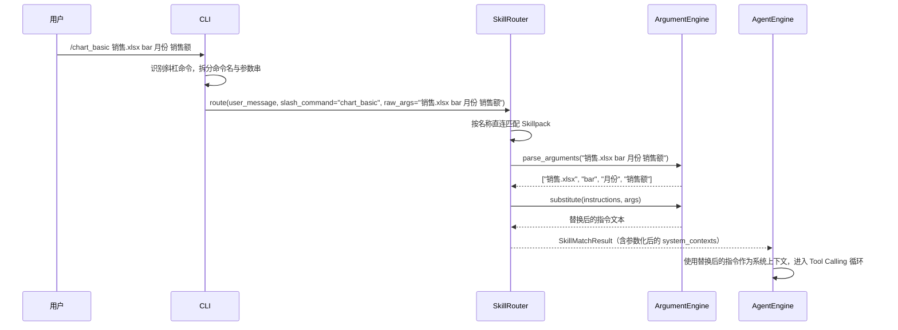
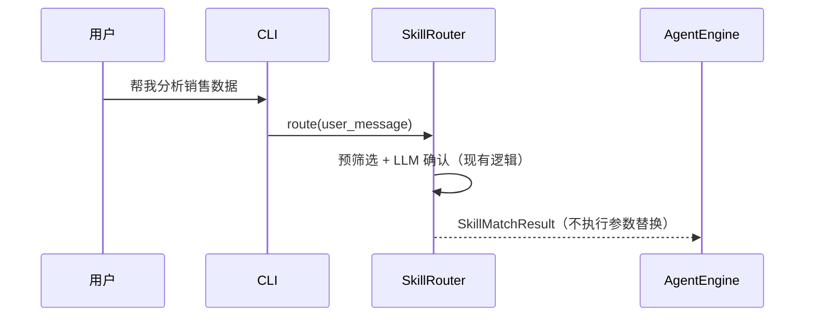
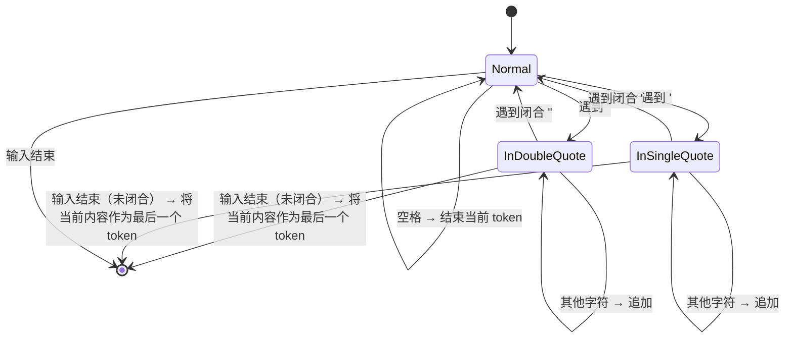

# 设计文档：Skillpack 参数化模板

## 概述

本设计为 ExcelManus 的 Skillpack 系统添加 `$ARGUMENTS` 参数化模板能力。核心思路是在现有 Skillpack 加载、路由、渲染流程中插入一个轻量的"参数解析 + 占位符替换"层，同时扩展 CLI 斜杠命令注册机制，使 Skillpack 可作为斜杠命令直接调用。

变更范围集中在 4 个模块：
1. `models.py` — 数据模型新增 `argument_hint` 字段
2. `loader.py` — 解析 frontmatter 新字段
3. 新增 `arguments.py` — 参数解析与占位符替换引擎
4. `router.py` — 支持斜杠命令直连路由 + 参数传递
5. `cli.py` — 动态注册 Skillpack 斜杠命令 + 自动补全

设计原则：最小侵入，不改变现有自然语言路由行为。

## 架构

### 数据流



### 自然语言路由（无变更）



## 组件与接口

### 1. ArgumentEngine（新增模块：`excelmanus/skillpacks/arguments.py`）

纯函数式设计，无状态，负责两个职责：

```python
def parse_arguments(raw: str) -> list[str]:
    """将原始参数字符串解析为位置参数列表。
    
    规则：
    - 按空格分隔
    - 支持双引号和单引号包裹含空格的参数
    - 引号未闭合时，将剩余文本视为单个参数（容错）
    """

def substitute(template: str, args: list[str]) -> str:
    """将模板中的占位符替换为实际参数值。
    
    占位符优先级（从长到短匹配）：
    - $ARGUMENTS — 替换为完整参数字符串（所有参数用空格拼接）
    - $ARGUMENTS[N] — 替换为第 N 个位置参数
    - $N — 替换为第 N 个位置参数（$0 等价于 $ARGUMENTS[0]）
    
    越界索引替换为空字符串。
    不含占位符的模板原样返回。
    """
```

### 2. Skillpack 数据模型扩展（`models.py`）

```python
@dataclass(frozen=True)
class Skillpack:
    # ... 现有字段 ...
    argument_hint: str = ""  # 新增：参数格式提示，如 "<file> <chart_type> <x_col> <y_col>"
```

`render_context` 方法保持不变 — 参数替换发生在 Router 层，替换后的文本直接作为 `system_contexts` 传入。

### 3. SkillpackLoader 扩展（`loader.py`）

在 `_parse_skillpack_file` 中新增对 `argument_hint` 字段的解析：

```python
argument_hint = self._get_optional_str(frontmatter, "argument_hint", default="")
```

### 4. SkillRouter 扩展（`router.py`）

新增斜杠命令直连路由路径：

```python
async def route(
    self,
    user_message: str,
    *,
    skill_hints: list[str] | None = None,
    file_paths: list[str] | None = None,
    confirm_with_llm: ConfirmWithLLM | None = None,
    blocked_skillpacks: set[str] | None = None,
    slash_command: str | None = None,   # 新增
    raw_args: str | None = None,        # 新增
) -> SkillMatchResult:
```

当 `slash_command` 非空时：
1. 按名称直接查找 Skillpack（跳过预筛选和 LLM 确认）
2. 调用 `parse_arguments(raw_args)` 解析参数
3. 调用 `substitute(skill.instructions, args)` 替换占位符
4. 构建 `SkillMatchResult`，`system_contexts` 使用替换后的文本

### 5. SkillMatchResult 扩展（`models.py`）

为支持参数化后的上下文覆盖，新增可选字段：

```python
@dataclass(frozen=True)
class SkillMatchResult:
    skills_used: list[str]
    tool_scope: list[str]
    route_mode: str
    system_contexts: list[str] = field(default_factory=list)
    parameterized: bool = False  # 新增：标记是否经过参数替换
```

### 6. CLI 扩展（`cli.py`）

#### 斜杠命令识别

在 `_repl_loop` 中，现有斜杠命令处理之后、"未知斜杠命令"提示之前，插入 Skillpack 斜杠命令检测：

```python
# 检查是否为 Skillpack 斜杠命令
if user_input.startswith("/"):
    cmd_name, _, raw_args = user_input[1:].partition(" ")
    skill = loader.get_skillpack(cmd_name)
    if skill is not None:
        # 通过 engine.chat 传递 slash_command 和 raw_args
        reply = await engine.chat(
            user_input,
            slash_command=cmd_name,
            raw_args=raw_args.strip(),
        )
        # 渲染回复...
        continue
```

#### 自动补全扩展

扩展 `_compute_inline_suggestion` 函数，在现有内置命令补全之外，增加 Skillpack 名称补全。需要将已加载的 Skillpack 名称列表传入补全逻辑。

#### /help 扩展

在帮助表格中追加 Skillpack 命令区域，显示 `/{name}` 和对应的 `argument_hint`。

### 7. AgentEngine 扩展（`engine.py`）

`chat` 方法签名新增 `slash_command` 和 `raw_args` 参数，透传给 `_route_skills`：

```python
async def chat(
    self,
    user_message: str,
    on_event: EventCallback | None = None,
    skill_hints: list[str] | None = None,
    slash_command: str | None = None,   # 新增
    raw_args: str | None = None,        # 新增
) -> str:
```

## 数据模型

### Skillpack（扩展）

| 字段 | 类型 | 默认值 | 说明 |
|------|------|--------|------|
| argument_hint | str | "" | 参数格式提示，如 `<file> <chart_type>` |

### 占位符语法

| 占位符 | 含义 | 示例 |
|--------|------|------|
| `$ARGUMENTS` | 完整参数字符串 | `"销售.xlsx bar 月份 销售额"` |
| `$ARGUMENTS[N]` | 第 N 个位置参数 | `$ARGUMENTS[0]` → `"销售.xlsx"` |
| `$N` | 第 N 个位置参数（简写） | `$0` → `"销售.xlsx"` |

### 替换正则模式

```python
# 匹配顺序：先长后短，避免 $1 误匹配 $10 的前缀
_PLACEHOLDER_PATTERN = re.compile(
    r'\$ARGUMENTS\[(\d+)\]'   # $ARGUMENTS[N]
    r'|\$ARGUMENTS'            # $ARGUMENTS
    r'|\$(\d+)'               # $N
)
```

### 参数解析状态机




## 正确性属性

*正确性属性是系统在所有合法执行路径上都应保持的特征或行为——本质上是对"系统应该做什么"的形式化陈述。属性是人类可读规格与机器可验证正确性保证之间的桥梁。*

### Property 1: argument_hint 解析一致性

*对于任意*合法的 argument_hint 字符串，将其写入 SKILL.md frontmatter 后由 SkillpackLoader 解析，得到的 Skillpack 对象的 `argument_hint` 属性应与原始字符串一致。

**Validates: Requirements 1.1**

### Property 2: 非字符串 argument_hint 触发校验错误

*对于任意*非字符串类型的值（整数、布尔值、列表），将其作为 `argument_hint` 字段写入 frontmatter 后解析，SkillpackLoader 应抛出 `SkillpackValidationError`。

**Validates: Requirements 1.3**

### Property 3: 占位符替换正确性

*对于任意*参数列表和包含占位符的模板文本，`substitute(template, args)` 的结果中：
- 所有 `$ARGUMENTS` 被替换为完整参数字符串（空格拼接）
- 所有 `$N` 和 `$ARGUMENTS[N]` 被替换为对应位置参数（越界时为空字符串）
- 结果中不再包含任何未替换的占位符

**Validates: Requirements 2.1, 2.2**

### Property 4: 无占位符模板恒等

*对于任意*不包含占位符（`$ARGUMENTS`、`$ARGUMENTS[N]`、`$N`）的文本和任意参数列表，`substitute(text, args)` 应返回与原文完全相同的文本。

**Validates: Requirements 2.5**

### Property 5: 参数解析 round-trip

*对于任意*不含引号字符的非空字符串 token 列表，将每个 token 按需加引号后用空格拼接为参数字符串，再由 `parse_arguments` 解析，应得到与原始 token 列表相同的结果。

**Validates: Requirements 5.1, 5.2**

### Property 6: CLI 斜杠命令解析

*对于任意*已注册的 Skillpack 名称和任意参数字符串，用户输入 `/{name} {args}` 时，CLI 的命令解析逻辑应正确提取出命令名 `name` 和原始参数串 `args`。

**Validates: Requirements 3.2**

### Property 7: 自动补全匹配

*对于任意*已注册的 Skillpack 名称，当用户输入该名称的任意非空前缀（以 `/` 开头）时，自动补全函数应返回包含该名称的补全建议。

**Validates: Requirements 3.5**

### Property 8: 路由器斜杠命令参数传递

*对于任意*包含占位符的 Skillpack 和任意参数列表，通过 `slash_command` 路由时，返回的 `SkillMatchResult.system_contexts` 应包含经过参数替换后的指令文本，且 `parameterized` 标记为 `True`。

**Validates: Requirements 4.1**

### Property 9: 自然语言路由行为不变

*对于任意*不包含 `slash_command` 参数的路由调用，SkillRouter 的行为应与参数化功能添加前完全一致——不执行任何参数替换，`parameterized` 为 `False`。

**Validates: Requirements 4.3**

## 错误处理

| 场景 | 处理方式 |
|------|----------|
| `argument_hint` 类型非字符串 | `SkillpackLoader` 抛出 `SkillpackValidationError` |
| 斜杠命令名称不匹配任何 Skillpack 且非内置命令 | CLI 显示"未知命令"提示，列出可用命令 |
| 位置参数索引越界 | 替换为空字符串，不报错 |
| 引号未闭合 | 将剩余文本视为单个参数，不报错 |
| 替换后正文为空/纯空白 | 返回空字符串 |
| 无参数调用但 `argument_hint` 非空 | CLI 显示参数提示，继续执行（占位符替换为空字符串） |

## 测试策略

### 属性测试（Property-Based Testing）

使用 `hypothesis` 库，每个属性测试至少运行 100 次迭代。

| 属性 | 测试文件 | 标签 |
|------|----------|------|
| Property 1 | `tests/test_pbt_skillpack_args.py` | Feature: skillpack-arguments, Property 1: argument_hint 解析一致性 |
| Property 2 | `tests/test_pbt_skillpack_args.py` | Feature: skillpack-arguments, Property 2: 非字符串 argument_hint 触发校验错误 |
| Property 3 | `tests/test_pbt_skillpack_args.py` | Feature: skillpack-arguments, Property 3: 占位符替换正确性 |
| Property 4 | `tests/test_pbt_skillpack_args.py` | Feature: skillpack-arguments, Property 4: 无占位符模板恒等 |
| Property 5 | `tests/test_pbt_skillpack_args.py` | Feature: skillpack-arguments, Property 5: 参数解析 round-trip |
| Property 6 | `tests/test_pbt_skillpack_args.py` | Feature: skillpack-arguments, Property 6: CLI 斜杠命令解析 |
| Property 7 | `tests/test_pbt_skillpack_args.py` | Feature: skillpack-arguments, Property 7: 自动补全匹配 |
| Property 8 | `tests/test_pbt_skillpack_args.py` | Feature: skillpack-arguments, Property 8: 路由器斜杠命令参数传递 |
| Property 9 | `tests/test_pbt_skillpack_args.py` | Feature: skillpack-arguments, Property 9: 自然语言路由行为不变 |

### 单元测试

| 测试范围 | 测试文件 | 覆盖内容 |
|----------|----------|----------|
| ArgumentEngine | `tests/test_arguments.py` | 边界情况：空输入、引号未闭合、越界索引、纯空白结果 |
| SkillpackLoader | `tests/test_loader_argument_hint.py` | argument_hint 缺失时默认值、类型校验 |
| CLI 命令分发 | `tests/test_cli_slash_commands.py` | 内置命令优先级、未知命令提示、/help 输出 |
| SkillRouter | `tests/test_router_slash.py` | 斜杠命令直连路由、参数传递、自然语言路由不变 |

### 测试互补性

- 属性测试覆盖通用正确性（所有合法输入）
- 单元测试覆盖具体边界情况和错误条件
- 两者互补，共同保证功能正确性
