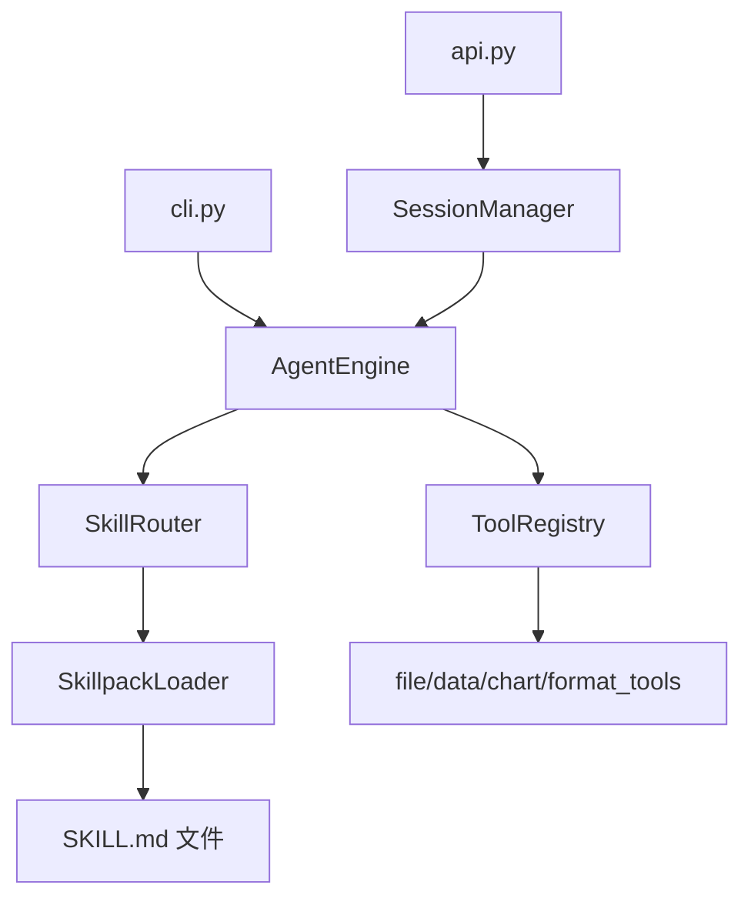

# 设计文档

## 概述

本设计文档针对 ExcelManus v3 重构后代码审查发现的 8 个问题，提供具体的技术方案。所有变更遵循最小侵入原则，保持现有外部行为不变。

涉及的核心模块：
- `excelmanus/engine.py` — AgentEngine（问题 1、2、3）
- `excelmanus/tools/registry.py` — ToolRegistry（问题 2）
- `excelmanus/skillpacks/loader.py` — SkillpackLoader / Frontmatter 解析器（问题 5）
- `excelmanus/skillpacks/router.py` — SkillRouter（问题 6）
- `excelmanus/api.py` — FastAPI 服务（问题 7）
- `excelmanus/config.py` — ExcelManusConfig（问题 7）
- `excelmanus/skills/` — 旧 skills 目录（问题 4）
- `.kiro/steering/` — Steering 文件（问题 8）

## 架构

当前 v3 架构为 Tools + Skillpacks 双层结构：



本次清理不改变架构层次，仅在各模块内部进行重构和增强。

## 组件与接口

### 问题 1：拆分 AgentEngine.chat()

当前 `chat()` 方法约 230 行，承担了路由、消息管理、Tool Calling 循环、参数解析、授权检查、熔断逻辑和事件发射等多重职责。

拆分方案：

```python
class AgentEngine:
    async def chat(self, user_message, on_event=None, skill_hints=None) -> str:
        """编排层：路由 → 消息管理 → 调用循环 → 返回结果。"""
        route_result = await self._route_skills(user_message, skill_hints)
        self._last_route_result = route_result
        self._memory.add_user_message(user_message)
        # ... 日志 ...
        return await self._tool_calling_loop(route_result, on_event)

    async def _tool_calling_loop(self, route_result, on_event) -> str:
        """迭代循环体：LLM 请求 → 工具调用遍历 → 熔断检测。"""
        tool_scope = route_result.tool_scope
        tools = self._get_openai_tools(tool_scope=tool_scope)
        # for iteration in range(1, max_iter + 1): ...
        #     response = await self._create_chat_completion_with_system_fallback(...)
        #     if not message.tool_calls: return reply
        #     for tc in message.tool_calls:
        #         result = await self._execute_tool_call(tc, tool_scope, on_event, iteration)
        #     if breaker_triggered: return breaker_reply

    async def _execute_tool_call(self, tc, tool_scope, on_event, iteration) -> ToolCallResult:
        """单个工具调用：参数解析 → 执行 → 事件发射 → 返回结果。"""
        # 解析参数、调用 registry.call_tool()、捕获异常、发射事件
```

关键约束：
- `chat()` 缩减到 ~30 行，仅做编排
- `_tool_calling_loop()` 包含迭代循环、thinking 提取、熔断逻辑
- `_execute_tool_call()` 包含参数解析、工具执行、事件发射，返回 `ToolCallResult`
- 外部行为（返回值、事件顺序、异常类型）完全不变

### 问题 2：统一授权检查

当前存在两处授权检查：
1. `chat()` 中 `tool_name not in allowed_tools` → 手动构造 JSON 错误
2. `ToolRegistry.call_tool(tool_scope=...)` → 抛出 `ToolNotAllowedError`

统一方案：
- 移除 `_execute_tool_call()` 中的手动授权检查
- 始终传递 `tool_scope` 给 `registry.call_tool()`
- 在 `_execute_tool_call()` 中捕获 `ToolNotAllowedError`，格式化为相同结构的 JSON 错误

```python
async def _execute_tool_call(self, tc, tool_scope, ...):
    try:
        result_value = await asyncio.to_thread(
            self._registry.call_tool, tool_name, arguments, tool_scope=tool_scope
        )
    except ToolNotAllowedError:
        # 格式化为 TOOL_NOT_ALLOWED JSON 错误（与当前格式一致）
    except ToolNotFoundError:
        # 格式化为工具未找到错误
    except ToolExecutionError as exc:
        # 格式化为执行错误
```

### 问题 3：移除 inspect 检测

当前 `_registry_supports_tool_scope()` 使用 `inspect.signature()` 检测 `call_tool` 是否支持 `tool_scope` 参数。在 v3 中 `ToolRegistry` 是自有代码，始终支持该参数。

方案：
- 删除 `_registry_supports_tool_scope()` 方法
- 删除 `import inspect`（如无其他用途）
- 所有 `call_tool` 调用直接传递 `tool_scope=tool_scope`

### 问题 4：清理旧 skills/ 目录

当前 `excelmanus/skills/` 包含：
- `__init__.py` — SkillRegistry 兼容层（~120 行）
- `chart_skill.py`、`data_skill.py`、`file_skill.py`、`format_skill.py`

方案：
- 删除所有 `*_skill.py` 文件
- 将 `__init__.py` 替换为迁移提示模块：

```python
"""excelmanus.skills 已在 v3 中废弃。

请迁移到 excelmanus.tools（ToolRegistry）和 excelmanus.skillpacks（SkillpackLoader/Router）。
"""

class SkillRegistry:
    def __init__(self, *args, **kwargs):
        raise ImportError(
            "SkillRegistry 已在 v3 中废弃。"
            "请使用 excelmanus.tools.ToolRegistry 和 excelmanus.skillpacks.SkillpackLoader。"
        )

class SkillRegistryError(Exception):
    pass
```

### 问题 5：增强 Frontmatter 解析器

当前 `_parse_frontmatter()` 的局限：
- 使用 `line.split(":", 1)` 解析键值对，URL 值（含 `://`）可能被错误分割 — 实际上 `split(":", 1)` 只分割第一个冒号，URL 不会被错误分割，但引号字符串不被处理
- 不支持引号包裹的字符串值
- 不支持多行字符串、嵌套对象

增强方案（不引入 pyyaml 依赖）：
- 增强 `_parse_scalar()` 支持引号字符串（去除首尾匹配的引号）
- 对不支持的语法（如 `|`、`>`、`{`）抛出明确的 `SkillpackValidationError`
- 新增 `_format_frontmatter()` 静态方法，将字典格式化回 frontmatter 文本
- 在模块文档字符串中记录支持的语法子集

```python
@staticmethod
def _parse_scalar(value: str) -> Any:
    """解析标量值，支持引号字符串。"""
    if (value.startswith('"') and value.endswith('"')) or \
       (value.startswith("'") and value.endswith("'")):
        return value[1:-1]
    # ... 原有的 bool/int/float 解析 ...

@staticmethod
def _format_frontmatter(data: dict[str, Any]) -> str:
    """将字典格式化为 frontmatter 文本。"""
    lines = []
    for key, value in data.items():
        if isinstance(value, list):
            lines.append(f"{key}:")
            for item in value:
                lines.append(f"  - {item}")
        elif isinstance(value, bool):
            lines.append(f"{key}: {'true' if value else 'false'}")
        else:
            lines.append(f"{key}: {value}")
    return "\n".join(lines)
```

### 问题 6：增强路由器预筛选

当前 `_prefilter_candidates()` 仅基于 `triggers`（精确子串匹配）和 `file_patterns`（glob 匹配）评分。

增强方案：新增 `_score_description()` 方法，基于词汇交集评分。

```python
@staticmethod
def _score_description(query: str, skill: Skillpack) -> int:
    """基于 description 的词汇交集评分。"""
    query_tokens = SkillRouter._tokenize(query)
    desc_tokens = SkillRouter._tokenize(skill.description)
    overlap = query_tokens & desc_tokens
    return len(overlap)  # 每个交集词 +1 分

@staticmethod
def _tokenize(text: str) -> set[str]:
    """分词：英文按空格/标点分割，中文按字符级 bigram 分割。"""
    # 英文 token
    tokens = set(re.findall(r"[a-zA-Z0-9_]+", text.lower()))
    # 中文 bigram
    chinese_chars = re.findall(r"[\u4e00-\u9fff]", text)
    for i in range(len(chinese_chars) - 1):
        tokens.add(chinese_chars[i] + chinese_chars[i + 1])
    # 单个中文字符也加入（支持单字匹配）
    for ch in chinese_chars:
        tokens.add(ch)
    return tokens
```

评分权重：triggers 匹配 +3 分（不变），description 交集每词 +1 分。

在 `_prefilter_candidates()` 中增加：
```python
score += self._score_description(query=query, skill=skill)
```

### 问题 7：CORS 配置提取

当前 `api.py` 硬编码 `allow_origins=["http://localhost:5173"]`。

方案：
1. `ExcelManusConfig` 新增字段：
```python
cors_allow_origins: list[str] = field(default_factory=lambda: ["http://localhost:5173"])
```

2. `load_config()` 新增解析逻辑：
```python
cors_raw = os.environ.get("EXCELMANUS_CORS_ALLOW_ORIGINS")
if cors_raw is not None:
    cors_allow_origins = [o.strip() for o in cors_raw.split(",") if o.strip()]
else:
    cors_allow_origins = ["http://localhost:5173"]
```

3. `api.py` 的 `lifespan()` 中从 config 读取：
```python
app.add_middleware(
    CORSMiddleware,
    allow_origins=_config.cors_allow_origins,
    ...
)
```

注意：由于 FastAPI 中间件需要在 app 创建时添加，而 config 在 lifespan 中加载，需要将 CORS 中间件的添加移到 lifespan 内部，或改为在模块级别加载 config。选择方案：将 CORS 中间件添加移到 lifespan 的 yield 之前。

### 问题 8：更新 Steering 文件

直接更新三个文件的内容，反映 v3 实际架构。无需特殊设计。

## 数据模型

### ExcelManusConfig 变更

```python
@dataclass(frozen=True)
class ExcelManusConfig:
    # ... 现有字段 ...
    cors_allow_origins: tuple[str, ...] = ("http://localhost:5173",)
    # 使用 tuple 而非 list，因为 frozen=True dataclass 不允许可变默认值
```

注意：由于 `ExcelManusConfig` 是 `frozen=True` 的 dataclass，默认值需要使用不可变类型。使用 `tuple` 存储，在 `api.py` 中转为 `list` 传给 CORS 中间件。

### ToolCallResult（不变）

```python
@dataclass
class ToolCallResult:
    tool_name: str
    arguments: dict[str, Any]
    result: str
    success: bool
    error: str | None = None
```

### Frontmatter 格式化输出

新增 `_format_frontmatter()` 静态方法，输入 `dict[str, Any]`，输出 frontmatter 文本字符串。支持的值类型：`str`、`int`、`float`、`bool`、`list[str | int | float | bool]`。


## 正确性属性

*属性（Property）是系统在所有合法执行中都应保持为真的特征或行为——本质上是对系统应做什么的形式化陈述。属性是人类可读规格说明与机器可验证正确性保证之间的桥梁。*

### Property 1: 未授权工具调用抛出 ToolNotAllowedError

*For any* 工具名 tool_name 和授权范围 tool_scope，如果 tool_name 不在 tool_scope 中，调用 `ToolRegistry.call_tool(tool_name, {}, tool_scope=tool_scope)` 应抛出 `ToolNotAllowedError`。

**Validates: Requirements 2.2**

### Property 2: 未授权工具错误响应格式正确

*For any* 未授权的工具调用，`_execute_tool_call()` 返回的 `ToolCallResult` 应满足：`success == False`，且 `error` 字段包含的 JSON 字符串中包含 `error_code`、`tool`、`allowed_tools`、`message` 四个键。

**Validates: Requirements 2.3, 2.4**

### Property 3: 引号字符串解析正确

*For any* 不含引号字符的字符串 s，`_parse_scalar('"' + s + '"')` 应返回 s，`_parse_scalar("'" + s + "'")` 也应返回 s。

**Validates: Requirements 5.1**

### Property 4: 不支持的 frontmatter 语法抛出异常

*For any* 包含多行字符串标记（`|`、`>`开头的值）或嵌套对象标记（`{` 开头的值）的 frontmatter 文本，`_parse_frontmatter()` 应抛出 `SkillpackValidationError`。

**Validates: Requirements 5.3**

### Property 5: Frontmatter round-trip

*For any* 合法的 frontmatter 字典（键为字符串，值为 str/int/float/bool 或其列表），`_parse_frontmatter(_format_frontmatter(d))` 应产生与 d 等价的字典。

**Validates: Requirements 5.5**

### Property 6: Description 词汇交集正向评分

*For any* Skillpack 和用户消息，如果用户消息与 Skillpack 的 description 存在至少一个词汇交集（通过 `_tokenize` 分词），则 `_score_description()` 的返回值应大于 0。

**Validates: Requirements 6.1**

### Property 7: 中文 n-gram 分词包含所有 bigram

*For any* 包含至少两个连续中文字符的字符串，`_tokenize()` 的结果应包含所有相邻中文字符对（bigram），且包含每个单独的中文字符。

**Validates: Requirements 6.2**

### Property 8: Triggers 评分权重高于 description 单词评分

*For any* Skillpack，单个 trigger 精确匹配的评分增量（+3）应大于等于 description 中单个词汇交集的评分增量（+1）。

**Validates: Requirements 6.3**

### Property 9: CORS 环境变量逗号分隔解析

*For any* 由非空非逗号字符串组成的列表 origins，将其用逗号连接后通过 CORS 解析逻辑处理，结果应等于原始列表（去除首尾空白后）。

**Validates: Requirements 7.2**

## 错误处理

| 场景 | 处理方式 |
|------|----------|
| 工具未授权（ToolNotAllowedError） | `_execute_tool_call()` 捕获，格式化为 JSON 错误，标记 success=False |
| 工具未找到（ToolNotFoundError） | `_execute_tool_call()` 捕获，格式化为错误字符串 |
| 工具执行失败（ToolExecutionError） | `_execute_tool_call()` 捕获，格式化为错误字符串 |
| JSON 参数解析失败 | `_execute_tool_call()` 内部处理，返回解析错误 |
| 连续失败触发熔断 | `_tool_calling_loop()` 检测并终止循环 |
| Frontmatter 不支持的语法 | 抛出 SkillpackValidationError，附带明确错误描述 |
| CORS 环境变量为空字符串 | 解析为空列表，CORS 中间件不允许任何跨域请求 |
| 导入旧 SkillRegistry | 实例化时抛出 ImportError，附带迁移提示 |

## 测试策略

### 测试框架

- 单元测试：pytest
- 属性测试：hypothesis（Python 属性测试库）
- 每个属性测试至少运行 100 次迭代

### 双重测试方法

**单元测试**覆盖：
- 具体示例和边界情况（如空字符串 CORS、含冒号的 frontmatter 值）
- 旧 skills 模块的 ImportError 行为
- Steering 文件内容正确性（关键字段存在性检查）
- 拆分后 chat() 方法的集成行为

**属性测试**覆盖（对应上述 9 个正确性属性）：
- Property 1: 生成随机工具名和 scope，验证 ToolNotAllowedError
- Property 2: 生成随机未授权工具调用，验证错误响应格式
- Property 3: 生成随机字符串，验证引号解析
- Property 4: 生成包含不支持语法标记的 frontmatter，验证异常
- Property 5: 生成随机 frontmatter 字典，验证 round-trip
- Property 6: 生成随机 Skillpack 和有交集的消息，验证正向评分
- Property 7: 生成随机中文字符串，验证 bigram 分词
- Property 8: 验证评分权重常量关系（triggers +3 >= description +1）
- Property 9: 生成随机 origin 列表，验证逗号分隔解析

### 属性测试标签格式

每个属性测试用注释标注：
```python
# Feature: v3-post-refactor-cleanup, Property N: {property_text}
```
