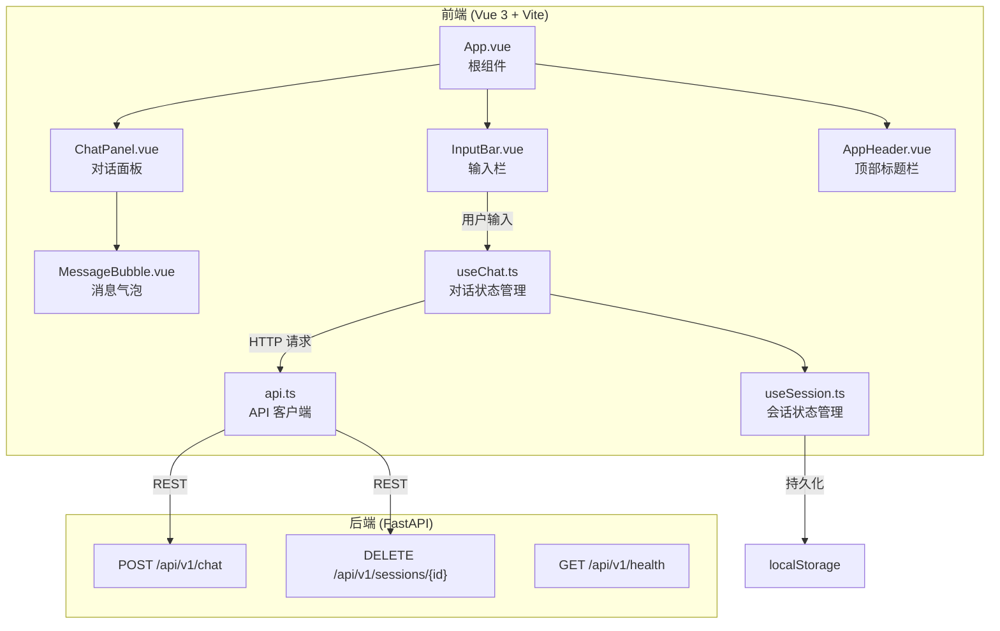
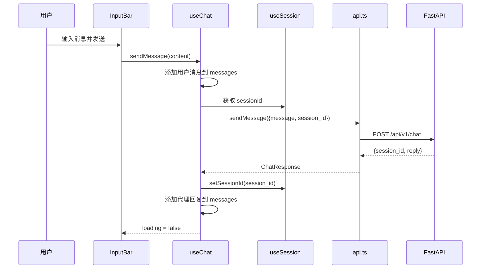

# 设计文档

## 概述

为 ExcelManus 构建一个基于 Vue 3 + TypeScript + Vite 的前端单页应用。前端采用对话式交互模式，用户通过自然语言输入 Excel 任务指令，系统调用后端 API 完成操作并展示结果。

技术选型：
- **Vue 3**：Composition API + `<script setup>` 语法
- **TypeScript**：类型安全
- **Vite**：构建工具，开发服务器支持 API 代理
- **CSS 变量**：统一配色方案，无需引入 UI 框架，保持轻量
- **markdown-it**：Markdown 渲染库，轻量且可扩展

设计决策说明：
- 不引入 Element Plus / Ant Design Vue 等重型 UI 框架，使用纯 CSS 实现美观界面，减少依赖体积
- 使用 `markdown-it` 而非 `marked` 或 `vue-markdown`，因为它更轻量且插件生态丰富
- 会话 ID 持久化到 localStorage，实现页面刷新后的会话恢复

## 架构



## 组件与接口

### 1. API 客户端 (`src/api.ts`)

```typescript
// API 请求/响应类型
interface ChatRequest {
  message: string
  session_id?: string | null
}

interface ChatResponse {
  session_id: string
  reply: string
}

interface HealthResponse {
  status: string
  version: string
  skills: string[]
}

interface ApiError {
  error: string
  error_id?: string
}

// API 客户端函数
function sendMessage(req: ChatRequest): Promise<ChatResponse>
function deleteSession(sessionId: string): Promise<void>
function checkHealth(): Promise<HealthResponse>
```

### 2. 会话管理 Composable (`src/composables/useSession.ts`)

```typescript
interface UseSession {
  sessionId: Ref<string | null>
  setSessionId(id: string): void
  clearSession(): void  // 清除 localStorage 和内存中的 session_id
}

function useSession(): UseSession
```

### 3. 对话管理 Composable (`src/composables/useChat.ts`)

```typescript
interface Message {
  id: string
  role: 'user' | 'assistant' | 'error'
  content: string
  timestamp: number
}

interface UseChat {
  messages: Ref<Message[]>
  loading: Ref<boolean>
  sendMessage(content: string): Promise<void>
  clearMessages(): void
  retryLast(): Promise<void>
}

function useChat(): UseChat
```

### 4. 组件层级

| 组件 | 职责 | Props / Emits |
|------|------|---------------|
| `App.vue` | 根组件，组合布局 | 无 |
| `AppHeader.vue` | 顶部标题栏，包含应用名称和新建会话按钮 | `@new-session` |
| `ChatPanel.vue` | 对话消息列表，自动滚动 | `messages: Message[]`, `loading: boolean` |
| `MessageBubble.vue` | 单条消息气泡，区分角色样式，渲染 Markdown | `message: Message` |
| `InputBar.vue` | 输入框 + 发送按钮 | `disabled: boolean`, `@send(content: string)` |

## 数据模型

### Message（前端消息模型）

```typescript
interface Message {
  id: string           // 唯一标识，使用 crypto.randomUUID() 或时间戳生成
  role: 'user' | 'assistant' | 'error'  // 消息角色
  content: string      // 消息内容（Markdown 格式）
  timestamp: number    // 消息时间戳（毫秒）
}
```

### API 交互数据流



### localStorage 持久化

| Key | 类型 | 说明 |
|-----|------|------|
| `excelmanus_session_id` | `string \| null` | 当前会话 ID |


## 正确性属性

*属性是系统在所有有效执行中应保持为真的特征或行为——本质上是关于系统应该做什么的形式化陈述。属性是人类可读规范与机器可验证正确性保证之间的桥梁。*

### Property 1: 对话完整性

*对于任意*非空消息字符串和任意有效的后端回复，执行一次完整的发送-接收流程后，消息列表应同时包含一条 role 为 `user` 的消息（内容等于发送内容）和一条 role 为 `assistant` 的消息（内容等于后端回复内容）。

**Validates: Requirements 3.1, 3.2**

### Property 2: 空白消息拒绝

*对于任意*仅由空白字符（空格、制表符、换行符等）组成的字符串，调用发送操作后，消息列表长度应保持不变，且不应触发任何 API 请求。

**Validates: Requirements 3.3**

### Property 3: Loading 状态禁用发送

*对于任意*处于 loading 状态（`loading === true`）的对话上下文，尝试发送任意消息应被阻止，消息列表长度不应增加。

**Validates: Requirements 3.5**

### Property 4: Markdown 渲染正确性

*对于任意*包含 Markdown 代码块（`` ``` ``）的字符串，渲染函数的输出应包含 `<pre>` 和 `<code>` HTML 标签。

**Validates: Requirements 3.6**

### Property 5: Session ID 复用

*对于任意*消息序列（长度 ≥ 2），第一次请求后获取的 session_id 应在所有后续请求中被携带，且所有后续请求携带的 session_id 值相同。

**Validates: Requirements 4.1**

### Property 6: 新建会话清空状态

*对于任意*已有消息列表和已有 session_id 的对话状态，执行新建会话操作后，session_id 应为 null，消息列表应为空数组。

**Validates: Requirements 4.2**

### Property 7: Session ID 持久化 round-trip

*对于任意*有效的 session_id 字符串，调用 `setSessionId(id)` 后，从 localStorage 读取 `excelmanus_session_id` 键应得到相同的字符串值。

**Validates: Requirements 4.3**

### Property 8: HTTP 错误消息生成

*对于任意* HTTP 错误状态码（400-599 范围内），错误处理逻辑应生成一条 role 为 `error` 的消息，且消息内容为非空字符串。

**Validates: Requirements 5.1**

## 错误处理

### 网络层错误

| 错误场景 | 处理方式 |
|----------|----------|
| 网络连接失败 | 在对话区域显示"网络连接失败"错误消息，附带重试按钮 |
| 请求超时 | 在对话区域显示"请求超时"错误消息，附带重试按钮 |
| HTTP 429 | 显示"会话数量已达上限，请稍后重试" |
| HTTP 409 | 显示"当前任务正在处理中，请等待完成" |
| HTTP 4xx/5xx | 显示通用错误提示，包含错误描述 |

### 前端状态错误

| 错误场景 | 处理方式 |
|----------|----------|
| 空白消息提交 | 静默阻止，不发送请求 |
| localStorage 不可用 | 降级为内存存储，不影响核心功能 |
| Markdown 渲染失败 | 降级为纯文本显示 |

### 错误消息格式

错误消息作为 `role: 'error'` 类型的 Message 对象插入对话列表，使用红色/橙色样式区分于正常消息。

## 测试策略

### 测试框架

- **单元测试**：Vitest（与 Vite 生态集成，零配置）
- **属性测试**：fast-check（JavaScript/TypeScript 属性测试库）
- **组件测试**：@vue/test-utils + jsdom

### 属性测试配置

- 每个属性测试运行至少 100 次迭代
- 每个属性测试必须通过注释引用设计文档中的属性编号
- 注释格式：`// Feature: vue-frontend, Property N: 属性标题`

### 单元测试覆盖

单元测试聚焦于：
- 具体的 API 调用行为（mock fetch）
- 边界情况（429、409 状态码的特定提示文案）
- 组件渲染的具体例子
- localStorage 读写的具体场景

### 属性测试覆盖

属性测试聚焦于：
- 对话完整性（Property 1）
- 输入验证（Property 2）
- 状态管理（Property 3, 5, 6）
- Markdown 渲染（Property 4）
- 持久化 round-trip（Property 7）
- 错误处理（Property 8）

### 双重测试互补

- 单元测试验证具体例子和边界情况，确保特定场景正确
- 属性测试验证通用规则，通过随机输入发现意外边界情况
- 两者结合提供全面的正确性保证
