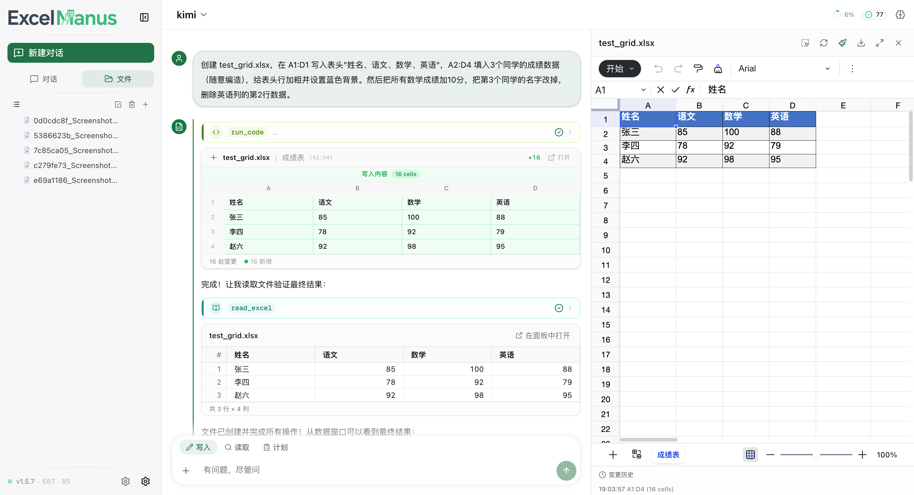
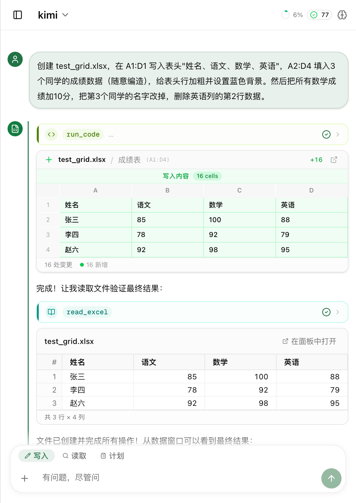

<p align="center">
  
</p>

<h3 align="center">用自然语言驱动 Excel 的 AI Agent</h3>

<p align="center">
  <a href="LICENSE"></a>
  
  
  
</p>

<p align="center">
  <a href="README_EN.md">English</a> · 中文 · <a href="docs/configuration.md">配置文档</a> · <a href="docs/ops-manual.md">运维手册</a>
</p>

<p align="center">
  
</p>

ExcelManus 是一个 LLM 驱动的 Excel Agent 框架。告诉它你想做什么，它会自动读数据、写公式、跑分析、画图表——支持 CLI 和 Web 双入口，接入 OpenAI / Claude / Gemini 等任意大模型。

## ✨ 核心特性

<table>
<tr>
<td width="50%">

### 📊 读写 Excel
单元格 · 公式 · VLOOKUP · 批量填充 · 多 Sheet 操作

### 📈 数据分析与图表
筛选、排序、聚合、透视表；复杂逻辑自动生成 Python 脚本执行。柱状图、折线图、饼图等嵌入 Excel 或导出图片。

### 🖼️ 图片识别
表格截图 → 结构化数据，4 阶段渐进管线提取数据 + 样式 + 公式

### 🔄 版本管理
Staging / Audit / CoW 版本链，`/undo` 精确回滚到任意操作

</td>
<td width="50%">

### 🧠 持久记忆
跨会话记忆偏好与操作模式，自动调整行为

### 🧩 Skillpack
一个 Markdown = 一个技能。自动发现、按需激活、支持 Hook 和命令分派

### 🔌 MCP & Subagent
接入外部 MCP Server 扩展工具集；大文件和复杂任务自动委派子代理

### 👥 多用户
独立工作区 / 数据库 / 会话隔离，管理员面板管控权限和用量

</td>
</tr>
</table>

## 🚀 快速开始

### 方式一：一键启动（推荐）

最简单的方式，自动安装依赖、启动后端和前端。

**第一步：克隆项目**

```bash
git clone https://github.com/kilolonion/excelmanus.git
cd excelmanus
```

**第二步：启动**

<details open>
<summary><b>Windows — 图形化部署工具</b></summary>

双击项目根目录的 `ExcelManusDeployTool.exe` 即可，无需安装任何环境。

工具会自动打开浏览器，在可视化界面中：
1. **自动检测环境** — Python、Node.js、npm、Git，缺失时通过 winget 自动安装
2. **填写 LLM 配置** — API Key、Base URL、模型名称
3. **点击「启动部署」** — 自动创建虚拟环境、安装依赖、启动前后端服务

部署完成后浏览器会自动打开 **http://localhost:3000**。

> 该工具为零依赖单文件 exe，基于 .NET Framework 4.0（Windows 内置）。源码：`deploy/ExcelManusSetup.cs`。

</details>

<details>
<summary><b>macOS / Linux — 启动脚本</b></summary>

```bash
./deploy/start.sh
```

首次启动时脚本会交互式提示填写大模型配置（API Key、Base URL、模型名称），之后再启动无需重复配置。

启动成功后浏览器会自动打开 **http://localhost:3000**。

**常用选项：**

```bash
./deploy/start.sh --prod             # 生产模式（性能更好）
./deploy/start.sh --backend-port 9000  # 自定义后端端口
./deploy/start.sh --workers 4         # 多 worker
./deploy/start.sh --backend-only      # 只启动后端
./deploy/start.sh --help              # 查看全部选项
```

</details>

**第三步：开始对话**

在 Web UI 或 CLI 中输入自然语言指令：

```
> 读取 sales.xlsx 前10行
> 把 A 列金额求和写到 B1
> 按地区分组统计销售额，生成柱状图
```

> 首次运行后配置会迁移到本地数据库，后续可通过 Web UI 设置面板或 `/config` 命令管理。

---

### 方式二：手动安装（pip）

适合已有 Python 环境（≥3.10）、想精确控制依赖的用户。

**1. 克隆并安装**

```bash
git clone https://github.com/kilolonion/excelmanus.git
cd excelmanus
pip install ".[all]"          # 完整安装（CLI + Web + 全部可选依赖）
# 或者按需选择：
# pip install ".[cli]"        # 仅 CLI 模式（轻量，不含 Web UI）
# pip install ".[web]"        # 仅 Web API 模式（不含 CLI dashboard）
```

**2. 创建配置文件**

```bash
cp .env.example .env
```

用编辑器打开 `.env`，找到最上方的 3 行必填项并修改：

```dotenv
EXCELMANUS_API_KEY=sk-xxxxxxxxxxxxxxxx        # 你的 LLM API Key
EXCELMANUS_BASE_URL=https://api.openai.com/v1  # 模型接口地址
EXCELMANUS_MODEL=gpt-4o                        # 模型名称
```

> 其余配置均有默认值，初次使用无需修改。完整配置说明见 [配置文档](docs/configuration.md)。

**3. 启动**

```bash
excelmanus            # CLI 终端交互模式
excelmanus-api        # Web API 模式（后端监听 http://localhost:8000）
```

如需 Web UI 前端，还需单独启动：

```bash
cd web && npm install && npm run dev    # 前端开发服务器（http://localhost:3000）
```

## 💻 使用方式

### CLI

终端对话，支持 Dashboard 布局，`/` 自动补全，打错有纠错。

<details>
<summary>📋 常用命令</summary>

| 命令 | 说明 |
| --- | --- |
| `/help` | 帮助 |
| `/skills` | 技能管理 |
| `/model list` | 切换模型 |
| `/undo <id>` | 回滚操作 |
| `/backup list` | 查看备份 |
| `/rules` | 自定义规则 |
| `/memory` | 记忆管理 |
| `/compact` | 上下文压缩 |
| `/config export` | 加密导出配置 |
| `/config import` | 导入配置 |
| `/clear` | 清空对话 |

</details>

### Web UI

基于 Next.js + Univer.js，提供完整的可视化操作体验。

```bash
# 方式一：一键启动（推荐）
./deploy/start.sh

# 方式二：分别启动
excelmanus-api                          # 后端
cd web && npm install && npm run dev    # 前端
```

- **SSE 流式响应** — 实时显示思考过程、工具调用、子代理执行
- **Excel 侧边面板** — 内嵌查看器，实时预览编辑，支持选区引用
- **写入 Diff** — 每次修改前后对比，一目了然
- **多会话** — 历史持久化，切换无缝
- **文件交互** — 拖拽上传、`@` 引用文件和技能
- **审批机制** — 高风险操作弹窗确认

<p align="center">
  
</p>
<p align="center"><sub>移动端同样可用 — 响应式布局适配</sub></p>

### REST API

`excelmanus-api` 启动后即可使用，SSE 推送 25+ 种事件类型。

<details>
<summary>📋 主要接口</summary>

| 接口 | 说明 |
| --- | --- |
| `POST /api/v1/chat/stream` | SSE 流式对话 |
| `POST /api/v1/chat` | JSON 对话 |
| `POST /api/v1/chat/abort` | 终止任务 |
| `GET /api/v1/files/excel` | Excel 文件流 |
| `GET /api/v1/files/excel/snapshot` | Excel JSON 快照 |
| `POST /api/v1/backup/apply` | 应用备份 |
| `GET /api/v1/skills` | 技能列表 |
| `POST /api/v1/config/export` | 导出配置 |
| `GET /api/v1/health` | 健康检查 |

</details>

## 🤖 模型支持

| Provider | 说明 |
| --- | --- |
| **OpenAI 兼容** | 默认协议，支持任何兼容 API |
| **Claude (Anthropic)** | URL 含 `anthropic` 自动切换，支持 extended thinking |
| **Gemini (Google)** | URL 含 `googleapis` / `generativelanguage` 自动切换 |
| **OpenAI Responses API** | `EXCELMANUS_USE_RESPONSES_API=1` 启用 |

可配置**辅助模型（AUX）**用于路由、子代理和窗口管理，主模型与辅助模型独立切换。

## 🔒 安全机制

| 机制 | 说明 |
| --- | --- |
| **路径沙盒** | 读写限制在工作目录，路径穿越和符号链接越界被拒绝 |
| **代码审查** | `run_code` 静态分析，按 Green / Yellow / Red 三级自动审批 |
| **Docker 沙盒** | 可选容器隔离（`EXCELMANUS_DOCKER_SANDBOX=1`） |
| **操作审批** | 高风险写入需确认，变更自动记录 diff 和快照 |
| **版本链** | Staging → Audit → CoW，`/undo` 回滚任意版本 |
| **MCP 白名单** | 外部工具默认需逐项确认 |
| **用户隔离** | 多用户模式下工作区和数据库物理隔离 |

## 🧩 Skillpack

一个目录 + 一个 `SKILL.md`（含 `name` 和 `description`）即可创建技能。自动发现，按需激活，支持 Hook、命令分派、MCP 依赖声明。

<details>
<summary>📦 内置技能</summary>

| 技能 | 用途 |
| --- | --- |
| `data_basic` | 读取、分析、筛选、转换 |
| `chart_basic` | 图表（内嵌 + 图片） |
| `format_basic` | 样式、条件格式 |
| `file_ops` | 文件管理 |
| `sheet_ops` | 工作表与跨表操作 |
| `excel_code_runner` | Python 脚本处理大文件 |
| `run_code_templates` | 常用代码模板 |

</details>

协议详见 [`docs/skillpack_protocol.md`](docs/skillpack_protocol.md)。

## 🏗️ 部署

### Windows 图形化部署工具

Windows 用户可直接双击运行 `ExcelManusDeployTool.exe`，无需安装任何依赖。

```text
ExcelManusDeployTool.exe    ← 双击即可
```

工具会自动打开浏览器，在可视化界面中完成所有部署操作：

- **环境检测** — 自动检查 Python、Node.js、npm、Git，缺失时通过 winget 自动安装
- **LLM 配置** — 在界面中填写 API Key、Base URL、模型名称
- **一键部署** — 自动创建虚拟环境、安装后端/前端依赖、启动服务
- **实时日志** — 所有步骤的输出实时显示在界面中

> 该工具为纯 C# 编译的单文件 exe，基于 .NET Framework 4.0（Windows 内置），零外部依赖。源码位于 `deploy/ExcelManusSetup.cs`，可通过 `deploy/build_exe.bat` 重新编译。

### Docker 部署（推荐）

镜像已发布到 Docker Hub，支持 **amd64**（Intel/AMD）和 **arm64**（Apple Silicon / AWS Graviton）双架构，`docker pull` 时自动匹配：

```bash
docker pull kilol/excelmanus-api:1.6.5       # 后端 API
docker pull kilol/excelmanus-sandbox:1.6.5   # 代码沙盒（可选）
docker pull kilol/excelmanus-web:1.6.5       # 前端 Web
```

#### Docker Compose 一键启动

```bash
cp .env.example .env                      # 编辑 API Key、模型等
docker compose -f deploy/docker-compose.yml up -d   # 后端 + 前端 + PostgreSQL
```

访问 `http://localhost:3000`。加 `--profile production` 启用 Nginx 反向代理后访问 `http://localhost`。

#### 多平台镜像构建

如需自行构建多架构镜像：

```bash
# Linux / macOS
./deploy/build_multiarch.sh --push

# Windows
deploy\build_multiarch.bat --push
```

默认构建 `linux/amd64` + `linux/arm64`，可通过环境变量 `REGISTRY`、`PLATFORMS` 自定义。

### 手动部署

适用于宝塔面板 / 裸机等不使用 Docker 的场景，详见 [运维手册](docs/ops-manual.md)。

### 一键启动（本地开发）

```bash
# macOS / Linux
./deploy/start.sh              # 开发模式
./deploy/start.sh --prod       # 生产模式（npm run start）
./deploy/start.sh --workers 4  # 多 worker

# Windows PowerShell
.\deploy\start.ps1 -Production

# Windows CMD
deploy\start.bat --prod
```

支持 `--backend-port`、`--frontend-port`、`--log-dir`、`--backend-only`、`--frontend-only` 等选项，详见 `./deploy/start.sh --help`。

脚本自动检测操作系统（macOS / Linux / Windows），在 Linux 上自动识别 apt / dnf / yum / pacman 等包管理器并给出安装提示。

### 远程部署 (deploy.sh / deploy.ps1)

部署脚本在本地运行，通过 SSH 操作远程服务器。支持单机、前后端分离、Docker、本地四种拓扑。

```bash
# 基本部署
./deploy/deploy.sh                         # 完整部署
./deploy/deploy.sh --backend-only          # 只更新后端
./deploy/deploy.sh --frontend-only         # 只更新前端

# 前后端分离 + 双密钥
./deploy/deploy.sh --backend-host 1.2.3.4 --frontend-host 5.6.7.8 \
    --backend-key ~/.ssh/backend.pem --frontend-key ~/.ssh/frontend.pem

# 低内存服务器：本地构建前端制品后上传
./deploy/deploy.sh --frontend-only --frontend-artifact ./frontend-standalone.tar.gz

# 首次部署：推送 .env 模板到远程服务器
./deploy/deploy.sh init-env

# 运维命令
./deploy/deploy.sh check                   # 环境检查 + 前后端互联检测
./deploy/deploy.sh status                  # 查看运行状态
./deploy/deploy.sh rollback                # 回滚上一版本
./deploy/deploy.sh history                 # 部署历史
./deploy/deploy.sh logs                    # 部署日志
```

Windows PowerShell：

```powershell
.\deploy\deploy.ps1                        # 完整部署
.\deploy\deploy.ps1 init-env               # 推送 .env 模板
.\deploy\deploy.ps1 check                  # 环境检查
.\deploy\deploy.ps1 rollback -Force        # 回滚（跳过确认）
```

<details>
<summary>部署安全机制</summary>

脚本内置三层防护，避免部署导致线上 502：

| 层 | 机制 | 说明 |
| --- | --- | --- |
| **构建退出码** | 不使用 `\| tail` 管道 | 避免管道吞掉 `npm run build` 的真实退出码 |
| **产物校验** | 校验 BUILD_ID + routes-manifest.json | Turbopack 产物不完整时拒绝重启 |
| **启动降级** | 自动检测 standalone vs next start | 无论 Next.js 是否生成 standalone 都能启动 |

构建失败或产物不完整时，脚本会中止并保留当前运行版本，不会触发 PM2 重启。

</details>

> 自动排除 `.env`、`data/`、`workspace/`，不覆盖线上数据。部署后自动检测前后端互联、CORS 配置和健康检查。

## 👥 多用户

```dotenv
EXCELMANUS_AUTH_ENABLED=true
EXCELMANUS_JWT_SECRET=your-random-secret-key-at-least-64-chars
```

支持**邮箱密码**、**GitHub OAuth**、**Google OAuth**、**QQ OAuth** 四种登录方式。每个用户拥有独立的工作区和数据库，首个注册用户自动成为管理员。

> **前后端分离部署注意**：Google/GitHub OAuth 回调已优化为前端页面接收 + 浏览器直连后端交换 token，避免跨服务器代理链超时。需在 OAuth 提供商控制台将重定向 URI 设为 `https://your-domain/auth/callback`。

详细配置见 [配置文档](docs/configuration.md)。

## 🧪 评测框架

内置 Bench 评测，支持多轮用例、自动断言、JSON 日志和 Suite 并发：

```bash
python -m excelmanus.bench --all                         # 全部
python -m excelmanus.bench --suite bench/cases/xxx.json  # 指定 suite
python -m excelmanus.bench --message "读取前10行"          # 单条
```

## 📖 配置参考

快速开始只需 3 个环境变量。完整配置（窗口感知、安全策略、Subagent、MCP、VLM、Embedding 等）见 [配置文档](docs/configuration.md)。

## 🖥️ 平台支持

| 平台 | 状态 | 说明 |
| --- | --- | --- |
| **macOS** | ✅ 完整支持 | 开发主平台 |
| **Linux** | ✅ 完整支持 | Ubuntu / Debian / CentOS / Fedora / Arch 等 |
| **Windows** | ✅ 完整支持 | PowerShell 5.1+ 或 CMD，需安装 Python + Node.js |

启动脚本自动检测 OS 和包管理器，缺少依赖时给出精确的安装命令。

## 🛠️ 开发

```bash
pip install -e ".[all,dev]"   # 完整安装 + 测试依赖
pytest
```

## 📄 许可证

[Apache License 2.0](LICENSE) © kilolonion
