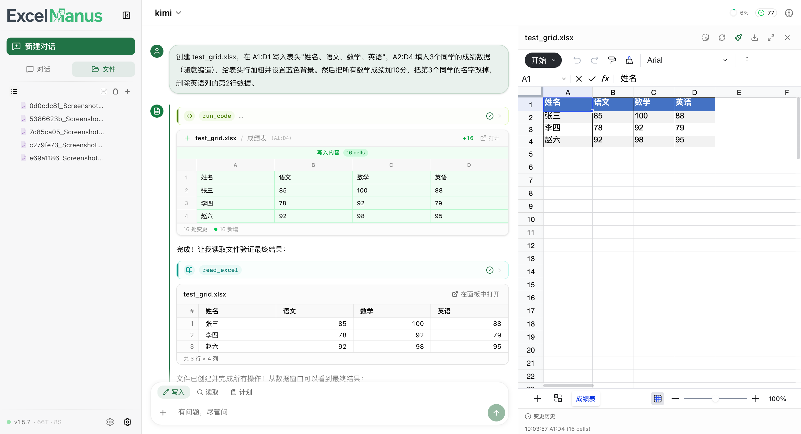
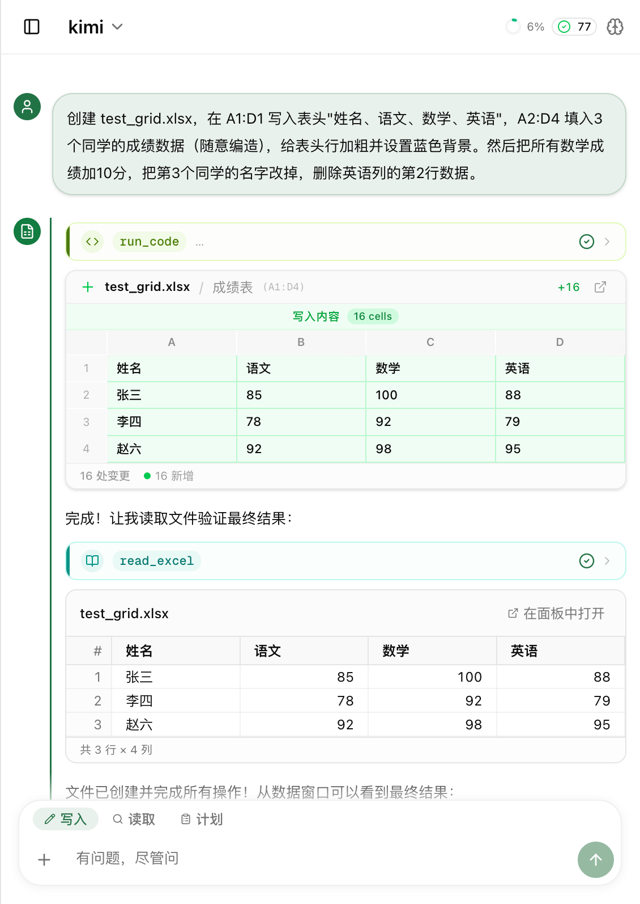

<p align="center">
  
</p>

<h3 align="center">Open-Source AI Agent Framework for Excel, Driven by Natural Language</h3>

<p align="center">
  <a href="LICENSE"></a>
  <a href="https://github.com/kilolonion/excelmanus"></a>
  
  
  
  
</p>

<p align="center">
  <a href="README.md">中文</a> · English · <a href="docs/configuration_en.md">Configuration</a> · <a href="docs/ops-manual_en.md">Ops Manual</a> · <a href="https://clawhub.ai">ClawHub Market</a>
</p>

<p align="center">
  
</p>

---

**ExcelManus** is a fully open-source, LLM-powered Excel Agent framework. Describe what you need in plain language and it will read data, write formulas, run analysis scripts, and create charts — like an AI assistant that truly understands Excel.

- **Four interfaces** — Web UI / CLI Terminal / Multi-Channel Bot (Telegram · QQ · Feishu) / REST API
- **Any LLM** — OpenAI · Claude · Gemini · local Ollama / vLLM, plug and play
- **Production-ready** — Multi-arch Docker · hot updates · multi-user isolation · approval flows · version rollback

> 💡 Only 3 env vars to get started: `API_KEY` + `BASE_URL` + `MODEL`

---

## ✨ Key Capabilities

<table>
<tr>
<td width="50%">

### 📊 Full-Format Excel Read & Write
Cell read/write · Formulas · VLOOKUP · Batch fill · Multi-sheet operations
Auto-converts `.xlsx` / `.xls` / `.xlsb` / `.csv`

### 📈 Data Analysis & Visualization
Filter, sort, aggregate, pivot tables; complex logic auto-generates Python scripts
Bar · line · pie charts embedded in Excel or exported as HD images

### 🖼️ Vision Recognition & Extraction
Table screenshot → structured Excel data
4-stage progressive pipeline (skeleton → data → style → formula), supports single-pass extraction and large-table chunking

### 🔄 Version Management & Diff
Staging / Audit / CoW version chain, `/undo` precise rollback
Excel write diff visualization, text file unified diff display

### ✅ Verification Gate
Attach structured verification conditions to subtasks (row count / sheet exists / formula / value match)
Auto-validates before task completion, blocks agent if checks fail

</td>
<td width="50%">

### 🧠 Persistent Memory & Session History Awareness
Cross-session memory for user preferences and operation patterns; Playbook auto-distills task experience
**Episodic Memory**: auto-generates structured session summaries, semantically retrieves past sessions to inject context

### 🧩 Skillpack & ClawHub Market
One Markdown = one skill, auto-discovery, on-demand activation
Built-in [ClawHub](https://clawhub.ai) market for one-click search / install / update

### 🔌 MCP & Subagent
Connect external MCP Servers to extend toolset
Large files and complex tasks auto-delegated to sub-agents

### 🔍 Window Perception & Semantic Retrieval
Adaptive window perception engine for intelligent context focus management
Embedding-powered parallel semantic retrieval for memory / files / skills, zero extra latency

### 🤖 Multi-Channel Bot
Telegram · QQ · Feishu — three channels with file send/receive
Three concurrency modes (Queue / Steer / Guide), adaptive streaming output strategies

### � In-App Hot Update
One-click version check → backup → update → auto-restart from Web UI
Version compatibility validation, blue-green deployment, rollback window protection

</td>
</tr>
</table>

## 🚀 Quick Start

> **Prerequisites**: Python ≥ 3.10 · Node.js ≥ 18 (for Web UI)

### Option 1: One-Click Start (Recommended)

Auto-installs dependencies and launches both backend and frontend.

<details open>
<summary><b>🪟 Windows — GUI Setup Tool (Easiest)</b></summary>

**No need to clone first** — download `ExcelManus.exe` from [Releases](https://github.com/kilolonion/excelmanus/releases) and double-click.

Two-step wizard:
1. **Environment check** — Auto-detects Python / Node.js / Git, installs via winget if missing
2. **One-click deploy** — Clones repo → installs deps → starts services with live progress

Browser auto-opens `http://localhost:3000` when done.

</details>

<details>
<summary><b>🍎 macOS / 🐧 Linux — Start Script</b></summary>

```bash
git clone https://github.com/kilolonion/excelmanus.git
cd excelmanus
chmod +x ./deploy/start.sh
./deploy/start.sh
```

On first launch, the script interactively prompts for LLM config (API Key, Base URL, Model). Browser auto-opens `http://localhost:3000`.

```bash
./deploy/start.sh --prod              # Production mode
./deploy/start.sh --backend-port 9000 # Custom port
./deploy/start.sh --workers 4         # Multi-worker
./deploy/start.sh --help              # All options
```

</details>

### Option 2: Manual Install (uv)

For users who want precise control over dependencies. [uv](https://docs.astral.sh/uv/) is 10–100x faster than pip.

```bash
# 1. Install uv
curl -LsSf https://astral.sh/uv/install.sh | sh
# Windows: powershell -ExecutionPolicy ByPass -c "irm https://astral.sh/uv/install.ps1 | iex"

# 2. Clone and install
git clone https://github.com/kilolonion/excelmanus.git
cd excelmanus
uv sync --all-extras     # Full install (also supports pip install ".[all]")

# 3. Configure
cp .env.example .env     # Edit .env with your API Key / Base URL / Model

# 4. Launch
uv run excelmanus        # CLI terminal mode
uv run excelmanus-api    # Web API (http://localhost:8000)
cd web && npm i && npm run dev   # Web frontend (http://localhost:3000)
```

### Start Chatting

Type natural language in the Web UI or CLI:

```
> Read the first 10 rows of sales.xlsx
> Sum column A amounts and write to B1
> Group sales by region and generate a bar chart
> Recreate this table screenshot as an Excel file
```

## 💻 Three Interfaces

### Web UI

Built on **Next.js + Univer.js**, providing a full visual experience.

| Feature | Description |
| --- | --- |
| **SSE Streaming** | Real-time display of thinking, tool calls, sub-agent execution; auto-reconnect |
| **Excel Side Panel** | Embedded Univer viewer, live preview/edit, range selection, full-screen mode |
| **Excel & Text Diff** | Before/after comparison on every write |
| **Multi-Session** | SQLite + IndexedDB 3-tier cache, survives refresh/restart |
| **File Interaction** | Drag & drop upload, `@` reference files and skills; `.xls` / `.xlsb` auto-converted |
| **Approval Flow** | Confirmation dialog for high-risk operations, changes auto-snapshot |
| **Optimistic UI** | Messages appear immediately, writes optimistic update + rollback on failure |
| **Error Guidance** | Actionable suggestion cards (retry / check settings / copy diagnostic ID) |
| **ClawHub Market** | Inline skill market panel in sidebar |
| **Admin Dashboard** | User management + per-provider/model LLM usage stats |
| **Plan Mode** | Complex tasks auto-planned, interactive confirmation before execution |
| **Hot Update Notification** | Detects new versions, auto-probes backend after upgrade |

<p align="center">
  
</p>
<p align="center"><sub>Responsive layout — works on mobile</sub></p>

### CLI

Terminal chat with Dashboard layout, `/` auto-completion, and typo correction.

<details>
<summary>📋 Command Reference</summary>

| Command | Description |
| --- | --- |
| `/help` | Help |
| `/skills` | Skill management (list / install / activate / disable) |
| `/clawhub search <keyword>` | ClawHub market search |
| `/clawhub install <slug>` | Install market skill |
| `/clawhub update` | Update all installed skills |
| `/model list` | Switch models |
| `/model aux` | Configure auxiliary model (AUX) |
| `/plan` | Toggle Plan mode |
| `/undo <id>` | Rollback operation |
| `/registry` | View file registry |
| `/backup list` | View backups |
| `/rules` | Custom rules |
| `/memory` | Memory management |
| `/playbook` | Playbook task experience management |
| `/compact` | Context compaction |
| `/config export` | Encrypted config export |
| `/config import` | Import config |
| `/export` | Export session (Markdown / Plain Text / EMX) |
| `/clear` | Clear conversation |
| `/rollback` | Rollback session to a specific turn |

</details>

### Multi-Channel Bot

Supports **Telegram** · **QQ** · **Feishu** with a unified message handling framework:

| Feature | Description |
| --- | --- |
| **Unified Adapter Layer** | Message send/receive, file upload/download, event bridging abstracted uniformly |
| **Three Concurrency Modes** | Queue · Steer · Guide, switch via `/concurrency` |
| **Adaptive Streaming Output** | Telegram edit-stream · QQ progressive paragraphs · Feishu card-stream, optimal UX per channel |
| **HTTP Retry & Backoff** | Connection-level retry + exponential backoff + 429 Retry-After respect |

```bash
# Telegram
EXCELMANUS_TG_TOKEN=xxx python3 excelmanus_tg_bot.py

# QQ / Feishu: configure channel credentials in Web UI settings
```

### REST API

Available once `excelmanus-api` starts. SSE pushes 30+ event types.

<details>
<summary>📋 Main Endpoints</summary>

| Endpoint | Description |
| --- | --- |
| `POST /api/v1/chat/stream` | SSE streaming chat |
| `POST /api/v1/chat` | JSON chat |
| `POST /api/v1/chat/abort` | Abort task |
| `POST /api/v1/chat/subscribe` | Reconnect and restore session stream |
| `POST /api/v1/chat/rollback` | Rollback session to a specific turn |
| `GET /api/v1/sessions` | Session list (with archive filter) |
| `GET /api/v1/sessions/{id}/messages` | Paginated message history |
| `GET /api/v1/files/excel` | Excel file stream |
| `GET /api/v1/files/excel/snapshot` | Excel JSON snapshot |
| `POST /api/v1/files/excel/write` | Side panel write-back |
| `GET /api/v1/skills` | Skill list |
| `GET /api/v1/clawhub/*` | ClawHub market (search / install / update) |
| `GET /api/v1/version/check` | Version check & hot update |
| `POST /api/v1/version/update` | Execute online update |
| `GET /api/v1/auth/codex/status` | Codex connection status |
| `POST /api/v1/config/export` | Export config |
| `GET /api/v1/health` | Health check |

</details>

## 🤖 Model Support

ExcelManus auto-detects model providers by URL — zero-config switching:

| Provider | Description |
| --- | --- |
| **OpenAI Compatible** | Default protocol. Any OpenAI-compatible API — Ollama / vLLM / LM Studio / DeepSeek etc. |
| **Claude (Anthropic)** | Auto-switches when URL contains `anthropic`, supports extended thinking |
| **Gemini (Google)** | Auto-switches when URL contains `googleapis` / `generativelanguage` |
| **OpenAI Responses API** | Next-gen inference API, enable with `EXCELMANUS_USE_RESPONSES_API=1` |
| **OpenAI Codex** | Device Code Flow to bind Codex subscription, private models auto-discovered, no manual Key |
| **MiniMax** | Auto-detects base_url, built-in recommended model list |

### Auxiliary Model (AUX)

Configure an independent lighter model for **intent routing, sub-agents, and window perception advisor** — significantly reduce cost without affecting task quality:

```dotenv
EXCELMANUS_AUX_API_KEY=sk-xxxx
EXCELMANUS_AUX_BASE_URL=https://api.openai.com/v1
EXCELMANUS_AUX_MODEL=gpt-4o-mini
```

### Model Capability Probing

On first use of a new model, ExcelManus auto-probes its capability boundaries (vision, function calling, context window, etc.) and dynamically adjusts tool strategies — no manual configuration needed.

## 🔍 Window Perception & Semantic Engine

ExcelManus includes an **adaptive window perception engine** and **embedding-powered semantic retrieval system** to keep the agent precisely contextualized during long conversations:

| Module | Description |
| --- | --- |
| **Window Perception Manager** | 25 sub-modules collaborating on dynamic context focus, projection, strategy adaptation |
| **Semantic Memory Retrieval** | User preferences and history vectorized, auto-recalled for new tasks |
| **Semantic File Registry** | Workspace files indexed by embedding, injected into context by relevance |
| **Semantic Skill Router** | Skillpack descriptions vectorized, auto-matches optimal skill |
| **Session History Retrieval** | Auto-generates structured session summaries, semantic / filename / recency three-path hybrid retrieval, injects history context on first turn |
| **Error Solution Store** | Error → solution vector index, auto-recalls past fixes for similar errors |
| **Smart Context Compaction** | Relevance-scored differential truncation, high-relevance messages retain more detail |

All semantic retrieval runs in parallel via `asyncio.gather`, zero extra latency. Set `EXCELMANUS_EMBEDDING_ENABLED=false` to disable entirely (graceful no-op fallback).

## 🔒 Security

| Mechanism | Description |
| --- | --- |
| **Path Sandbox** | Reads/writes restricted to working directory, path traversal and symlink escapes rejected |
| **Code Review** | `run_code` static analysis, Green / Yellow / Red tier auto-approval |
| **Docker Sandbox** | Optional container isolation for user code (`EXCELMANUS_DOCKER_SANDBOX=1`) |
| **Operation Approval** | High-risk writes require confirmation, changes auto-record diffs and snapshots |
| **Version Chain** | Staging → Audit → CoW, `/undo` rollback to any version |
| **MCP Whitelist** | External tools require per-item confirmation by default |
| **Rate Limiting** | Built-in API rate limiting to prevent abuse |
| **User Isolation** | Physical workspace, database, and session isolation per user |

## 🧩 Skillpack & ClawHub

One directory + one `SKILL.md` (with `name` and `description`) to create a skill. Auto-discovery, on-demand activation, supports Hooks, command dispatch, and MCP dependency declarations.

### ClawHub Skill Market

Built-in [ClawHub](https://clawhub.ai) integration — search, install, and update community skill packs from the UI sidebar or CLI:

```bash
/clawhub search financial reports   # Search market
/clawhub install <slug>             # Install
/clawhub update                     # Update all installed
```

<details>
<summary>📦 Built-in Skills</summary>

| Skill | Purpose |
| --- | --- |
| `data_basic` | Read, analyze, filter, transform |
| `chart_basic` | Charts (embedded + image export) |
| `format_basic` | Styles, conditional formatting, advanced layout |
| `file_ops` | File management |
| `sheet_ops` | Worksheet & cross-sheet operations |
| `excel_code_runner` | Python scripts for large files |
| `run_code_templates` | Common code templates |

</details>

Protocol details in [`docs/skillpack_protocol_en.md`](docs/skillpack_protocol_en.md).

## 🧠 Playbook — Task Experience Learning

Playbook auto-analyzes success/failure patterns and distills reusable operational knowledge:

- **Auto-learn** — Generates PlaybookDelta after task completion, stored in SQLite
- **Semantic dedup** — Similar entries merged, stale entries retired
- **Auto-inject** — Matching entries injected before related future tasks, reducing repeated mistakes
- **Management** — `/playbook list` to view · `/playbook clear` to reset

## 👥 Multi-User & Admin

```dotenv
EXCELMANUS_AUTH_ENABLED=true
EXCELMANUS_JWT_SECRET=your-random-secret-key-at-least-64-chars
```

Supports **email/password** · **GitHub OAuth** · **Google OAuth** · **QQ OAuth**.
Each user gets an independent workspace and database. First registered user becomes admin.

**Admin Dashboard** (`/admin`):
- View all users' LLM usage (grouped by provider/model)
- Manage login method toggles
- Set model allowlists and system-level configuration

**OpenAI Codex Subscription**: Users can bind their Codex subscription via Device Code Flow — private models auto-discovered, no manual API Key needed.

> **Split-server note**: OAuth callbacks optimized to frontend page + browser-direct-to-backend token exchange. Set redirect URI to `https://your-domain/auth/callback`.

See [Configuration](docs/configuration_en.md) for details.

## 🏗️ Deployment

### Docker Compose (Recommended)

```bash
cp .env.example .env
docker compose -f deploy/docker-compose.yml up -d
```

Visit `http://localhost:3000`. Add `--profile production` for Nginx reverse proxy.

Images support **amd64** + **arm64** dual architecture:

```bash
docker pull kilol/excelmanus-api:1.7.0       # Backend API
docker pull kilol/excelmanus-sandbox:1.7.0   # Code sandbox (optional)
docker pull kilol/excelmanus-web:1.7.0       # Frontend Web
```

### Windows GUI Setup

Download `ExcelManus.exe` from [Releases](https://github.com/kilolonion/excelmanus/releases) and double-click. Two-step wizard (Vite + React + Tailwind CSS), auto environment detection and deployment. Zero external dependencies, source: `deploy/ExcelManusSetup.cs`.

### Start Scripts (Local Development)

```bash
./deploy/start.sh              # macOS / Linux dev mode
./deploy/start.sh --prod       # Production mode
.\deploy\start.ps1 -Production # Windows PowerShell
deploy\start.bat --prod        # Windows CMD
```

Supports `--backend-port` · `--frontend-port` · `--workers` · `--backend-only` and more.

### Remote Deploy

Deploy scripts operate remote servers via SSH, supporting single-server / split frontend-backend / Docker topologies:

```bash
./deploy/deploy.sh                    # Full deploy
./deploy/deploy.sh --backend-only     # Backend only
./deploy/deploy.sh --frontend-only    # Frontend only
./deploy/deploy.sh rollback           # Rollback to previous version
./deploy/deploy.sh check              # Environment + connectivity check
```

<details>
<summary>🔐 Deployment Safety</summary>

Three-layer protection to prevent 502 during deployment:

| Layer | Mechanism | Description |
| --- | --- | --- |
| **Build exit code** | No pipe swallowing exit codes | Build failure aborts immediately |
| **Artifact validation** | BUILD_ID + routes-manifest.json | Incomplete artifacts refuse restart |
| **Startup fallback** | standalone vs next start auto-detect | Compatible with all Next.js outputs |

On failure, keeps current running version. Auto-excludes `.env`, `data/`, `workspace/`.

</details>

### Hot Update

ExcelManus has built-in application-level hot update:

- **Version check** — Periodically polls Gitee / GitHub Tags API with TTL cache
- **Data backup** — Auto-backs up `.env`, user data, uploads before update
- **Code update** — git pull + dependency reinstall, mutex lock prevents concurrent updates
- **Web UI integration** — Settings panel one-click: check → confirm → execute with live progress
- **Restart probe** — Frontend auto-detects backend recovery after update, seamless refresh

See [Hot Update Design](docs/hot-update-design.md).

For manual deployment, see [Ops Manual](docs/ops-manual_en.md).

## ⚡ Performance Highlights

| Optimization | Impact |
| --- | --- |
| **Claude Layered Cache** | System prompt split into stable prefix + dynamic block, 2nd request TTFT drops to 3-5s |
| **Chitchat Fast Path** | Chitchat routing skips tool building, prompt tokens 28k → ~3k |
| **SACR Sparse Compression** | Strips null keys from tool results, up to **74% token savings** on sparse data |
| **Single-Pass Extraction** | Strong VLM models complete all 4 extraction phases in one call |
| **Image Lifecycle Management** | Auto-manages image retention/downgrade across turns |
| **Auxiliary Model Separation** | Routing/sub-agents use lightweight AUX model, main model focuses on reasoning |
| **Context Budget Management** | Dynamic budget allocation with relevance-scored differential truncation |
| **Parallel Semantic Retrieval** | `asyncio.gather` runs memory/file/skill/session-history retrieval in parallel, zero extra latency |
| **SSE Event Deduplication** | Unified frontend `dispatchSSEEvent` handler |
| **Database WAL Mode** | SQLite WAL for concurrent reads/writes |

## 📖 Configuration Reference

Only 3 env vars to get started. Common configuration categories:

| Category | Key Config |
| --- | --- |
| **Basic** | `EXCELMANUS_API_KEY` / `BASE_URL` / `MODEL` |
| **Auxiliary Model** | `EXCELMANUS_AUX_API_KEY` / `AUX_BASE_URL` / `AUX_MODEL` |
| **VLM (Vision)** | `EXCELMANUS_VLM_MODEL` / `VLM_EXTRACTION_TIER` |
| **Multi-User** | `EXCELMANUS_AUTH_ENABLED` / `JWT_SECRET` |
| **Security** | `EXCELMANUS_DOCKER_SANDBOX` / `GUARD_MODE` |
| **Performance** | `EXCELMANUS_WINDOW_PERCEPTION_*` / `IMAGE_KEEP_ROUNDS` |
| **Playbook** | `EXCELMANUS_PLAYBOOK_ENABLED` |
| **ClawHub** | `EXCELMANUS_CLAWHUB_ENABLED` / `CLAWHUB_REGISTRY_URL` |
| **Embedding** | `EXCELMANUS_EMBEDDING_ENABLED` / `EMBEDDING_MODEL` |
| **Session Summary** | `EXCELMANUS_SESSION_SUMMARY_ENABLED` / `SESSION_SUMMARY_MIN_TURNS` |

Full reference in [Configuration](docs/configuration_en.md).

## 🖥️ Platform Support

| Platform | Status | Notes |
| --- | --- | --- |
| **macOS** | ✅ Full support | Primary dev platform |
| **Linux** | ✅ Full support | Ubuntu / Debian / CentOS / Fedora / Arch etc. |
| **Windows** | ✅ Full support | PowerShell 5.1+ or CMD |

Start scripts auto-detect OS and package manager, providing precise install commands when dependencies are missing.

## 🧪 Evaluation Framework

Built-in Bench evaluation with multi-turn cases, auto-assertion, JSON logs, and suite-level concurrency:

```bash
uv run python -m excelmanus.bench --all                         # All
uv run python -m excelmanus.bench --suite bench/cases/xxx.json  # Specific suite
uv run python -m excelmanus.bench --message "Read first 10 rows"  # Single test
```

## 🛠️ Development & Contributing

```bash
uv sync --all-extras --dev    # Full install + test dependencies
uv run pytest                 # Run all tests (3900+ cases)
uv run pytest tests/test_engine.py tests/test_api.py  # Targeted tests
```

PRs and Issues welcome! Please ensure new code includes tests and `uv run pytest` passes.

## ⭐ Star History

If ExcelManus helps you, please give us a Star 🌟

<p align="center">
  <a href="https://github.com/kilolonion/excelmanus/stargazers">
    
  </a>
</p>

## 📄 License

[Apache License 2.0](LICENSE) © kilolonion
