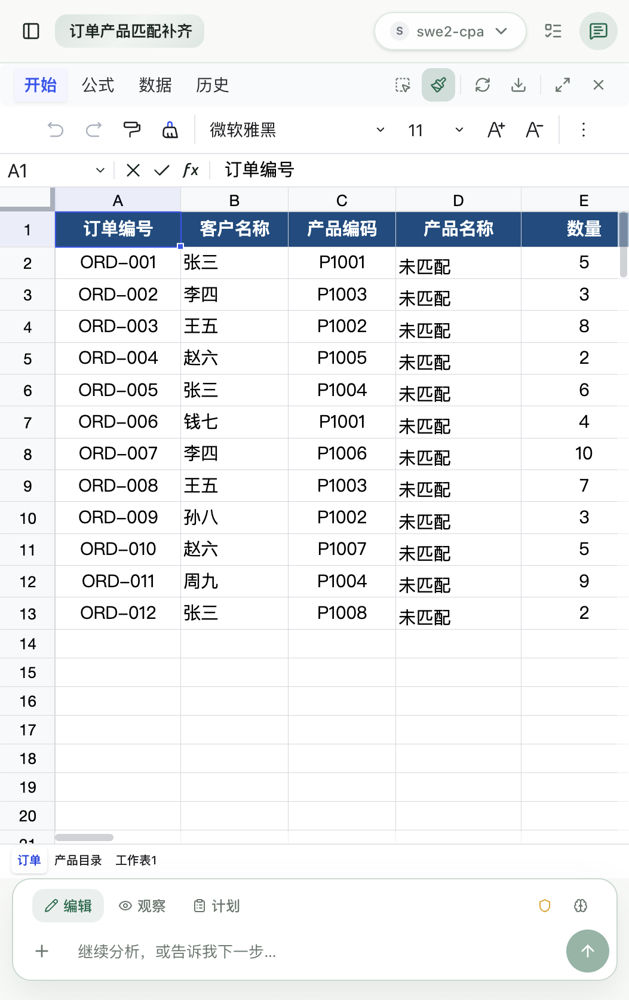
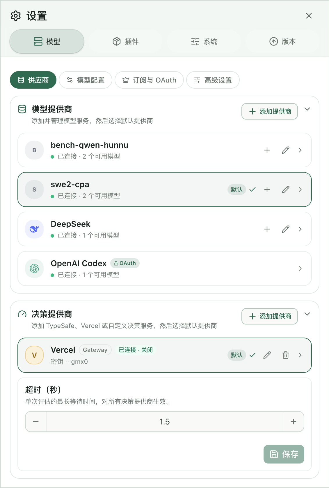

<p align="center">
  
</p>

<h3 align="center">An open-source AI assistant for Excel and Word</h3>

<p align="center">
  <a href="LICENSE"></a>
  <a href="https://github.com/kilolonion/excelmanus"></a>
  
  
  
</p>

<p align="center">
  <a href="README.md">中文</a> · English · <a href="docs/README.md">Documentation</a> · <a href="docs/configuration_en.md">Configuration</a> · <a href="docs/ops-manual_en.md">Operations</a>
</p>

<p align="center">
  
</p>
<p align="center"><sub>One workspace for conversations, files, tasks, and spreadsheets</sub></p>

**ExcelManus** brings conversations, files, and spreadsheet editing into one workspace. Describe a task to read workbooks, organize data, write formulas, format cells, create charts, and save results as editable files.

The project provides a Web UI, a REST API, and packaging for Windows and macOS desktop apps. Your deployment manages models, credentials, and conversation data. Connect an OpenAI-compatible endpoint, Anthropic, Gemini, or a local model service; available features depend on the model and endpoint.

> This guide describes the current **1.8.0 source tree**. Desktop availability, signing status, and supported architectures depend on the published assets. See the [Desktop README](desktop/README.md) for build details.

## Features

| Capability | What you can do |
| --- | --- |
| Excel processing | Read and edit cells, formulas, worksheets, styles, conditional formatting, and data validation; filter, group, aggregate, compare, and split data |
| Analysis and charts | Use built-in tools for common operations and Python with the same tools for loops, cross-file workflows, or custom calculations |
| Word processing | Read, search, edit, and create `.docx` documents; use Python for more complex work |
| Images to spreadsheets | Give a screenshot to the active vision-capable model and generate a workbook from its structured specification |
| Previews and history | Preview and edit spreadsheets, inspect changes, compare revisions, and restore earlier files |
| Range interaction and concurrency safety | Ask the user to confirm exact cells, show planned or changed ranges, and bind writes to a content version so another session is not overwritten; save conflicts can be reviewed and merged per cell |
| Workspaces and conversations | Register existing local folders and bind each conversation to one; conversations in a folder share its files |
| Background tasks and recovery | Run subagents in the background, inspect and steer them from Tasks, and resume an interrupted main task with `/resume` |
| Skills and external tools | Reuse workflows through Skillpacks and connect search or other services through MCP |

Uploaded `.xls` and `.xlsb` files are converted to `.xlsx`. The project also handles `.xlsx`, `.xlsm`, `.csv`, and `.tsv`; each format supports different structures. Formula calculation, complex object preservation, and rendering should not be assumed to match Microsoft Excel exactly. Keep original copies of important files and review generated results.

## Desktop app

ExcelManus Desktop packages the Web workspace, API backend, and the Python and Node.js runtimes required by `run_code` into one application. Open the installed app without starting the frontend and backend separately, then connect and select a model in Settings.

- **Unified workspace:** switch between conversations, files, background tasks, and spreadsheet views in one window.
- **Built-in spreadsheet workspace:** inspect and edit workbooks, use the formula bar and sheet tabs, and continue the conversation from the current file.
- **Range confirmation and navigation:** let the agent ask for a range in the workbook, then locate inspected, planned, and changed areas in the current sheet.
- **Central model management:** configure model providers, model profiles, subscription accounts and authorization, plus optional decision services.
- **Local app profile:** the main database, credentials, and default workspace live in the app profile; registered external workspaces remain at their original paths.

<table>
<tr>
<td width="50%"></td>
<td width="50%"></td>
</tr>
<tr>
<td align="center"><b>Spreadsheet workspace</b><br />Inspect and edit a workbook, then continue the conversation</td>
<td align="center"><b>Models and connections</b><br />Manage providers, models, subscription accounts, and authorization</td>
</tr>
</table>

Installer availability, supported architectures, and signing status depend on the individual release assets. See the [desktop guide](desktop/README.md) for packaging, signing, runtimes, and data migration.

## Quick start

### Install the desktop app

If a release includes an installer for your system and architecture, download it from [GitHub Releases](https://github.com/kilolonion/excelmanus/releases). Desktop packages include the frontend, backend, and Python and Node.js runtimes. Additional MCP commands may require separate executables.

The app uses its own data directory. Add and activate a model in Settings after launch, and install a new app bundle to upgrade. See the [desktop guide](desktop/README.md) for builds, signing, and data migration.

### Start from source

Install **Python ≥ 3.10, Node.js ≥ 20.9, and Git**. [uv](https://docs.astral.sh/uv/) is the recommended Python dependency manager. The launcher checks prerequisites, installs project dependencies, and starts both services.

macOS / Linux:

```bash
git clone https://github.com/kilolonion/excelmanus.git
cd excelmanus
./deploy/start.sh
```

Windows PowerShell:

```powershell
git clone https://github.com/kilolonion/excelmanus.git
cd excelmanus
.\deploy\start.ps1
```

Windows CMD users can run `deploy\start.bat`. A [Gitee mirror](https://gitee.com/kilolonion/excelmanus) is also available.

Open [http://localhost:3000](http://localhost:3000). Add and activate a model in onboarding or Settings → Model. Model credentials are configured in the UI; no terminal prompt is required. Settings remain available before a model is configured.

```bash
./deploy/start.sh --prod                  # Build and serve the production frontend
./deploy/start.sh --backend-port 9000     # Choose a backend port
./deploy/start.sh --frontend-port 8080    # Choose a frontend port
./deploy/start.sh --backend-only         # Run only the backend
./deploy/start.sh --help                 # Show all options
```

On Windows, use `.\deploy\start.ps1 -Production` or `deploy\start.bat --prod`. Keep **one backend worker** on a single host so in-memory conversation and execution state stay in one process.

### Start services manually

From the repository root, install dependencies and start the API:

```bash
uv sync --frozen --extra web --extra analysis
uv run excelmanus-api --host 127.0.0.1 --port 8000
```

In a second terminal, start the frontend:

```bash
cd web
npm ci
npm run dev
```

An API-only installation needs the `web` extra. Add `--extra vba` for VBA inspection or `--extra system-one` for experimental Jev integration as needed. See the [Web README](web/README.md) for frontend connection settings.

### Try a task

Upload a file or register its local folder, then describe what you need:

```text
Read the first 10 rows of sales.xlsx and explain the columns.
Group sales by region, save a new workbook, and create a bar chart.
Compare these price lists and report changed prices and missing items.
Turn this table screenshot into an editable Excel file.
```

Use `@` to reference files, skills, or spreadsheet selections. Choose plan mode to discuss an approach before executing it, or read mode to inspect and analyze files.

## Workspace and task execution

The Web UI uses Next.js, React, and Univer. It provides streaming conversations, file previews, selection references, cell editing, revision history, background tasks, and a responsive mobile layout.

- **Direct tools and code:** the same task can alternate between business tools and `run_code`. There is no separate code-mode switch. Common tools are available upfront; other capabilities are discovered and loaded on demand.
- **Writes and approvals:** ordinary workspace edits follow the current permissions and record changes. Deleting files or running shell commands may require confirmation. Not every write opens an approval dialog.
- **Version conflicts:** workbook writes use the observed content version. Read the latest file before resolving a conflict to avoid overwriting edits from another conversation or application.
- **Range confirmation:** a confirmed range is bound to its workspace, file, sheet, and the content version visible to the user; stale or invalid selections remain pending for correction.
- **History and undo:** previews, restores, and operation undo validate file versions; restore checks pending edits and conflicts before replacing a file.
- **Background subagents:** the model starts them explicitly through `delegate`. They can continue after the main chat ends; pausing or cancelling preserves already committed changes.
- **Recovery:** unfinished tasks become interrupted after a restart. `/resume` continues from saved messages and tool results; it does not restore an old process or automatically replay writes with unknown outcomes.
- **Memory and summaries:** memory is read on demand. Session-end summaries are off by default. Enabling these features can generate additional model requests.

## Models and settings

Manage multiple model profiles in Settings and activate one for conversation, subagents, and context compaction. `/model <name>` switches the active profile.

| Interface | Configuration |
| --- | --- |
| OpenAI-compatible | Enter the Base URL, API key, and model ID for a compatible cloud or local service |
| OpenAI Responses | Set the profile protocol to `openai_responses` |
| Anthropic / Gemini | Use the provider preset or explicitly select `anthropic` / `gemini` |
| Codex subscription | Use browser authorization or a device code under Settings → Model → Subscription account; model availability comes from the connected account |

For a remote deployment, follow the UI instructions to use device authorization or paste the complete browser callback URL. This integration uses the fixed local callback `http://localhost:1455/auth/callback`; do not replace it with your deployment domain.

**Product settings are stored in the main database:** model profiles in `model_profiles`, and other settings in `config_kv`. Project `.env` and user `config.env` files are no longer product configuration sources. Process parameters such as `EXCELMANUS_HOME`, bind ports, and the management token locate data or start services. See the [configuration reference](docs/configuration_en.md).

## Data and access boundaries

ExcelManus is a single-user application. Workspaces and conversations share process-level model credentials, memory, and external service settings; they do not provide tenant isolation.

Source installations default to `~/.excelmanus`, with workspace files under `data/`. Other registered folders remain in place. Each workspace stores revisions in `.excelmanus/revisions/`. Back up the main database, `.secret_key`, and all workspace files together.

File tools check workspace boundaries, sensitive paths, and symlinks. Python executes in a local subprocess with path checks, code policy, and timeouts; this is not VM or container isolation. Model requests may include messages, file content returned by tools, and images. Search and MCP calls send their corresponding arguments. See the [privacy policy](docs/privacy-policy.md) (Chinese).

The backend binds to `127.0.0.1` by default. Configure a management token and a controlled entry point for remote access, including when a reverse proxy exposes a loopback backend. See the [operations guide](docs/ops-manual_en.md).

## REST API

The backend defaults to [http://localhost:8000](http://localhost:8000). Its [interactive API reference](http://localhost:8000/docs) describes the running version's request and response schemas.

| Endpoint | Purpose |
| --- | --- |
| `POST /api/v1/chat/stream` | Streaming conversation |
| `POST /api/v1/chat` | JSON conversation |
| `POST /api/v1/chat/abort` | Stop the main task |
| `POST /api/v1/chat/subscribe` | Subscribe or reconnect to conversation events |
| `POST /api/v1/chat/{session_id}/answer` | Submit an answer or range confirmation |
| `POST /api/v1/chat/{session_id}/approve` | Approve or reject a pending action |
| `POST /api/v1/chat/{session_id}/guide` | Inject a guide message into a running session |
| `GET /api/v1/sessions/{session_id}/turn` | Inspect main-task state and recovery conditions |
| `GET /api/v1/sessions/{session_id}/subagents` | List background subagents |
| `POST /api/v1/sessions/{session_id}/subagents/{run_id}` | Steer, pause, cancel, or continue a background task |
| `GET /api/v1/files/excel/view` | Read a workbook view |
| `POST /api/v1/files/excel/write` | Save spreadsheet edits |
| `POST /api/v1/files/excel/merge` | Preview or merge a conflicting workbook draft with per-cell choices |
| `GET /api/v1/files/word/snapshot` | Read a Word snapshot |
| `POST /api/v1/files/word/write` | Save Word edits |
| `GET /api/v1/revisions` | List file revisions |
| `POST /api/v1/revisions/restore` | Restore a file revision |
| `GET /api/v1/version/check` | Check published releases and update info |
| `GET /api/v1/version/manifest` | Read frontend/backend version fingerprints |
| `GET /api/v1/version/installations` | List local installation paths and their current/available/missing status |
| `POST /api/v1/version/installations/delete` | Delete an old installation record, optionally removing its directory (current install is protected) |
| `POST /api/v1/version/installations/cleanup` | Remove records for directories that no longer exist |
| `GET /api/v1/version/upgrade/capability` | Check whether web updates are available and why |
| `GET /api/v1/version/upgrade/status` | Read the latest web update status |
| `POST /api/v1/version/upgrade` | Start a stop-then-update when supported |
| `GET /api/v1/health` | Check service status |

When a valid management token is configured, API requests require `Authorization: Bearer <token>`, except health checks and CORS preflight requests. A successful health check confirms that the service responds; it does not validate model configuration, file operations, or external tools.

## Skillpacks

A directory with a `SKILL.md` containing `name` and `description` defines a skill. The model loads it through `skill`, or the user invokes it with `/<skill_name>` or `@`. Skills can declare reference files, hooks, and MCP dependencies. Loading a skill does not expand session permissions.

<details>
<summary>📦 Built-in skills</summary>

| Skill | Purpose |
| --- | --- |
| `data_basic` | Data reading, analysis, filtering, and transformation |
| `chart_basic` | Workbook charts and image export |
| `format_basic` | Styles, conditional formatting, and layout |
| `file_ops` | File management |
| `sheet_ops` | Worksheet and cross-sheet operations |
| `excel_code_runner` | Custom Python calculations and tool composition |
| `run_code_templates` | Batch writing, analysis, and formatting templates |
| `word_basic` | Word reading, editing, and generation |
| `word_code_runner` | Complex Word workflows |
| `agent_self_management` | Inspect capabilities and adjust session settings; disabled by default |

</details>

See the [Skillpack protocol](docs/skillpack_protocol_en.md) for discovery, overrides, resources, and hooks.

Enable **Agent self-management** under Settings → System → Capabilities to make the skill and its `inspect_agent` / `configure_agent` tools available. The switch applies to live sessions immediately. Agent changes affect the current session only; credentials, approval permissions, and global defaults cannot be changed through these tools.

## Updates and deployment

| Installation | Update method |
| --- | --- |
| Desktop app | Install a new app bundle and retain a backup of the user data directory |
| Local Git checkout | Apply a stop-then-update from Settings, or stop services and run `./deploy/update.sh` |
| Remote server | Run `bash ./deploy/deploy.sh` from the operations machine; the server API does not update itself |

Local Git updates use fast-forward and stop on branch conflicts. Server deployment synchronizes the deployment checkout; back up data and keep uncommitted development work elsewhere. The project does not currently provide a Docker installation workflow or promise zero-downtime updates.

Web updates check for unsaved workbook edits and running tasks before stopping services. They have a downtime window and only prompt a refresh after both frontend and backend recover. Server-side web updates are disabled by default; enable `EXCELMANUS_WEB_UPGRADE_ENABLED=1` together with administrator login protection. See [update behavior](docs/hot-update-design.md) (Chinese) and the [operations guide](docs/ops-manual_en.md).

## Development and evaluation

```bash
uv sync --frozen --extra web --extra analysis --dev
uv run pytest tests/test_engine.py tests/test_api.py
```

Frontend checks and desktop builds are documented in the [Web README](web/README.md) and [Desktop README](desktop/README.md). Update related documentation and run relevant contract tests when changing tools, skills, or prompts.

Live-model evaluations call the configured provider and may incur charges:

```bash
uv run python -m excelmanus.bench --all
uv run python -m excelmanus.bench --suite bench/cases/suite_realistic.json --case R01
```

Prepare isolated settings and fixtures as described in the [Bench guide](bench/README.md). `--all` includes the default short suites; longer suites require explicit selection. Historical reports are evidence of their own runs, not validation of the current release.

Contributions and feedback are welcome through [Issues](https://github.com/kilolonion/excelmanus/issues) and pull requests.

## License

[Apache License 2.0](LICENSE) © kilolonion. See also the [terms of service](docs/terms-of-service.md) (Chinese).
