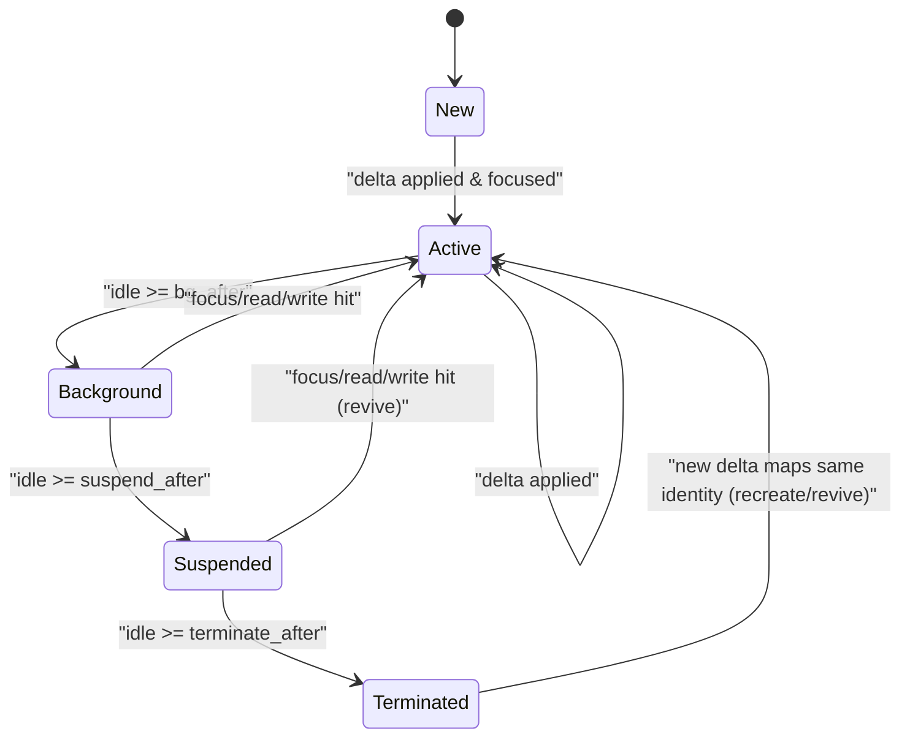

# 窗口模型泛化设计（概念定案）

> 日期：2026-02-15  
> 状态：已评审并完成首轮实现（Task 1-8）  
> 范围：`excelmanus/window_perception/`  
> 决策前提：本轮讨论显式忽略“代码改造成本”，仅按概念正确性评估。

---

## 实施同步（2026-02-15）

1. `WindowState` 已从 `excelmanus.window_perception` 顶层导出移除，外部需从 `models` 显式导入。
2. manager 摄入路径已落地 `classify -> locate(identity) -> apply_delta -> ingest`。
3. projection 层新增 `identity` 在 tool payload 中的显式承载，并增加一致性回归测试：
   `test_projection_identity_intent_consistency_across_outputs`。

---

## 1. 目标与结论

### 1.1 目标

将当前以 `WindowState` 为中心的宽对象模型，重构为：

- `BaseWindow`（极薄基类）
- `ExplorerWindow` / `SheetWindow`（判别联合子类）
- 每种窗口对应 `typed data container`
- 横切语义（intent/audit/focus）与业务数据解耦

### 1.2 最终结论

采用以下概念架构：

1. `Window = ExplorerWindow | SheetWindow`（判别联合）
2. `BaseWindow` 只承载身份与生命周期不变量
3. 业务数据只存在于 `ExplorerData` / `SheetData`
4. `IntentState` / `AuditState` / `FocusState` 作为独立横切域组合到窗口
5. 投影层（notice/tool payload/confirmation）纯只读，不回写状态

---

## 2. 类型模型（字段级草案）

### 2.1 顶层类型

```text
Window = ExplorerWindow | SheetWindow

BaseWindow
- id: WindowId
- kind: WindowKind
- title: str
- lifecycle: LifecycleState
```

### 2.2 生命周期域

```text
LifecycleState
- detail_level: DetailLevel
- idle_turns: int
- last_access_seq: int
- dormant: bool
```

### 2.3 Explorer 窗口

```text
ExplorerWindow(BaseWindow)
- data: ExplorerData
- intent: IntentState
- audit: AuditState
- focus: FocusState

ExplorerData
- directory: str
- entries: list[str]
```

### 2.4 Sheet 窗口

```text
SheetWindow(BaseWindow)
- data: SheetData
- intent: IntentState
- audit: AuditState
- focus: FocusState

SheetData
- file_path: str
- sheet_name: str
- sheet_tabs: list[str]
- viewport: ViewportState
- schema: list[ColumnDef]
- cache: CacheState
- style: StyleState
- filter: FilterState
```

### 2.5 Sheet 子域

```text
ViewportState
- range_ref: str
- visible_rows: int
- visible_cols: int
- total_rows: int
- total_cols: int

CacheState
- viewport_range: str
- cached_ranges: list[CachedRange]
- data_buffer: list[dict[str, Any]]
- max_cached_rows: int
- stale_hint: str | None

StyleState
- freeze_panes: str | None
- style_summary: str
- column_widths: dict[str, float]
- row_heights: dict[str, float]
- merged_ranges: list[str]
- conditional_effects: list[str]
- status_bar: dict[str, Any]
- scroll_position: dict[str, Any]

FilterState
- active: bool
- condition: dict[str, Any] | None
- unfiltered_buffer: list[dict[str, Any]] | None
```

### 2.6 横切域

```text
IntentState
- tag: IntentTag
- confidence: float
- source: str
- updated_turn: int
- lock_until_turn: int

AuditState
- operations: list[OpEntry]
- changes: list[ChangeRecord]
- max_history_entries: int
- max_change_records: int
- current_iteration: int

FocusState
- active_range: str
- last_focus_turn: int
```

---

## 3. 接口契约（核心流程）

```text
classify(tool_call, tool_result) -> WindowDelta | DeltaReject
locate(state, delta) -> WindowId | CreateWindow
apply_delta(window, delta) -> ApplyResult

evaluate_lifecycle(window, context) -> LifecycleAdvice
project_notice(window, view_mode) -> NoticeProjection
project_tool_payload(window) -> ToolPayloadProjection
project_confirmation(window, op_context) -> ConfirmationProjection
```

### 3.1 契约职责

1. `classify`：仅做解析与判别，不改状态。
2. `locate`：只做 identity 命中/创建决策，不做业务更新。
3. `apply_delta`：唯一状态写入口，原子、确定、可审计。
4. `project_*`：纯只读投影，不得回写。
5. `evaluate_lifecycle`：仅依赖生命周期/意图/焦点域，不下钻业务容器细节。

### 3.2 ApplyResult

```text
ApplyResult =
  | Applied(window, audit_events, derived_updates)
  | Rejected(reason_code, reason_detail, suggested_action?)
```

---

## 4. 生命周期状态机



### 4.1 状态语义

1. `New`：已创建，未进入稳定调度。
2. `Active`：高优先渲染态。
3. `Background`：降级摘要态。
4. `Suspended`：最小信息保留态。
5. `Terminated`：不渲染态，可按 identity 复活。

### 4.2 迁移冲突优先级

同轮若同时出现降级与 `FocusHit`，`FocusHit` 优先。

---

## 5. Identity 设计

### 5.1 主键模型

```text
ExplorerIdentity
- directory_norm: str

SheetIdentity
- file_path_norm: str
- sheet_name_norm: str
```

### 5.2 规则

1. `id` 是技术实例标识，`identity` 是业务语义主键。
2. `locate` 仅按 identity 命中，不按标题/摘要等弱信号命中。
3. identity 建立后禁止 silent drift。

### 5.3 规范化

1. 路径统一绝对化与分隔符规则。
2. sheet 名匹配使用规范化值，展示保留可读形式。
3. 主键字段缺失时返回 `INCOMPLETE_IDENTITY`，不猜测。

### 5.4 冲突码

- `WINDOW_KIND_CONFLICT`
- `WINDOW_IDENTITY_CONFLICT`
- `AMBIGUOUS_LOCATE`
- `INCOMPLETE_IDENTITY`

---

## 6. 投影协议（Notice / Tool Payload / Confirmation）

### 6.1 统一原则

1. 先结构化 DTO，再文本渲染。
2. 投影函数完全只读。
3. 同状态输入必须得到确定性输出。

### 6.2 Context

```text
ProjectionContext
- mode: enriched | anchored | unified
- detail_budget: int
- rows_budget: int
- now_turn: int
- locale: str
```

### 6.3 DTO 草案

```text
NoticeProjection
- window_id
- window_kind
- tier
- title
- headline
- facts
- warnings
- intent_hint
- token_estimate

ToolPayloadProjection
- window_id
- window_kind
- identity
- compact_metrics
- highlights
- intent
- range_ref

ConfirmationProjection
- window_label
- operation
- affected_range
- shape
- change_summary
- intent
- hint
- confidence
```

### 6.4 投影错误码

- `PROJECTION_INSUFFICIENT_DATA`
- `PROJECTION_IDENTITY_MISSING`
- `PROJECTION_RANGE_UNRESOLVED`
- `PROJECTION_INVARIANT_BROKEN`

---

## 7. 全局不变量

1. `window.kind` 不可变。
2. `ExplorerDelta` 不能作用于 `SheetWindow`，反之亦然。
3. `project_*` 不得修改任何状态。
4. 所有状态变化必须经 `apply_delta`。
5. `BaseWindow` 不承载类型专属业务字段。
6. 三类投影的 `identity/intent/window_id` 必须一致。

---

## 8. 定案清单

### 8.1 必须做（Must）

1. 判别联合窗口模型：`ExplorerWindow | SheetWindow`。
2. 极薄 `BaseWindow`。
3. typed data containers 全量承载业务数据。
4. 横切域对象组合（intent/audit/focus）。
5. 单入口状态写入（`apply_delta`）。
6. identity 统一解析与冲突显式化。
7. 投影层与状态层彻底解耦。

### 8.2 禁止做（Must Not）

1. 禁止回引核心 `metadata: dict[str, Any]` 兜底。
2. 禁止在 `BaseWindow` 回填 `file_path/sheet_name/directory/viewport` 等字段。
3. 禁止 `project_*` 回写。
4. 禁止散写字段绕过 `apply_delta`。
5. 禁止默认分支吞掉 window kind。
6. 禁止 identity 静默漂移。

### 8.3 可选做（Optional）

1. `Terminated` tombstone + TTL 复活策略。
2. `AuditState` 向 event-sourcing 演进。
3. 投影输出增加稳定哈希，服务快照测试。

---

## 9. 设计验收标准（Concept-level）

1. 类型层面无法构造 explorer/sheet 混杂非法状态。
2. 所有窗口变更都可追溯到 `WindowDelta`。
3. 生命周期迁移仅由状态机驱动，不被业务代码侧写。
4. notice/tool payload/confirmation 三类输出一致且可解释。

---

## 10. 后续动作

1. 本文作为概念基线，下一步进入实现计划文档（TDD + 分任务执行）。
2. 实施阶段若出现与不变量冲突，以本文不变量优先。
