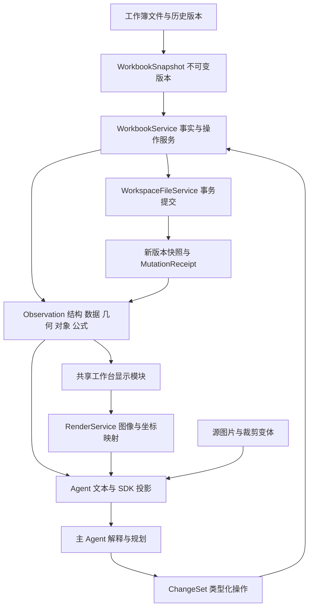

# ExcelManus 工作簿感知与操作架构 V2 实施说明

日期：2026-09-24。状态：V2 工作树实现已完成本轮修复；本文区分当前支持能力与发布验收。验证记录见 [V2 验证记录](workbook-v2-validation.md)。V2 是唯一工作簿协议，运行时不再披露或翻译旧工作簿工具契约。真实浏览器夹具与独立 wheel 渲染已验证；真实模型行为和完整桌面安装包仍属于发布验收，不会被单元测试结果冒充。

## 1. 已执行决策与范围

建立统一的 `WorkbookService`，负责从不可变工作簿版本读取事实、按范围提供观察、编译操作并交给现有文件事务服务提交。Agent、Code Mode、工作台、历史预览和渲染均通过这条路径。表格数据、几何、样式、对象、公式和图像共用版本、地址和证据契约。

本次破坏性调整覆盖工作簿领域接口、工具参数与返回契约、读取/渲染/修改实现、SDK、提示词、前端预览以及对应验收。继续以现有工作区身份、权限、取消、文件事务、历史版本和 Agent 主循环为基础；所有写入最终进入 `WorkspaceFileService`。这明确了重构边界，防止同时重写聊天系统、文件系统和表格引擎。

对外工具契约和前端读取协议已经升为 `workbook/2`。旧工作簿可以原样读取，不需要文件迁移；旧工具名、旧参数和旧返回协议不再进入运行时。

主 Agent 负责自然语言理解、业务判断、选择证据和交付。运行时负责参数、坐标、版本、权限、操作语义与事实报告。视觉复核由主 Agent 显式调用，不引入强制验收子代理或隐藏模型回合。下文“验收闸门”指开发和发布的验收，不是每个用户任务的强制工作流。

## 2. 已核实的基础与需要校正的结论

1. `WorkbookSnapshot` 已有不可变 backing 和版本身份，`WorkspaceFileService.apply_batch()` 已有读取依赖校验、幂等操作与事务回执。V2 在此基础上收敛领域服务，不再建第二套版本或提交数据库。
2. 当前调度器的 `expose_spreadsheet_value()` 会把结构化 value 投影到模型正文，大结果可取回。因此“底层 model_text 没显示某字段”本身不足以证明真实模型看不到；验收必须检查最终请求的观察载荷，包括整形、spill 和硬截断之后的形态。
3. `range` 已支持组合 facets、有限多区域和按已用范围裁剪的整轴请求；搜索使用固定快照及 offset 游标。CSV 尊重请求 facets，未请求与格式不支持分别报告。
4. `preview_spreadsheet` 已注册为只读派生观察；工作台 surface 使用共享 Univer 映射，print surface 使用 LibreOffice，并把 renderer/version/coverage/limitations 一起返回。导出类 `render_spreadsheet` 仍是显式文件导出动作，不再承担 Agent 观察。
5. 尺寸操作在序列化后重新打开文件核对，回执同时给出 before/requested/persisted 和 verified；方向性缩放由 `geometry.scale` 的 x/y 明确表达。
6. `max_tokens` 是当前提示词段的静态预算检查值，没有证据表明段正文会因该值自动截断。增加预算不等于保证模型会遵守规则。
7. `WorkbookSpec.purpose=visual_replica` 校验完整行列几何或 LayoutReference；它校验输入覆盖，不证明视觉相似。生成成功、字段覆盖、实际视觉相似分别报告。
8. 默认列宽的 8.43 是常见假设，不能对所有字体/应用当作文件声明的精确值；前端固定乘 7.5 的列宽换算也不能充当通用 Excel 几何模型。

主要证据位置：

- `excelmanus/workbook/snapshot.py`：快照、版本和读取缓存。
- `excelmanus/workspace/file_service.py`：`ReadDependency`、`MutationReceipt`、`apply_batch`。
- `excelmanus/engine_core/tool_dispatcher.py`：结构化 value 投影及写后观察。
- `excelmanus/engine_core/spill.py`：`expose_spreadsheet_value`、spill 覆盖和完整载荷取回（工作簿业务核验已迁出）。
- `excelmanus/tools/workbook_tools.py`：V2 工具注册与 schema。
- `excelmanus/workbook/preview.py`、`preview_worker.py`：只读渲染观察与附件回执。
- `excelmanus/attachments/project.py`：请求版图像和 detail 投影。
- `web/src/lib/workbook-observation.ts` 与 `web/src/components/excel/UniverSheet.tsx`：UI 的 V2 观察转换和窗口投影。

## 3. 目标数据流



`WorkbookScene` 可以作为“同一份表格的多种观察”的概念名称，不作为每次传给模型的巨型 JSON，也不存放另一份可变工作簿。事实从同一版本按需派生；默认只取轻量总览，需要某一区域时再查它的值、显示、几何和对象。

## 4. 模块职责与唯一所有者

| 模块 | 负责 | 唯一输出或边界 |
|---|---|---|
| Snapshot/Workspace | 文件身份、不可变版本、读取租约、事务、历史与恢复 | 现有 file ref、snapshot id、content version、mutation receipt |
| WorkbookService | 工作簿领域入口、查询分发、操作编译、能力裁剪 | 接受 ObservationRequest / ChangeSet |
| WorkbookAdapter | 文件解析与编码、原生单位、公式和对象引用、未知 OOXML 部件清单 | 文件事实及明确的支持范围 |
| ObservationService | 总览、区域、对象、公式依赖、搜索与逐维度覆盖 | 版本绑定的 Observation |
| Presentation/Geometry | 显示样式、尺寸继承、隐藏状态、边界、单位转换和字体假设 | 可解释的显示/几何投影 |
| RenderService | 工作台图像、打印图像、坐标映射、渲染身份 | RenderRef + ImageAttachmentRef + coverage |
| MutationCompiler | 新建、写值、公式、格式、布局、对象统一编译 | 一批可执行操作与影响范围 |
| ObservationProjector | 模型短文本、SDK 对象、UI tiles 的确定性投影 | 同一 observation id 下的不同投影 |
| CapabilityRegistry | schema、操作支持、运行环境、模式权限和示例 | 工具、SDK、发现、文档共同来源 |

以下职责由模块函数共同实现，不要求每个概念都实例化成独立的 Service 类。薄入口本身不是缺陷；关键是各入口使用同一事实提取器和变更执行器。当前代码组织：

```text
excelmanus/workbook/
  service.py       # Agent、HTTP、历史共用入口；可接收已经固定的 snapshot
  protocol.py      # ObservationRequest 类型与协议身份
  adapter.py       # OOXML 清单、解析预算、保真支持边界
  render_environment.py # 资源校验、依赖发现、字体环境指纹
  observation.py   # overview/region/facets/coverage
  geometry.py      # Excel 原生尺寸、隐藏/分组轴和像素估算
  presentation.py  # 显示样式、打印设置和规则元数据
  contracts.py     # ChangeSet discriminated union
  mutation.py      # 原子执行、序列化回读和 MutationReceipt
  spec.py          # WorkbookSpec V2 → 同一 ChangeSet
  preview.py       # workbench/print 观察
  preview_worker.py# headless 共享显示入口

web/src/lib/workbook-observation.ts
web/src/lib/workbook-style.ts
web/src/lib/workbook-preview-entry.ts
web/src/lib/api.ts               # /workbooks/observe|changes|compare
```

先把现有可用逻辑移到这些职责下，再按已证明的差异替换实现。避免先复制整个 `data.py`、`workbook_tools.py`，留下两套可以各自演进的核心逻辑。

## 5. 六份核心契约

### 5.1 WorkbookRef / SnapshotRef

包含工作区身份、相对路径、content version、snapshot id，以及事务/历史已有登记时的 lineage_id。首次只读且尚未登记历史的文件，lineage_id 可为 null，不伪造持久身份。文件改名不能变成另一个工作区对象，历史快照也不能被当作当前写入版本。当前版本变动后，旧观察仍可解释，但写入必须显式处理冲突。

### 5.2 Observation

```text
identity: observation_id, snapshot_id, file, content_version, schema_version
request: sheet, range, facets, mode, query, offset, limit, locale
sheets: 轻量 manifest；regions: 有界 cells / geometry / objects / dependencies
coverage: loaded / unloaded；regions[].coverage 按 facet 报告状态
provenance: adapter / adapter_version / projection_version / calculation / locale
search: matches / total_matches / coverage.next_offset
```

每个维度分别标明完整性。读取完一块值，不意味着该块的样式、公式缓存或图片也已读取。`[]` 表示已经确认没有对象，`not_requested` 表示没有查询，`unsupported` 表示当前适配器无法确认。这些状态不能合并为一个空列表。

范围统一使用 Excel 的 1-based 行列语义；模型可用 A1 地址，UI 0-based 索引只在 UI 适配器边界转换。范围相交的合并区域需包含原始锚点；隐藏行列、分组列宽、默认尺寸和样式继承一并解析。

单元格分开报告 raw value、formula、cached_value 与 calculation_provenance；未缓存公式标为 formula_text/missing_cache。未渲染的 display 明确为 renderer_required，实际 displayed_cells 由 preview 的 Univer 格式器提供。显示文本带 locale/number format/renderer 口径。无法解析某格式或条件格式时，报告原始规则及未求值状态，不编造“最终显示颜色”。

### 5.3 Geometry

保存原生尺寸与派生尺寸：列宽使用 Excel 字符宽度，行高使用 pt，绘图锚点保留 EMU/偏移；像素边界带渲染器、字体集合、DPI、zoom、device scale。

总览给出 content/formatted 单元格边界和原生 print area。drawing bounds 仅在查询对象时计算；visible 的隐藏状态在区域几何中逐轴解析。未查询的边界使用状态描述，不冒充已测量值。20 行 × 6 列不能被当成视觉长宽比。区域宽高须根据有效行列尺寸、隐藏状态与对象外延计算，分别报告网格范围和绘图范围。

尺寸继承采用区间表达：默认值、列/行区间覆盖、单项覆盖及隐藏状态。未声明的默认列宽保留 `unspecified`，必要时输出 `estimated` 值及字体依据。实际测量值与估算值不能复用同一个无说明字段。

换行、字号、合并、缩进、旋转、shrink-to-fit 作为样式事实传递。当前几何编译器不测量字形的最小可读高度；缩高报告 clipping_risk，预览用于检查效果。不支持的样式保留 raw_style，并标记部分显示。字体指纹覆盖安装字体环境；字体替换仍标为未测量，不能声称原生 Excel 像素一致。

### 5.4 RenderRef

```text
render_id, snapshot_id, observation_id
surface: workbench | print
sheet, ranges, page_or_tile
attachment_id, source_pixel_size, attachment_pixel_size
source_to_attachment; request_pixel_size 在请求投影时分配并附缩放信息
renderer_version, font_fingerprint, locale, dpi, zoom
cell_to_pixel_map, object_bounds, coverage, limitations
```

`workbench` 表示应用工作台；`print` 表示打印页。两者不得在输出里混称“Excel 原样”。每张图绑定源版本与范围。渲染成功且当前模型能看图时，同一次工具调用直接返回文本定位信息和视觉附件。

### 5.5 ChangeSet

新建和修改共用操作类型：sheet create/rename、cell values/formulas、style patch、merge、axis sizes、geometry scale、print settings、objects、names、validation 等。操作使用 discriminated union，每种操作有自身参数，避免一个宽松对象同时混用 columns=数据列/像素宽度/冻结数量等含义。

包含 expected version、读取依赖、实际目标和操作数组。Agent/SDK 的 operation id 由执行上下文产生；HTTP 接受调用者稳定的 operation_id。一次布局任务可同时写值、合并、样式、列宽行高，统一原子提交。dry_run=true 使用同一编译与序列化核验路径，返回计划、影响与核验结果，不提交文件/历史；真实提交仍重新校验版本和依赖。普通操作不要求额外批准。

`WorkbookSpec V2` 保留新表声明能力，作为 ChangeSet 的输入编译器。尺寸、样式、图表和图片编译成同一批已注册操作并再次校验；shapes 明确拒绝。LayoutReference 与不确定项保留在文档回执和事务意图中。编译展开限制为 200000 个单元格。

### 5.6 MutationReceipt / ObservationDiff

事务回执沿用 WorkspaceFileService，增加领域 observation 引用：before/after 版本、实际受影响范围、变动维度、相应字段的回读结果、未观察项。

在发布前核验拟提交的序列化字节，提交成功后把证据绑定到回执确认的最终版本；不重新打开可能已被外部修改的活路径。`dimensions_requested`、`dimensions_persisted`、`geometry_delta`、`visual_observed` 分开报告。视觉图未取回时不标“视觉已验证”。提交后观察失败返回“已提交，观察未完成”，不能以普通失败提示模型重放写入。

## 6. 对外工具与发现方式

当前模型工具面：

| 工具 | 使用方式 |
|---|---|
| `observe_spreadsheet` | 总览、区域、搜索、对象、依赖；同一次区域请求可组合 data/presentation/geometry 等 facets |
| `preview_spreadsheet` | 观察某范围的工作台图或打印图；返回图像附件及相同版本的几何 |
| `analyze_spreadsheet` | 保留过滤、聚合、质量、查询；结果引用实际 source_snapshots/content_version 和计算口径 |
| `apply_spreadsheet_changes` | 类型化 ChangeSet，覆盖新建、数据、格式、布局、对象与打印设置 |
| `workbook/merge-review` HTTP workflow | 对 `cells.patch` 草稿做三方核对，再把选择后的 ChangeSet 交给同一 MutationService |
| `compare_spreadsheets` | 按维度对比值、公式、几何、对象、显示；图像比较显式请求 |
| `manage_spreadsheet_versions` | 版本浏览、检查点、恢复 |

计算、格式转换、导出继续作为专用动作，通过同一服务访问快照。`preview` 只在应用管理的派生缓存中生成可清理观察，不改源文件或用户交付目录；`export` 才是工作区写入。read/plan 可使用 preview，权限仍在执行器校验。

旧工作簿工具和旧参数已经从注册表、SDK、HTTP 客户端、前端调用和提示词中删除。运行时不会把失败请求翻译到旧协议，也不会双写；历史聊天只作为不可执行的展示记录。

能力发现基于注册契约、模型视觉能力、文件格式、模式权限和可用引擎，返回 available/unavailable/unknown 及原因。关键词匹配最多排序候选工具，不能再把“表格太胖”未命中解释为“能力不存在”。字段说明、Python SDK、tool_detail 使用运行时 schema；`scripts/generate_workbook_contracts.py` 从同一 schema 生成 TypeScript wire 类型（--check 校验漂移）。UI 保留面向显示的投影类型，避免把整个工具合同强塞进组件。依赖发现区分 unavailable 与已发现依赖但尚未执行的 unknown。

## 7. 工作台与 Agent 共用视觉观察

当前保留 Univer 作为工作台显示适配器；数据、尺寸与样式映射由 `workbook-observation`/Geometry 与 headless preview 共用。当前 Univer core 不装配图表/图片，也不计算条件格式；工具 limitations 与工作台提示都会说明。UI 尺寸编辑发送 geometry.resize 的 CSS 像素请求，后端统一转换；7px 字符宽度仍是显式估算，并非测得的字体指标。

headless 工作台渲染进程在受控临时环境中运行固定页面，关闭编辑与任意网络访问，通过版本/范围就绪信号等待字体与网格加载完成，返回图像及坐标映射。它不需要抢占用户屏幕或改变用户当前选区。

打印渲染继续使用 LibreOffice，保留分页、纸张、缩放和打印区域语义。LibreOffice 临时重算若改变缓存值，需报告其计算来源；不得把重算后的打印图声称为原始未重算工作台的同像素视图。

工作台采用最多 16 项/32 MiB 的进程缓存，5 分钟分桶失效，键绑定工作区快照、Observation、surface、资源清单与字体环境。当前显示配置固定为 zh-CN、96 DPI、zoom=1、device scale=1、保存缓存值；配置变化须更新渲染资源身份。print 不复用该缓存。临时文件退出即清理；进入历史的图像附件继续遵循附件存储策略。源图→标准附件→请求图均有缩放口径，压缩后不继续使用未经换算的源坐标。

工作台首屏以轻量结构和可见窗口读取；Agent 使用同一服务。发送聊天前继续 flush 用户本地修改并固定当前 file/sheet/range/version，可补充 viewport/zoom 作为对话指向提示，但 viewport 不自动扩大修改授权范围。

需要在实现早期验证：Univer 所选组件对图表、图片、条件格式的实际支持、headless 打包体积/启动成本、字体分发。能力不支持时返回明确 limitations；不能无声丢对象。打印渲染可以作为另一种已标注的观察，不伪装成工作台渲染。

## 8. “横向加长、纵向降低”的新执行语义

主 Agent 把用户意图转换成明确的轴向操作。存在已绑定表格区域时先用它；多个视觉表格时用区域观察定位，必要时才澄清。显式“宽增、高减”的要求优先于“胖”这种可能含糊的形容词。

示例为拟定契约：对观察到的 A1:F20 应用 `geometry.scale`，x=1.25、y=0.8，保持值和公式；这两个比例由模型按任务选择，不能把示例硬编码成默认。

几何编译器用当前有效尺寸求目标宽高，转换为原生列宽/行高。禁止将“fit content”隐式插入到已指定比例操作后，覆盖用户的尺寸目标。自动适配必须带轴、范围和保留策略。

列宽作用于整列、行高作用于整行，因此布局影响可超出 A1:F20。编译器报告受影响轴、区域外有值/有样式单元格和绘图锚点样本，不把启发式表格识别当事实。preserve_outside=true 时存在共享轴影响则拒绝，建议移到独立行列或显式允许该影响。默认仍执行授权的轴向操作并报告完整作用域。

变矮与完整显示文本可能冲突。编译器给出 clipping 风险（当前不测最小可读高度）；Agent 可以重分配列宽、调整换行或征求必要偏好。系统不能擅自把“降低高度”执行成“增加高度”，也不能静默删内容或缩字号。

写后提供 W/H 的 before/after、每轴变化、坐标覆盖和误差口径。对显式轴向操作，落盘结果方向可以确定性检查。对于用户一句自然语言是否被正确理解，仍需主 Agent 和真实模型场景评测。

## 9. 图片复刻的单一工作流

1. 保存源图片的不可变身份与可用原始字节。当前的标准化、请求压缩和局部裁剪成为带来源转换的派生变体。容量限制明确；不能把不可逆降采样后的图片标作原始图。
2. 主模型读取全图；小字、长表、复杂合并按区域继续裁剪。图像 detail 及实际分辨率须贯彻请求投影，不能只在工具返回文字中声称 high。
3. 主模型形成布局草稿（概念名称 `LayoutDraft`，实现直接使用 WorkbookSpec + LayoutReference，不另造持久状态）：表格 bbox、行/列边界、合并区域、文字/数值、样式及不确定项，关联源 attachment 和坐标系。线段检测等确定性辅助可提供候选与置信信息，不替代主模型判断。
4. 列/行边界先表示相对比例。图片的截图缩放、DPI 和透视校正影响绝对尺寸；编译器按目标总宽与截图纵横比求初始 Excel 尺寸，附固定 DPI/字宽估算口径；打印约束通过独立 print_layout 操作声明，字体和可读性由预览复核。
5. Draft 经 WorkbookSpec V2 编译为 ChangeSet。视觉复刻模式校验布局覆盖与边界合法性，允许无法确认的格子进入 uncertainties；数据提取模式可采用默认布局。不能对所有新表统一强制填写每行高度。
6. `preview_spreadsheet` 返回生成表的图像，直接进入主模型视觉上下文；主模型与源图做局部对照后，按需要应用修正。

`LayoutDraft` 只是设计输入，不是另一个持久工作簿状态。跨版本的截图都带来源，不把旧截图继续当成修改后的表格。多轮修正受现有时间/工具/令牌预算约束；保留已生成成果并报告未解决项，不进入隐藏无限验收循环。

## 10. 数据、Excel 语义和文件保真

- 所有分析先固定快照，并保留原始坐标。DataFrame 是分析投影，不能替代稀疏表单、合并区、留白和图形的模型。
- 表头、数据块、汇总区和输入区识别属于有证据的推断。区域标注可重叠，必须保留来源范围及 confidence，不能覆盖确定的单元格事实。
- 公式文本、保存缓存、派生计算值分别标来源。修改输入后旧缓存失效；实际重算需记录引擎及其输入版本。
- XLSX adapter 初期可封装 openpyxl，但编码路径必须核对未触及 OOXML 部件与关系。当前仅对已识别的 LibreOffice ExcelA1 计算扩展和空自定义属性部件做定向回填，不实现通用 package patch；对其他未知部件、签名、扩展节点和不支持绘图明确拒绝写入，并检查关系图、未修改图片和宏字节；不能凭能重新打开文件就认定对象已保留。
- 宏、外链、签名、扩展图形等使用能力清单表达保留/修改/渲染支持程度。修改签名覆盖的内容不得继续声称签名有效。转换为 xlsx 的损失独立报告。
- 不承诺所有 Excel 扩展功能与所有渲染器像素一致。支持范围由适配器契约及原生应用样本验收决定。

## 11. 观察预算与上下文

观察按任务范围与 facets 查询。轻量总览提供实际存在的维度、粗范围、对象计数和可继续查询的句柄；结构较复杂时再取局部样式/几何，避免每次展开整表。

覆盖和分页由事实服务负责，模型/SDK/UI 共用 observation id。大型值块可以 spill，但保留身份、coverage、单位、警告、渲染关联及下一页定位等元信息。任何模型整形都不能删除这些关键字段或把推断改成已确认事实；语义摘要如保留，应作为旁注。

历史压缩至少保留目标、最后观察版本、有效范围、待完成事项和附件引用。重新取图或数据时核对版本，不能以“之前已经看过”代替当前版本事实。

提示词以少量原则规定何时查值、何时查几何、何时看图、何时报告未知；使用细节进入工具契约和可发现的工作流。动态观察不反复改写稳定 system 前缀，沿用现有 RequestSeries/请求身份的更新边界。

## 12. 已删除的旧代码与唯一实现

| 现有实现 | V2 接管后处理 |
|---|---|
| `tools/intent_tools.py`、`replica_spec.py`、`workbook/sheets.py`、`workbook/view_mutate.py` | 物理删除；无注册、导入或运行时调用者 |
| `workbook.data.read_excel` 旧宽泛读取 API | 物理删除；数据分析改走 `analyze_spreadsheet`，事实/版式读取改走 `observe_spreadsheet` |
| `workbook_tools.py` 多类业务分发、宽松字段与独立格式提交 | 已收敛为 V2 薄工具适配；领域逻辑进入 `WorkbookService`、Observation 和 Mutation |
| `workbook/data.py` 中样式/对象/尺寸重复采集 | 迁入统一事实/显示提取器；数据分析复用其快照和坐标 |
| `workbook/sheets.py` 自有 overview 投影 | 物理删除；overview projector 只保留在 `observation.py` |
| `snapshot.py` 内 UI 专用样式、几何投影 | 保留快照权威；投影移到通用观察与显示模块 |
| `api_routes_files.py` 旧 snapshot / view / write 解析 | 物理删除；读取、写入、比较统一到 `/workbooks/observe|changes|compare` |
| UI `width * 7.5` 和独立默认值 | 主路径删除；UI/headless 使用服务端几何，UI resize 的 CSS 像素在后端统一换算 |
| `replica_spec.py` 独立样式/尺寸编译 | 物理删除；V2 spec 编译成同一 ChangeSet |
| `spill.py` 中工作簿业务核验 | 物理删除；spill 只做存储、覆盖和投影 |
| 静态 `_MODEL_CAPABILITIES`、手写旧工具否定、过期 skill 说明 | 物理删除；能力发现读取 live catalog 和协议 schema |
| 工作区文件导出的 render/read_image 组合 | 保留导出用途；Agent 观察由 preview 直接返回视觉附件 |
| 前几轮的尺寸摘要、固定默认值、重复提示规则 | 作为回归样例迁移；由事实/几何/新契约覆盖后删除冗余实现 |

删除以运行时引用、SDK/前端消费者和场景验收为准。历史聊天里的旧工具卡片只保留展示文本，旧写入记录不自动重放。

## 13. 实施批次、依赖和退出条件

| 批次 | 交付 | 退出条件 |
|---|---|---|
| A：契约与基线 | 已完成：V2 schema、Observation、Geometry、ChangeSet 和测试夹具 | 旧模块已删除；关键字段有明确单位与 coverage |
| B：统一观察 | 已完成：WorkbookService + overview/region/facets + geometry resolver | Agent、SDK、UI 使用同一版本绑定 Observation |
| C：视觉观察 | 本地与独立 wheel 验证：workbench/print、附件、坐标映射、资源指纹 | 原生桌面安装包、不同系统字体仍需发布验收 |
| D：统一变更 | 已实现：ChangeSet、dry-run、轴影响/冲突、编译及最终序列化回读 | native/HTTP/SDK 确定性测试；自然语言选择比例仍需真实模型验证 |
| E：复刻工作流 | 已完成基础：LayoutReference、源图 provenance、V2 spec 几何校验 | 仍需真实模型和更多图片样例验收视觉误差 |
| F：运行时切换 | 注册工具、API/SDK、前端、提示词、历史消费者已使用 V2 | 测试迁移结果单列；不能用旧测试的函数名替换冒充迁移完成 |
| G：删除与发布 | 代码删除已完成；浏览器、打包和真实模型为发布闸门 | 发布前必须完成列出的环境验收，不能以本机预览替代 |

第一条可交付链路是 B+C+D 对应的“读取一个已有区域 → 看图 → 加宽压低 → 读取新版本尺寸与图像”。让原始问题先得到端到端验证，再扩展更多对象和复刻，不把价值交付拖到所有模块重写之后。

每批交付含迁移映射、源变更、实际验收记录、未支持项和可回退边界。当前工作树存在其他并行修改，实施前建立本次修改清单和基线；不能直接拿 HEAD 工作树替代用户未提交内容。

## 14. 验收矩阵

| 场景 | 需要的证据 |
|---|---|
| 指令“宽增加，高降低”及多种口语表达 | 无手工参数介入的真实模型 trace；最终原生尺寸与同 renderer 下 W/H 方向一致；值/公式无意外变化 |
| 非默认字体/字号、CJK 换行、合并区 | 默认继承与文字测量口径；溢出/截断可观察；无法满足的尺寸约束明确返回 |
| 同一列/行上存在两张视觉表格 | 操作影响范围覆盖整轴，不能假装只改一块矩形 |
| 分组列宽、隐藏行列、稀疏表单 | overview、局部观察、UI、preview 的有效尺寸一致；留白不误判成丢数据 |
| 800 行以后的样式或对象 | 可定点查询，不受 overview 首段扫描上限阻挡；coverage 如实 |
| 图表和嵌入图片扩展到数据区之外 | drawing bounds、锚点、裁剪与受支持的图像均可观察 |
| 公式未计算、依赖已变、原生缓存缺失 | raw/formula/cache/derived 状态分离，显示和分析不会把未计算当空白或零 |
| 源图大幅压缩、长表、多次裁剪 | 源图/请求图坐标转换可复原，细节通过局部观察恢复；没有像素单位混用 |
| 读后人工编辑、恢复历史、切换工作簿 | 旧观察仍可查、旧版本写入被拒绝；新图片和 UI 不混用旧版本 |
| 写入中取消、提交后观察失败、重试 | 提交状态和 observation 状态独立；幂等重试不重复业务写入 |
| read/plan、无视觉模型、缺渲染依赖 | 模式权限正确，支持/不可用/未知区分明确；不伪称已看图 |
| 百万行或大量格式/对象 | 有界内存、分页、取消、请求预算；比较在同硬件同夹具上的延迟与成本 |
| 真实桌面/网页与打包运行时 | 正确字体和渲染依赖、UI 场景与 headless 场景对应；本机成功不替代打包验收 |

开发测试验证执行语义；真实模型评测验证模型是否主动获得合适证据和选对工具。图片相似性同时考虑内容、结构、相对几何和可读性，按样例设误差范围；单个像素差/SSIM 数字不能替代这些判据。

已有通过的聚焦测试只作为基线。V2 完成不得以“schema 可编译”“单元测试通过”或“图片文件已生成”代替上述场景闭环。

## 15. 破坏性切换与回退

协议带显式 `workbook/2` 标识。V2 是唯一运行时协议；不存在 V1/V2 会话选择、旧参数翻译、失败回落或影子双写。旧参数直接按 schema 拒绝并返回字段错误。HTTP 观察端点校验显式 x-workbook-protocol，前端拒绝不兼容的协议/响应形状。

回退以代码版本和协议版本为单位，不在当前进程内保留旧 workbook adapter。已提交用户工作簿保持原样；需要恢复时使用版本历史的显式 restore ChangeSet。历史工具卡片只做展示，禁止从历史卡片重放写入。

读投影和渲染缓存可清理重建。V2 写入文件仍是受支持的标准格式，源文件不需要数据库迁移。若对象超出适配器能力，V2 返回只读/unsupported 事实并拒绝会丢失对象的提交。

## 16. 设计取舍

统一服务增加了明确的类型与适配工作，但能消除现有多条感知路径的差异。共享工作台渲染带来 headless 进程、字体和打包成本；源部署需安装 Chromium，桌面构建脚本将其打入后端并在 frozen smoke 中实际取图。独立 wheel 已验证，正式系统安装/签名仍单独验收。OOXML 长尾特性无法靠一次改造获得全面保真，因此保留能力清单、未知部件和逐类验收。

目标是让 Agent 每次都能知道自己观察了哪一版、哪个区域、哪些维度，能够按需看到与工作台对应的图像，并依据实际变更结果继续工作。它仍需对含糊语言、业务含义及视觉质量作判断；系统为这些判断提供完整、可追溯且可继续查询的证据。


## 17. 本轮修复与可重复检查

- 修复搜索游标、CSV facets、稀疏区域的 unloaded、跨窗口合并锚点、继承样式与观察缓存被查询污染。
- 公式缺失缓存不能参与数值聚合并被当作零；quality/profile 对受影响列返回不可用统计。工作台与 headless 默认使用保存缓存；窗口注水不计算缺失的屏外依赖。
- 连续尺寸操作按最终合成结果核验，保留每步原始请求；极小比例不会因为像素取整而反向改变 native 尺寸。批次错误保留真实全局 operation_index。
- cells.patch 的 style 字段使用专用 schema，禁止混入 kind/sheet/range 改写目标。图像/跨文件 join 输入固定快照并登记读取依赖。
- 渲染资源有源码和输出哈希清单，wheel 构建拒绝缺失/过期资源；浏览器依赖和正式桌面包验收与资源打包分开报告。

检查命令与实测结果以 [验证记录](workbook-v2-validation.md) 为准。未提交文件是协作工作树状态，不能仅凭 git untracked 判断代码不可执行；发布仍须完整纳入变更并在干净 checkout 重建。
