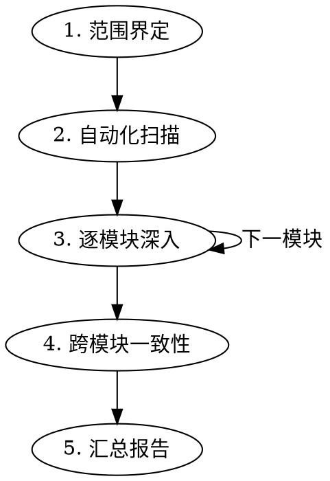

# 系统化代码巡检

## Overview

对代码库执行多维度、分阶段的系统巡检，输出结构化问题清单与修复建议。

核心原则：证据驱动。每个 finding 必须给出文件路径、行号和代码片段，不做无依据推测。

## 适用与边界

适用场景：
- 定期代码健康检查（每周、每月、里程碑后）。
- 大量变更后的全面审查。
- 接手新代码库时的摸底巡检。
- 用户要求“找 bug”“查死代码”“检查架构”等。
- 合并前预防性审查。

不适用场景：
- 已知单个 bug 的修复，改用 `systematic-debugging`。
- 刚写完的小功能 review，改用 `requesting-code-review`。

## 巡检流水线



执行要求：
- 每阶段结束后向用户简报进展。
- Phase 3 每完成 2 到 3 个模块汇报一次。

## 缺陷分类体系

| 编号 | 分类 | 严重度 | 典型信号 |
|------|------|--------|---------|
| B | Bug（逻辑缺陷） | 🔴高到🟠中 | 空指针、边界遗漏、异常处理缺失、类型错误 |
| C | Concurrency（竞态） | 🔴高 | async without await、共享可变状态、事件循环阻塞 |
| S | Security（安全） | 🔴高 | 注入、硬编码密钥、路径穿越、权限绕过 |
| A | Architecture（架构） | 🟠中 | 循环依赖、层级穿透、God class、职责混乱 |
| P | Performance（性能） | 🟠中到🟡低 | N+1 查询、内存泄漏、无界缓存、阻塞主线程 |
| I | Inconsistency（不一致） | 🟠中 | 类型定义分歧、API 契约不匹配、配置漂移 |
| R | Remnant（历史残余） | 🟡低 | 死代码、废弃 TODO、过时注释、实验代码未清理 |
| Y | YAGNI（过度工程） | 🟡低 | 未使用抽象层、无调用者的公共接口 |
| U | Unfinished（未完成） | 🟠中 | 占位实现、TODO/FIXME、半成品 API |
| F | Frontend（前端专项） | 🟠中到🟡低 | React 反模式、SSR 水合问题、状态泄漏、无障碍缺失 |

编号规则：
- 使用类别字母加序号，如 B1、B2、C1、S1。
- 在单次巡检中全局递增，不按模块重置。

## Phase 1：范围界定

目标：建立上下文并确定巡检边界。

1. 读取项目结构，生成目录快照。
2. 识别技术栈，读取 `package.json`、`pyproject.toml`、`Cargo.toml` 等。
3. 确认范围，全量或指定模块或近期变更。
4. 提取 git 变更热点并排序高频文件。
5. 列出模块清单并估算优先级。

产出：巡检范围文档（模块列表加优先级）。

## Phase 2：自动化扫描

目标：用工具快速捕获低垂果实，产出原始信号。

按 [`references/checklists.md`](references/checklists.md) 的 Layer 1 执行：
- 类型检查。
- Lint。
- 安全敏感词扫描。
- TODO/FIXME/HACK 历史残余扫描。
- 类型逃逸扫描（`type: ignore`、`noqa`、`@ts-ignore`、`as any`）。
- 循环依赖扫描。

产出：按类别汇总的原始信号列表（未去重、未定级）。

## Phase 3：逐模块深入

目标：对每个模块做全维度审查，输出可执行 findings。

按 [`references/checklists.md`](references/checklists.md) 的 Layer 2 加 Layer 3 执行。

### 3a. 快速通读

- 读取入口文件和核心文件，每轮批量读取 3 到 5 个相关文件。
- 建立模块内部依赖图与调用主路径。

### 3b. 十维度扫描

按 B/C/S/A/P/I/R/Y/U/F 依次检查：
- B Bug：空值处理、边界条件、异常路径、类型安全。
- C Concurrency：async/await 完整性、共享状态竞争、锁或信号量使用。
- S Security：输入校验、权限检查、路径与命令注入、敏感信息泄露。
- A Architecture：职责单一、依赖方向、层级边界。
- P Performance：循环内 I/O、无界增长、重复计算。
- I Inconsistency：类型、契约、命名与其他模块对齐情况。
- R Remnant：未引用函数、变量、import，过时注释。
- Y YAGNI：无调用者公共方法、过早抽象。
- U Unfinished：TODO/FIXME、`pass`、`NotImplementedError`、占位 API。
- F Frontend：hooks 依赖数组、渲染频率、SSR 兼容性、可访问性。

### 3c. Finding 记录模板

```markdown
#### {编号}: {一句话标题}
- **文件**: `path/to/file.py:42-58`
- **严重度**: 🔴高 / 🟠中 / 🟡低
- **证据**:
  ```python
  # 问题代码片段
  ```
- **问题**: {具体描述与风险}
- **建议修复**: {修复方向或代码示例}
```

## Phase 4：跨模块一致性

目标：识别单模块审查看不到的系统性问题。

1. 对齐 API 契约：后端返回类型与前端消费类型一致。
2. 对齐配置：`.env.example`、README、代码默认值一致。
3. 对齐错误处理：同类错误具有统一处理模式。
4. 对齐命名约定：同一概念跨模块命名一致。
5. 对齐依赖版本：共享依赖版本兼容并同步。

## Phase 5：汇总报告

输出到 `docs/audit_YYYYMMDD.md`：

```markdown
# 代码巡检报告
> 日期: YYYY-MM-DD | 范围: {描述} | 模块数: N

## 一、执行摘要
{总 findings 数，按严重度分布，最高风险 Top 3}

## 二、统计概览
| 类别 | 🔴高 | 🟠中 | 🟡低 | 合计 |
|------|------|------|------|------|
| B Bug | | | | |
| C Concurrency | | | | |
| S Security | | | | |
| A Architecture | | | | |
| P Performance | | | | |
| I Inconsistency | | | | |
| R Remnant | | | | |
| Y YAGNI | | | | |
| U Unfinished | | | | |
| F Frontend | | | | |

## 三、高优先级 Findings（🔴）
{逐条详情}

## 四、中优先级 Findings（🟠）
{逐条详情}

## 五、低优先级 Findings（🟡）
{逐条详情}

## 六、修复优先级排序
| 优先级 | Finding | 预期收益 | 实施难度 |
|--------|---------|---------|---------|
| P0 | | | |
| P1 | | | |
| P2 | | | |
```

## 常见误区

- 巡检范围过大导致每模块过浅。优先分批次，单次聚焦 5 到 8 个模块。
- 未理解上下文就直接判定缺陷。不确定时标记“需确认”并写明疑点。
- 只给问题不给方案。每个 finding 必须附建议修复方向。
- 自动化扫描结果不做过滤直接上报。Phase 2 信号必须经 Phase 3 人工确认。

## 快速参考

| 阶段 | 关键动作 | 产出 |
|------|---------|------|
| 1. 范围 | 读结构、定边界、看热点 | 模块清单 |
| 2. 扫描 | 工具驱动批量检测 | 原始信号 |
| 3. 深入 | 逐模块十维度审查 | Findings 列表 |
| 4. 一致性 | 跨模块契约、配置、命名对齐 | 系统性 Findings |
| 5. 报告 | 分级汇总与修复优先级 | `audit_YYYYMMDD.md` |

详细检查清单见 [`references/checklists.md`](references/checklists.md)。

相关 skill：
- `systematic-debugging`：单个 bug 的根因分析。
- `verification-before-completion`：修复后的验证流程。
